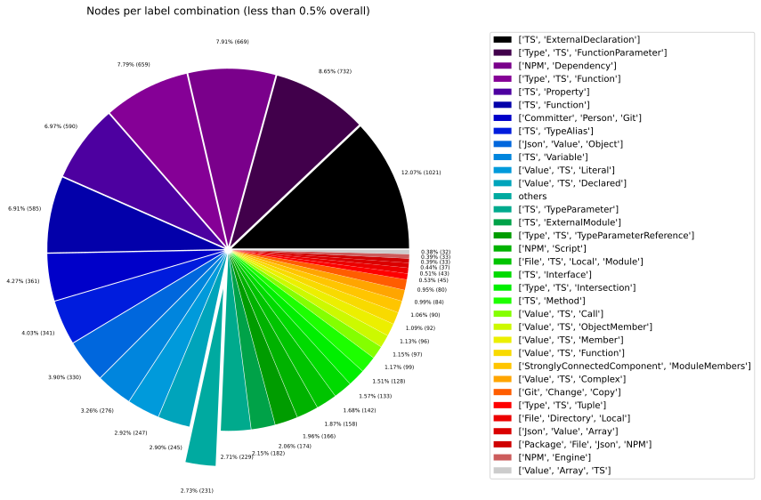
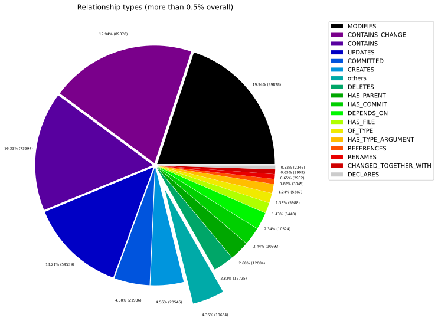
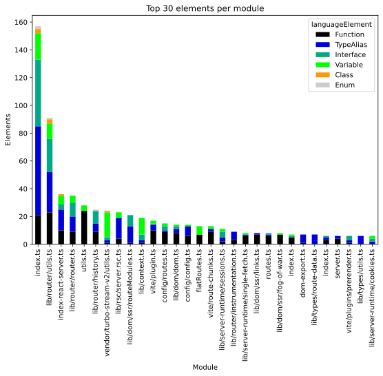
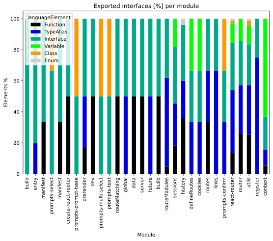
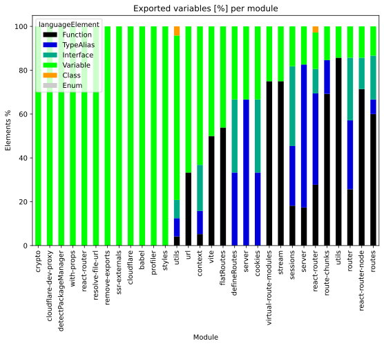

# Overview Report

## 1. Overview

High-level summary of graph database contents: general graph structure (node labels, relationships), Java artifacts, and TypeScript modules.

## 📚 Table of Contents

1. [Overview](#1-overview)
1. [General](#2-general)
1. [Java](#3-java)
1. [TypeScript](#4-typescript)

---

## 2. General

### 2.1 Node label combinations

Shows how many nodes carry each combination of labels and their share of the total node count.

| nodeLabels | nodesWithThatLabels | nodesWithThatLabelsPercent |
| --- | --- | --- |
| ["Git","Update","Change"] | 59455 | 28.413245336939845 |
| ["Type","TS","NotIdentified"] | 54184 | 25.89426095932636 |
| ["Git","Change","Create"] | 17520 | 8.372719843632765 |
| ["Git","Commit"] | 10982 | 5.2482425412542835 |
| ["Type","TS","Declared"] | 10782 | 5.152663547605507 |
| ["Git","Change","Delete"] | 9785 | 4.67620226426636 |
| ["Type","TS","Primitive"] | 9726 | 4.64800646113997 |
| ["File","Git"] | 6434 | 3.07477622568112 |
| ["Type","TS","Union"] | 5471 | 2.614563371262264 |
| ["Type","TS","Literal"] | 3402 | 1.6257986819656776 |

[Full data](./Node_label_combination_count.csv)

---

### 2.2 Node labels

Shows the number of nodes carrying each individual label, sorted by count descending.

| nodeLabel | nodesWithThatLabel | nodesWithThatLabelPercent |
| --- | --- | --- |
| Git | 110204 | 52.66593708034848 |
| TS | 94630 | 45.2232008449183 |
| Change | 89772 | 42.90158708918953 |
| Type | 88635 | 42.35822051029625 |
| Update | 59455 | 28.413245336939845 |
| NotIdentified | 54184 | 25.89426095932636 |
| Create | 17520 | 8.372719843632765 |
| Declared | 11027 | 5.269747814825258 |
| Commit | 10982 | 5.2482425412542835 |
| Delete | 9785 | 4.67620226426636 |

[Full data](./Node_label_count.csv)

---

### 2.3 Relationship types

Shows the number of relationships for each type and their share of the total relationship count.

| relationshipType | nodesWithThatRelationshipType | nodesWithThatRelationshipTypePercent |
| --- | --- | --- |
| CONTAINS_CHANGE | 89772 | 19.939983696533403 |
| MODIFIES | 89772 | 19.939983696533403 |
| CONTAINS | 73591 | 16.34589114881689 |
| UPDATES | 59455 | 13.206030061460073 |
| COMMITTED | 21964 | 4.878601366914624 |
| CREATES | 20532 | 4.560528285626074 |
| DELETES | 12717 | 2.8246755410240976 |
| HAS_PARENT | 12073 | 2.68163150167366 |
| HAS_COMMIT | 10982 | 2.439300683457312 |
| DEPENDS_ON | 10486 | 2.329130118988652 |

[Full data](./Relationship_type_count.csv)

---

### 2.4 Node labels and their relationships

Shows which node labels are connected by each relationship type, with count and percentage share.
| sourceLabels | relationshipType | targetLabels | relationshipCount |
| --- | --- | --- | --- |
| ["Git","Update","Change"] | UPDATES | ["Git"] | 59455 |
| ["Git","Update","Change"] | MODIFIES | ["Git"] | 59455 |
| ["Git","Commit"] | CONTAINS_CHANGE | ["Git","Update","Change"] | 59455 |
| ["TS","Union"] | CONTAINS | ["TS","NotIdentified"] | 53911 |
| ["Git","Change","Create"] | CREATES | ["Git"] | 17520 |
| ["Git","Change","Create"] | MODIFIES | ["Git"] | 17520 |
| ["Git","Commit"] | CONTAINS_CHANGE | ["Git","Change","Create"] | 17520 |
| ["Git","Commit"] | HAS_PARENT | ["Git","Commit"] | 12073 |
| ["Author","Person","Git","Committer"] | COMMITTED | ["Git","Commit"] | 10982 |
| ["Repository","Git"] | HAS_COMMIT | ["Git","Commit"] | 10982 |

[Full data](./Node_labels_and_their_relationships.csv)

---

### 2.5 Graph density

Statistical measures of the graph structure: node count, relationship count, and density metric.

---

### 2.6 Dependency node labels

Shows node labels present on dependency nodes — nodes that represent external dependencies not scanned as artifacts.

| sourceLabels | targetLabels | numberOfNodes | percentageOfTotalNodes |
| --- | --- | --- | --- |
| TS,Function | TS,ExternalDeclaration | 1186 | 0.57 |
| TS,Function | TS,Function | 826 | 0.39 |
| TS,Function | TS,ExternalModule | 445 | 0.21 |
| TS,Variable | TS,ExternalDeclaration | 383 | 0.18 |
| TS,Function | TS,Property | 381 | 0.18 |
| TS,Function | TS,Interface | 374 | 0.18 |
| File,TS,Local,Module | TS,ExternalDeclaration | 310 | 0.15 |
| TS,Function | TS,TypeAlias | 307 | 0.15 |
| TS,Function | TS,Variable | 295 | 0.14 |
| TS,TypeAlias | TS,TypeAlias | 188 | 0.09 |

[Full data](./Dependency_node_labels.csv)

---

## 3. Java

### 3.1 Artifact size

Overview of scanned Java artifacts: number of packages, types, methods, and lines of code.

> No overview data available.
> Please run the analysis pipeline first to scan and import code artifacts into the graph database (e.g., `analyze.sh`), then start Neo4j and re-run the overview reports.

### 3.2 Java overview charts

---

## 4. TypeScript

### 4.1 Module size

Overview of scanned TypeScript modules: number of exported language elements per module.

| nodeCount | relationshipCount | projectCount | moduleCount | functionCount | objectCount | typeAliasCount | interfaceCount | classCount | methodCount |
| --- | --- | --- | --- | --- | --- | --- | --- | --- | --- |
| 209251 | 450211 | 11 | 159 | 1333 | 1561 | 340 | 142 | 13 | 127 |

[Full data](./Overview_size_for_Typescript.csv)

### 4.2 TypeScript overview charts

