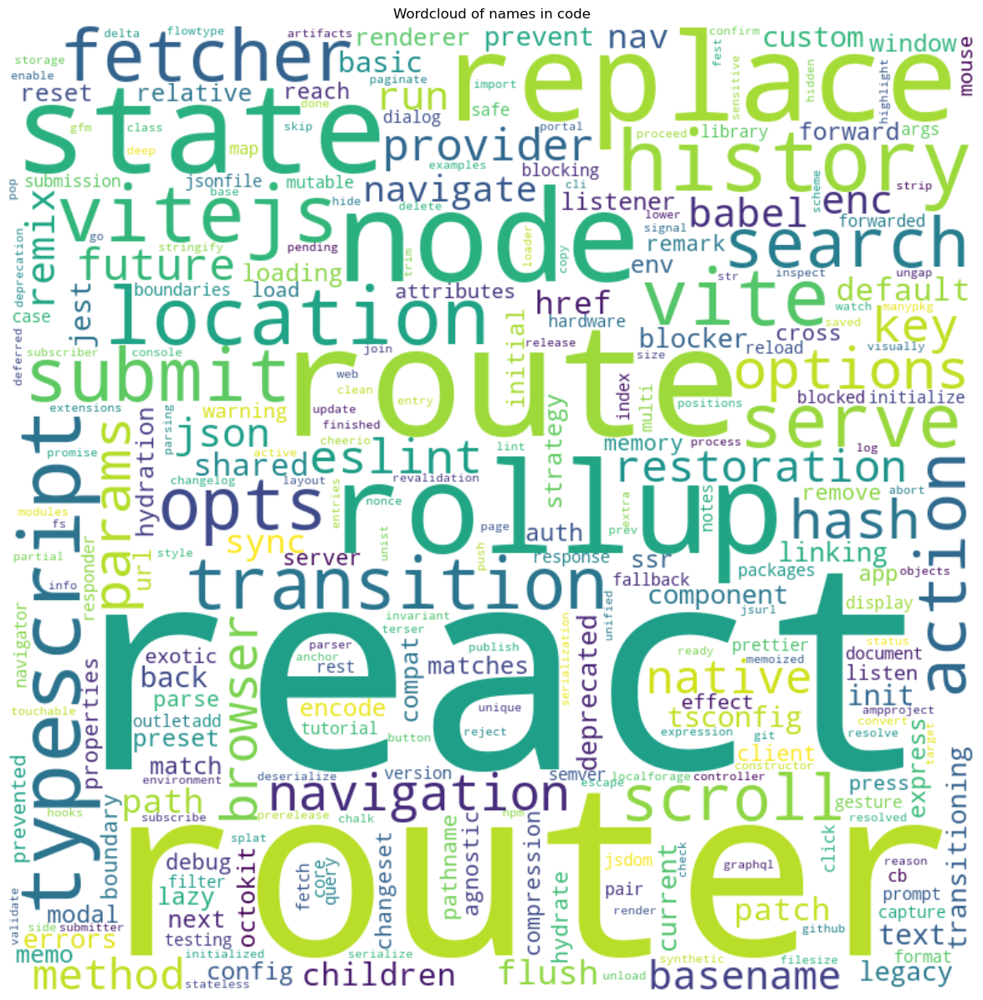
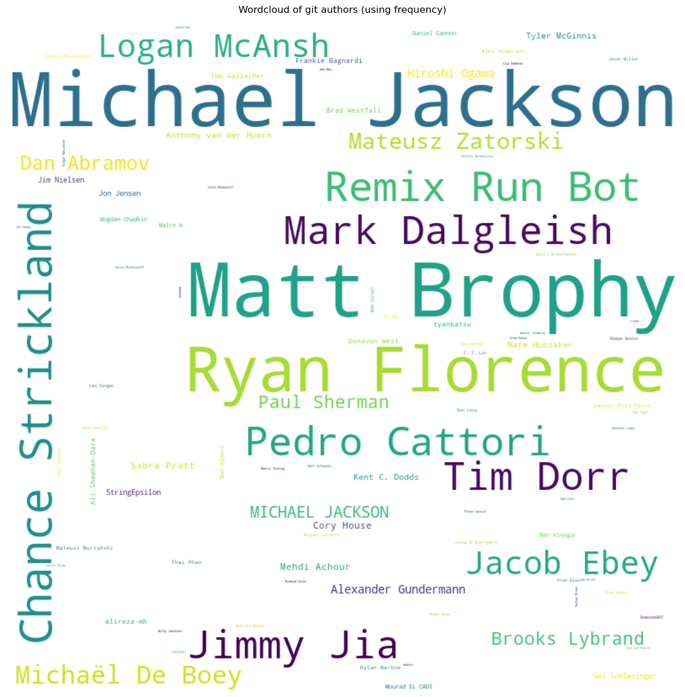

# Wordcloud
   

### References
- [jqassistant](https://jqassistant.org)
- [py2neo](https://py2neo.org/2021.1/)

## Word Cloud

## WordCloud of names in code

    Received notification from DBMS server: {severity: WARNING} {code: Neo.ClientNotification.Statement.UnknownLabelWarning} {category: UNRECOGNIZED} {title: The provided label is not in the database.} {description: One of the labels in your query is not available in the database, make sure you didn't misspell it or that the label is available when you run this statement in your application (the missing label name is: PrimitiveType)} {position: line: 3, column: 32, offset: 66} for query: "// Words for universal Wordcloud\n \n MATCH (named:!Key&!Primitive&!PrimitiveType&!Void&!JavaType&!ResolvedDuplicateType&!ExternalType&!Git)\n WHERE named.name > ''\n   AND named.name <> 'package-info'\n   AND named.name <> '<init>'\n   AND named.name <> '<clinit>'\n  WITH apoc.text.replace(named.name, '(?<!^)([-_A-Z\\W])', ' $1') AS words\n  WITH apoc.text.replace(words, '[-_0-9\\W]', ' ')                AS words\n  WITH apoc.text.replace(words, '\\s+', ' ')                      AS words\n  WITH split(toLower(trim(words)), ' ')                          AS words\n UNWIND words AS word\n   WITH word  AS word\n  WHERE size(word) > 1\n RETURN word\n //      ,count(*) as numberOfAppearances\n //ORDER BY numberOfAppearances DESC, word"

    Received notification from DBMS server: {severity: WARNING} {code: Neo.ClientNotification.Statement.UnknownLabelWarning} {category: UNRECOGNIZED} {title: The provided label is not in the database.} {description: One of the labels in your query is not available in the database, make sure you didn't misspell it or that the label is available when you run this statement in your application (the missing label name is: ExternalType)} {position: line: 3, column: 86, offset: 120} for query: "// Words for universal Wordcloud\n \n MATCH (named:!Key&!Primitive&!PrimitiveType&!Void&!JavaType&!ResolvedDuplicateType&!ExternalType&!Git)\n WHERE named.name > ''\n   AND named.name <> 'package-info'\n   AND named.name <> '<init>'\n   AND named.name <> '<clinit>'\n  WITH apoc.text.replace(named.name, '(?<!^)([-_A-Z\\W])', ' $1') AS words\n  WITH apoc.text.replace(words, '[-_0-9\\W]', ' ')                AS words\n  WITH apoc.text.replace(words, '\\s+', ' ')                      AS words\n  WITH split(toLower(trim(words)), ' ')                          AS words\n UNWIND words AS word\n   WITH word  AS word\n  WHERE size(word) > 1\n RETURN word\n //      ,count(*) as numberOfAppearances\n //ORDER BY numberOfAppearances DESC, word"

    Received notification from DBMS server: {severity: WARNING} {code: Neo.ClientNotification.Statement.UnknownLabelWarning} {category: UNRECOGNIZED} {title: The provided label is not in the database.} {description: One of the labels in your query is not available in the database, make sure you didn't misspell it or that the label is available when you run this statement in your application (the missing label name is: ResolvedDuplicateType)} {position: line: 3, column: 63, offset: 97} for query: "// Words for universal Wordcloud\n \n MATCH (named:!Key&!Primitive&!PrimitiveType&!Void&!JavaType&!ResolvedDuplicateType&!ExternalType&!Git)\n WHERE named.name > ''\n   AND named.name <> 'package-info'\n   AND named.name <> '<init>'\n   AND named.name <> '<clinit>'\n  WITH apoc.text.replace(named.name, '(?<!^)([-_A-Z\\W])', ' $1') AS words\n  WITH apoc.text.replace(words, '[-_0-9\\W]', ' ')                AS words\n  WITH apoc.text.replace(words, '\\s+', ' ')                      AS words\n  WITH split(toLower(trim(words)), ' ')                          AS words\n UNWIND words AS word\n   WITH word  AS word\n  WHERE size(word) > 1\n RETURN word\n //      ,count(*) as numberOfAppearances\n //ORDER BY numberOfAppearances DESC, word"

    Received notification from DBMS server: {severity: WARNING} {code: Neo.ClientNotification.Statement.UnknownLabelWarning} {category: UNRECOGNIZED} {title: The provided label is not in the database.} {description: One of the labels in your query is not available in the database, make sure you didn't misspell it or that the label is available when you run this statement in your application (the missing label name is: Void)} {position: line: 3, column: 47, offset: 81} for query: "// Words for universal Wordcloud\n \n MATCH (named:!Key&!Primitive&!PrimitiveType&!Void&!JavaType&!ResolvedDuplicateType&!ExternalType&!Git)\n WHERE named.name > ''\n   AND named.name <> 'package-info'\n   AND named.name <> '<init>'\n   AND named.name <> '<clinit>'\n  WITH apoc.text.replace(named.name, '(?<!^)([-_A-Z\\W])', ' $1') AS words\n  WITH apoc.text.replace(words, '[-_0-9\\W]', ' ')                AS words\n  WITH apoc.text.replace(words, '\\s+', ' ')                      AS words\n  WITH split(toLower(trim(words)), ' ')                          AS words\n UNWIND words AS word\n   WITH word  AS word\n  WHERE size(word) > 1\n RETURN word\n //      ,count(*) as numberOfAppearances\n //ORDER BY numberOfAppearances DESC, word"

    Received notification from DBMS server: {severity: WARNING} {code: Neo.ClientNotification.Statement.UnknownLabelWarning} {category: UNRECOGNIZED} {title: The provided label is not in the database.} {description: One of the labels in your query is not available in the database, make sure you didn't misspell it or that the label is available when you run this statement in your application (the missing label name is: JavaType)} {position: line: 3, column: 53, offset: 87} for query: "// Words for universal Wordcloud\n \n MATCH (named:!Key&!Primitive&!PrimitiveType&!Void&!JavaType&!ResolvedDuplicateType&!ExternalType&!Git)\n WHERE named.name > ''\n   AND named.name <> 'package-info'\n   AND named.name <> '<init>'\n   AND named.name <> '<clinit>'\n  WITH apoc.text.replace(named.name, '(?<!^)([-_A-Z\\W])', ' $1') AS words\n  WITH apoc.text.replace(words, '[-_0-9\\W]', ' ')                AS words\n  WITH apoc.text.replace(words, '\\s+', ' ')                      AS words\n  WITH split(toLower(trim(words)), ' ')                          AS words\n UNWIND words AS word\n   WITH word  AS word\n  WHERE size(word) > 1\n RETURN word\n //      ,count(*) as numberOfAppearances\n //ORDER BY numberOfAppearances DESC, word"

<table border="1" class="dataframe">
  <thead>
    <tr style="text-align: right;">
      <th></th>
      <th>word</th>
    </tr>
  </thead>
  <tbody>
    <tr>
      <th>0</th>
      <td>artifacts</td>
    </tr>
    <tr>
      <th>1</th>
      <td>npm</td>
    </tr>
    <tr>
      <th>2</th>
      <td>package</td>
    </tr>
    <tr>
      <th>3</th>
      <td>json</td>
    </tr>
    <tr>
      <th>4</th>
      <td>react</td>
    </tr>
    <tr>
      <th>5</th>
      <td>router</td>
    </tr>
    <tr>
      <th>6</th>
      <td>packages</td>
    </tr>
    <tr>
      <th>7</th>
      <td>react</td>
    </tr>
    <tr>
      <th>8</th>
      <td>router</td>
    </tr>
    <tr>
      <th>9</th>
      <td>dom</td>
    </tr>
  </tbody>
</table>

    There are 2471 words in the dataset for the plot titled 'Wordcloud of names in code'.

    

    

## WordCloud of git authors

<table border="1" class="dataframe">
  <thead>
    <tr style="text-align: right;">
      <th></th>
      <th>word</th>
      <th>frequency</th>
    </tr>
  </thead>
  <tbody>
    <tr>
      <th>0</th>
      <td>Brooks Lybrand</td>
      <td>78</td>
    </tr>
    <tr>
      <th>1</th>
      <td>Cody McFoo</td>
      <td>1</td>
    </tr>
    <tr>
      <th>2</th>
      <td>dadamssg</td>
      <td>1</td>
    </tr>
    <tr>
      <th>3</th>
      <td>MX</td>
      <td>1</td>
    </tr>
    <tr>
      <th>4</th>
      <td>Tobias Edwards</td>
      <td>1</td>
    </tr>
    <tr>
      <th>5</th>
      <td>Remix Run Bot</td>
      <td>449</td>
    </tr>
    <tr>
      <th>6</th>
      <td>Mark Dalgleish</td>
      <td>396</td>
    </tr>
    <tr>
      <th>7</th>
      <td>Matt Brophy</td>
      <td>1947</td>
    </tr>
    <tr>
      <th>8</th>
      <td>Jacob Ebey</td>
      <td>260</td>
    </tr>
    <tr>
      <th>9</th>
      <td>Lenz Weber-Tronic</td>
      <td>1</td>
    </tr>
  </tbody>
</table>

    

    

