# git log/history
   

### References
- [Visualizing Code: Polyglot Notebooks Repository (YouTube)](https://youtu.be/ipOpToPS-PY?si=3doePt2cp-LgEUmt)
- [gitstractor (GitHub)](https://github.com/IntegerMan/gitstractor)
- [Neo4j Python Driver](https://neo4j.com/docs/api/python-driver/current)

    Command line execution (CLI mode): Yes

## Git History - Directory Commit Statistics

### Treemap Layout Functions and Constants

### Visualization Data Preparation Functions

### File Data Preparation Functions

### File Data Preparation 

    Received notification from DBMS server: {severity: WARNING} {code: Neo.ClientNotification.Statement.AggregationSkippedNull} {category: UNRECOGNIZED} {title: The query contains an aggregation function that skips null values.} {description: null value eliminated in set function.} {position: None} for query: "// List git files with commit statistics\n \n  MATCH (git_file:File&Git&!Repository)\n  WHERE git_file.deletedAt IS NULL // filter out deleted files\n   WITH percentileDisc(git_file.createdAtEpoch, 0.5)          AS medianCreatedAtEpoch\n       ,percentileDisc(git_file.lastModificationAtEpoch, 0.5) AS medianLastModificationAtEpoch\n       ,collect(git_file)                                     AS git_files\n UNWIND git_files AS git_file\n   WITH *\n       ,datetime.fromepochMillis(coalesce(git_file.createdAtEpoch, medianCreatedAtEpoch))                                            AS fileCreatedAtTimestamp\n       ,datetime.fromepochMillis(coalesce(git_file.lastModificationAtEpoch, git_file.createdAtEpoch, medianLastModificationAtEpoch)) AS fileLastModificationAtTimestamp\n  MATCH (git_repository:Git&Repository)-[:HAS_FILE]->(git_file)\n  MATCH (git_commit:Git&Commit)-[:CONTAINS_CHANGE]->(git_change:Git&Change)-->(old_files_included:Git&File&!Repository)-[:HAS_NEW_NAME*0..3]->(git_file)\n RETURN git_repository.name + '/' + git_file.relativePath AS filePath\n       ,split(git_commit.author, ' <')[0]                 AS author\n       ,count(DISTINCT git_commit.sha)                    AS commitCount\n       ,date(max(git_commit.date))                        AS lastCommitDate\n       ,max(date(fileCreatedAtTimestamp))                 AS lastCreationDate\n       ,max(date(fileLastModificationAtTimestamp))        AS lastModificationDate\n       ,duration.inDays(date(max(git_commit.date)), date()).days               AS daysSinceLastCommit\n       ,duration.inDays(max(fileCreatedAtTimestamp), datetime()).days          AS daysSinceLastCreation\n       ,duration.inDays(max(fileLastModificationAtTimestamp), datetime()).days AS daysSinceLastModification\n       ,max(git_commit.sha)                               AS maxCommitSha\n ORDER BY filePath ASCENDING, commitCount DESCENDING"

### Data Preview

<table border="1" class="dataframe">
  <thead>
    <tr style="text-align: right;">
      <th></th>
      <th>fileCount</th>
      <th>authorCount</th>
      <th>commitCount</th>
      <th>daysSinceLastCommit</th>
      <th>daysSinceLastCreation</th>
      <th>daysSinceLastModification</th>
    </tr>
  </thead>
  <tbody>
    <tr>
      <th>count</th>
      <td>198.000000</td>
      <td>198.000000</td>
      <td>198.000000</td>
      <td>198.000000</td>
      <td>198.00000</td>
      <td>198.000000</td>
    </tr>
    <tr>
      <th>mean</th>
      <td>22.489899</td>
      <td>13.449495</td>
      <td>659.520202</td>
      <td>109.121212</td>
      <td>392.19697</td>
      <td>174.939394</td>
    </tr>
    <tr>
      <th>std</th>
      <td>100.699721</td>
      <td>39.140447</td>
      <td>3249.715697</td>
      <td>221.568670</td>
      <td>470.42799</td>
      <td>303.195697</td>
    </tr>
    <tr>
      <th>min</th>
      <td>1.000000</td>
      <td>2.000000</td>
      <td>2.000000</td>
      <td>2.000000</td>
      <td>2.00000</td>
      <td>1.000000</td>
    </tr>
    <tr>
      <th>25%</th>
      <td>2.000000</td>
      <td>3.000000</td>
      <td>22.250000</td>
      <td>11.000000</td>
      <td>65.00000</td>
      <td>10.000000</td>
    </tr>
    <tr>
      <th>50%</th>
      <td>5.000000</td>
      <td>6.000000</td>
      <td>64.000000</td>
      <td>11.000000</td>
      <td>142.00000</td>
      <td>25.000000</td>
    </tr>
    <tr>
      <th>75%</th>
      <td>13.000000</td>
      <td>10.000000</td>
      <td>255.500000</td>
      <td>120.000000</td>
      <td>616.25000</td>
      <td>143.500000</td>
    </tr>
    <tr>
      <th>max</th>
      <td>1280.000000</td>
      <td>483.000000</td>
      <td>37505.000000</td>
      <td>1235.000000</td>
      <td>1754.00000</td>
      <td>1288.000000</td>
    </tr>
  </tbody>
</table>

<table border="1" class="dataframe">
  <thead>
    <tr style="text-align: right;">
      <th></th>
      <th>directoryPath</th>
      <th>directoryParentPath</th>
      <th>directoryName</th>
      <th>fileCount</th>
      <th>firstFile</th>
      <th>mostFrequentFileExtension</th>
      <th>authorCount</th>
      <th>mainAuthor</th>
      <th>secondAuthor</th>
      <th>commitCount</th>
      <th>daysSinceLastCommit</th>
      <th>daysSinceLastCreation</th>
      <th>daysSinceLastModification</th>
      <th>lastCommitDate</th>
      <th>lastCreationDate</th>
      <th>lastModificationDate</th>
      <th>maxCommitSha</th>
    </tr>
  </thead>
  <tbody>
    <tr>
      <th>0</th>
      <td>react-router-6.30.0/examples/custom-query-parsing/types</td>
      <td>react-router-6.30.0/examples/custom-query-parsing</td>
      <td>types</td>
      <td>1</td>
      <td>react-router-6.30.0/examples/custom-query-parsing/types/jsurl.d.ts</td>
      <td>ts</td>
      <td>3</td>
      <td>Logan McAnsh</td>
      <td>Michael Jackson</td>
      <td>5</td>
      <td>360</td>
      <td>1248</td>
      <td>1248</td>
      <td>2024-03-27</td>
      <td>2021-10-20</td>
      <td>2021-10-20</td>
      <td>dd0de338dfb32e38d1f4b091b3442ae55515edc3</td>
    </tr>
    <tr>
      <th>1</th>
      <td>react-router-6.30.0/examples/data-router/src</td>
      <td>react-router-6.30.0/examples/data-router</td>
      <td>src</td>
      <td>1</td>
      <td>react-router-6.30.0/examples/data-router/src/lazy.tsx</td>
      <td>tsx</td>
      <td>2</td>
      <td>Matt Brophy</td>
      <td>Mark Dalgleish</td>
      <td>5</td>
      <td>771</td>
      <td>777</td>
      <td>771</td>
      <td>2023-02-10</td>
      <td>2023-02-03</td>
      <td>2023-02-09</td>
      <td>f94adc5a3290be4fcd175a2a7fae00fbcd8f4154</td>
    </tr>
    <tr>
      <th>2</th>
      <td>react-router-6.30.0/integration/helpers/cloudflare-dev-proxy-template/app/routes</td>
      <td>react-router-6.30.0/integration/helpers/cloudflare-dev-proxy-template/app</td>
      <td>routes</td>
      <td>1</td>
      <td>react-router-6.30.0/integration/helpers/cloudflare-dev-proxy-template/app/routes/_index.tsx</td>
      <td>tsx</td>
      <td>5</td>
      <td>Matt Brophy</td>
      <td>Mark Dalgleish</td>
      <td>22</td>
      <td>11</td>
      <td>25</td>
      <td>25</td>
      <td>2025-03-11</td>
      <td>2025-02-24</td>
      <td>2025-02-24</td>
      <td>f8b1a47883109f968702ff272a370070577ca2ed</td>
    </tr>
    <tr>
      <th>3</th>
      <td>react-router-6.30.0/integration/helpers/cloudflare-dev-proxy-template/public</td>
      <td>react-router-6.30.0/integration/helpers/cloudflare-dev-proxy-template</td>
      <td>public</td>
      <td>1</td>
      <td>react-router-6.30.0/integration/helpers/cloudflare-dev-proxy-template/public/favicon.ico</td>
      <td>ico</td>
      <td>3</td>
      <td>Matt Brophy</td>
      <td>Mark Dalgleish</td>
      <td>6</td>
      <td>11</td>
      <td>25</td>
      <td>25</td>
      <td>2025-03-11</td>
      <td>2025-02-24</td>
      <td>2025-02-24</td>
      <td>f174d2f63548c7070242453dafe3c101fd102520</td>
    </tr>
    <tr>
      <th>4</th>
      <td>react-router-6.30.0/integration/helpers/vite-5-template/app/routes</td>
      <td>react-router-6.30.0/integration/helpers/vite-5-template/app</td>
      <td>routes</td>
      <td>1</td>
      <td>react-router-6.30.0/integration/helpers/vite-5-template/app/routes/_index.tsx</td>
      <td>tsx</td>
      <td>6</td>
      <td>Matt Brophy</td>
      <td>Mark Dalgleish</td>
      <td>24</td>
      <td>11</td>
      <td>95</td>
      <td>95</td>
      <td>2025-03-11</td>
      <td>2024-12-17</td>
      <td>2024-12-17</td>
      <td>f8b1a47883109f968702ff272a370070577ca2ed</td>
    </tr>
    <tr>
      <th>5</th>
      <td>react-router-6.30.0/integration/helpers/vite-5-template/public</td>
      <td>react-router-6.30.0/integration/helpers/vite-5-template</td>
      <td>public</td>
      <td>1</td>
      <td>react-router-6.30.0/integration/helpers/vite-5-template/public/favicon.ico</td>
      <td>ico</td>
      <td>3</td>
      <td>Mark Dalgleish</td>
      <td>Matt Brophy</td>
      <td>5</td>
      <td>11</td>
      <td>95</td>
      <td>95</td>
      <td>2025-03-11</td>
      <td>2024-12-17</td>
      <td>2024-12-17</td>
      <td>740f55625e6de24975d5008a9135d4989fa5b795</td>
    </tr>
    <tr>
      <th>6</th>
      <td>react-router-6.30.0/integration/helpers/vite-6-template/app/routes</td>
      <td>react-router-6.30.0/integration/helpers/vite-6-template/app</td>
      <td>routes</td>
      <td>1</td>
      <td>react-router-6.30.0/integration/helpers/vite-6-template/app/routes/_index.tsx</td>
      <td>tsx</td>
      <td>3</td>
      <td>Mark Dalgleish</td>
      <td>Matt Brophy</td>
      <td>5</td>
      <td>11</td>
      <td>95</td>
      <td>95</td>
      <td>2025-03-11</td>
      <td>2024-12-17</td>
      <td>2024-12-17</td>
      <td>740f55625e6de24975d5008a9135d4989fa5b795</td>
    </tr>
    <tr>
      <th>7</th>
      <td>react-router-6.30.0/integration/helpers/vite-6-template/public</td>
      <td>react-router-6.30.0/integration/helpers/vite-6-template</td>
      <td>public</td>
      <td>1</td>
      <td>react-router-6.30.0/integration/helpers/vite-6-template/public/favicon.ico</td>
      <td>ico</td>
      <td>3</td>
      <td>Mark Dalgleish</td>
      <td>Matt Brophy</td>
      <td>5</td>
      <td>11</td>
      <td>95</td>
      <td>95</td>
      <td>2025-03-11</td>
      <td>2024-12-17</td>
      <td>2024-12-17</td>
      <td>740f55625e6de24975d5008a9135d4989fa5b795</td>
    </tr>
    <tr>
      <th>8</th>
      <td>react-router-6.30.0/integration/helpers/vite-plugin-cloudflare-template/app/routes</td>
      <td>react-router-6.30.0/integration/helpers/vite-plugin-cloudflare-template/app</td>
      <td>routes</td>
      <td>1</td>
      <td>react-router-6.30.0/integration/helpers/vite-plugin-cloudflare-template/app/routes/_index.tsx</td>
      <td>tsx</td>
      <td>3</td>
      <td>Matt Brophy</td>
      <td>Mark Dalgleish</td>
      <td>6</td>
      <td>11</td>
      <td>25</td>
      <td>25</td>
      <td>2025-03-11</td>
      <td>2025-02-24</td>
      <td>2025-02-24</td>
      <td>f174d2f63548c7070242453dafe3c101fd102520</td>
    </tr>
    <tr>
      <th>9</th>
      <td>react-router-6.30.0/integration/helpers/vite-plugin-cloudflare-template/public</td>
      <td>react-router-6.30.0/integration/helpers/vite-plugin-cloudflare-template</td>
      <td>public</td>
      <td>1</td>
      <td>react-router-6.30.0/integration/helpers/vite-plugin-cloudflare-template/public/favicon.ico</td>
      <td>ico</td>
      <td>5</td>
      <td>Matt Brophy</td>
      <td>Mark Dalgleish</td>
      <td>21</td>
      <td>11</td>
      <td>25</td>
      <td>25</td>
      <td>2025-03-11</td>
      <td>2025-02-24</td>
      <td>2025-02-24</td>
      <td>f8b1a47883109f968702ff272a370070577ca2ed</td>
    </tr>
    <tr>
      <th>10</th>
      <td>react-router-6.30.0/integration/helpers/vite-plugin-cloudflare-template/workers</td>
      <td>react-router-6.30.0/integration/helpers/vite-plugin-cloudflare-template</td>
      <td>workers</td>
      <td>1</td>
      <td>react-router-6.30.0/integration/helpers/vite-plugin-cloudflare-template/workers/app.ts</td>
      <td>ts</td>
      <td>3</td>
      <td>Matt Brophy</td>
      <td>Mark Dalgleish</td>
      <td>11</td>
      <td>3</td>
      <td>25</td>
      <td>2</td>
      <td>2025-03-19</td>
      <td>2025-02-24</td>
      <td>2025-03-19</td>
      <td>f77ca631ab6016e138716edf785c20d70b2855df</td>
    </tr>
    <tr>
      <th>11</th>
      <td>react-router-6.30.0/packages/create-react-router/__tests__/fixtures/basic/app/routes</td>
      <td>react-router-6.30.0/packages/create-react-router/__tests__/fixtures/basic/app</td>
      <td>routes</td>
      <td>1</td>
      <td>react-router-6.30.0/packages/create-react-router/__tests__/fixtures/basic/app/routes/home.tsx</td>
      <td>tsx</td>
      <td>8</td>
      <td>Matt Brophy</td>
      <td>Mark Dalgleish</td>
      <td>31</td>
      <td>120</td>
      <td>142</td>
      <td>142</td>
      <td>2024-11-22</td>
      <td>2024-10-31</td>
      <td>2024-10-31</td>
      <td>fbe8ac244eedb8556dd0faf00dfbe1f78e461120</td>
    </tr>
    <tr>
      <th>12</th>
      <td>react-router-6.30.0/packages/create-react-router/__tests__/fixtures/basic/public</td>
      <td>react-router-6.30.0/packages/create-react-router/__tests__/fixtures/basic</td>
      <td>public</td>
      <td>1</td>
      <td>react-router-6.30.0/packages/create-react-router/__tests__/fixtures/basic/public/favicon.ico</td>
      <td>ico</td>
      <td>2</td>
      <td>Mark Dalgleish</td>
      <td>Michael Jackson</td>
      <td>4</td>
      <td>120</td>
      <td>142</td>
      <td>142</td>
      <td>2024-11-22</td>
      <td>2024-10-31</td>
      <td>2024-10-31</td>
      <td>c6afcf85f2003d93e77f901e2b4ecdef5e83fd97</td>
    </tr>
    <tr>
      <th>13</th>
      <td>react-router-6.30.0/packages/create-react-router/__tests__/fixtures/blank</td>
      <td>react-router-6.30.0/packages/create-react-router/__tests__/fixtures</td>
      <td>blank</td>
      <td>1</td>
      <td>react-router-6.30.0/packages/create-react-router/__tests__/fixtures/blank/package.json</td>
      <td>json</td>
      <td>2</td>
      <td>Mark Dalgleish</td>
      <td>Michael Jackson</td>
      <td>4</td>
      <td>120</td>
      <td>142</td>
      <td>142</td>
      <td>2024-11-22</td>
      <td>2024-10-31</td>
      <td>2024-10-31</td>
      <td>c6afcf85f2003d93e77f901e2b4ecdef5e83fd97</td>
    </tr>
    <tr>
      <th>14</th>
      <td>react-router-6.30.0/packages/create-react-router/__tests__/fixtures/with-ignored-dir</td>
      <td>react-router-6.30.0/packages/create-react-router/__tests__/fixtures</td>
      <td>with-ignored-dir</td>
      <td>1</td>
      <td>react-router-6.30.0/packages/create-react-router/__tests__/fixtures/with-ignored-dir/package.json</td>
      <td>json</td>
      <td>2</td>
      <td>Mark Dalgleish</td>
      <td>Michael Jackson</td>
      <td>4</td>
      <td>120</td>
      <td>142</td>
      <td>142</td>
      <td>2024-11-22</td>
      <td>2024-10-31</td>
      <td>2024-10-31</td>
      <td>c6afcf85f2003d93e77f901e2b4ecdef5e83fd97</td>
    </tr>
    <tr>
      <th>15</th>
      <td>react-router-6.30.0/packages/react-router-architect/sessions</td>
      <td>react-router-6.30.0/packages/react-router-architect</td>
      <td>sessions</td>
      <td>1</td>
      <td>react-router-6.30.0/packages/react-router-architect/sessions/arcTableSessionStorage.ts</td>
      <td>ts</td>
      <td>3</td>
      <td>Matt Brophy</td>
      <td>Mark Dalgleish</td>
      <td>8</td>
      <td>120</td>
      <td>249</td>
      <td>184</td>
      <td>2024-11-22</td>
      <td>2024-07-16</td>
      <td>2024-09-18</td>
      <td>eed3ebd417e2522f527eee4fba098785ceb3dcfb</td>
    </tr>
    <tr>
      <th>16</th>
      <td>react-router-6.30.0/packages/react-router-cloudflare/sessions</td>
      <td>react-router-6.30.0/packages/react-router-cloudflare</td>
      <td>sessions</td>
      <td>1</td>
      <td>react-router-6.30.0/packages/react-router-cloudflare/sessions/workersKVStorage.ts</td>
      <td>ts</td>
      <td>3</td>
      <td>Matt Brophy</td>
      <td>Mark Dalgleish</td>
      <td>8</td>
      <td>120</td>
      <td>250</td>
      <td>184</td>
      <td>2024-11-22</td>
      <td>2024-07-15</td>
      <td>2024-09-18</td>
      <td>eed3ebd417e2522f527eee4fba098785ceb3dcfb</td>
    </tr>
    <tr>
      <th>17</th>
      <td>react-router-6.30.0/packages/react-router-config</td>
      <td>react-router-6.30.0/packages</td>
      <td>react-router-config</td>
      <td>1</td>
      <td>react-router-6.30.0/packages/react-router-config/LICENSE</td>
      <td>LICENSE</td>
      <td>3</td>
      <td>Chance Strickland</td>
      <td>Michael Jackson</td>
      <td>4</td>
      <td>1070</td>
      <td>1271</td>
      <td>1069</td>
      <td>2022-04-17</td>
      <td>2021-09-27</td>
      <td>2022-04-17</td>
      <td>fe8262722aa630dca8841a89206a0f46f6c40029</td>
    </tr>
    <tr>
      <th>18</th>
      <td>react-router-6.30.0/packages/react-router-dev/__tests__/fixtures/basic/app/routes</td>
      <td>react-router-6.30.0/packages/react-router-dev/__tests__/fixtures/basic/app</td>
      <td>routes</td>
      <td>1</td>
      <td>react-router-6.30.0/packages/react-router-dev/__tests__/fixtures/basic/app/routes/_index.tsx</td>
      <td>tsx</td>
      <td>7</td>
      <td>Matt Brophy</td>
      <td>Mark Dalgleish</td>
      <td>29</td>
      <td>11</td>
      <td>65</td>
      <td>65</td>
      <td>2025-03-11</td>
      <td>2025-01-16</td>
      <td>2025-01-16</td>
      <td>fbe8ac244eedb8556dd0faf00dfbe1f78e461120</td>
    </tr>
    <tr>
      <th>19</th>
      <td>react-router-6.30.0/packages/react-router-dev/__tests__/fixtures/basic/public</td>
      <td>react-router-6.30.0/packages/react-router-dev/__tests__/fixtures/basic</td>
      <td>public</td>
      <td>1</td>
      <td>react-router-6.30.0/packages/react-router-dev/__tests__/fixtures/basic/public/favicon.ico</td>
      <td>ico</td>
      <td>4</td>
      <td>Matt Brophy</td>
      <td>Mark Dalgleish</td>
      <td>7</td>
      <td>11</td>
      <td>65</td>
      <td>65</td>
      <td>2025-03-11</td>
      <td>2025-01-16</td>
      <td>2025-01-16</td>
      <td>c364bd450e5e8811bd4d24f7e5fe5489d361a66f</td>
    </tr>
    <tr>
      <th>20</th>
      <td>react-router-6.30.0/packages/react-router-dev/vite/static</td>
      <td>react-router-6.30.0/packages/react-router-dev/vite</td>
      <td>static</td>
      <td>1</td>
      <td>react-router-6.30.0/packages/react-router-dev/vite/static/refresh-utils.cjs</td>
      <td>cjs</td>
      <td>6</td>
      <td>Matt Brophy</td>
      <td>Mark Dalgleish</td>
      <td>57</td>
      <td>3</td>
      <td>273</td>
      <td>2</td>
      <td>2025-03-19</td>
      <td>2024-06-21</td>
      <td>2025-03-19</td>
      <td>f8b1a47883109f968702ff272a370070577ca2ed</td>
    </tr>
    <tr>
      <th>21</th>
      <td>react-router-6.30.0/packages/react-router-dom/docs</td>
      <td>react-router-6.30.0/packages/react-router-dom</td>
      <td>docs</td>
      <td>1</td>
      <td>react-router-6.30.0/packages/react-router-dom/docs/README.md</td>
      <td>md</td>
      <td>2</td>
      <td>Michael Jackson</td>
      <td>Jacob Bundgaard</td>
      <td>3</td>
      <td>1235</td>
      <td>1754</td>
      <td>1234</td>
      <td>2021-11-03</td>
      <td>2020-06-01</td>
      <td>2021-11-03</td>
      <td>c64bbce903ed80abed3488e0a57240f8a8978d0b</td>
    </tr>
    <tr>
      <th>22</th>
      <td>react-router-6.30.0/packages/react-router-express/__tests__</td>
      <td>react-router-6.30.0/packages/react-router-express</td>
      <td>__tests__</td>
      <td>1</td>
      <td>react-router-6.30.0/packages/react-router-express/__tests__/server-test.ts</td>
      <td>ts</td>
      <td>12</td>
      <td>Matt Brophy</td>
      <td>Chance Strickland</td>
      <td>64</td>
      <td>120</td>
      <td>273</td>
      <td>273</td>
      <td>2024-11-22</td>
      <td>2024-06-21</td>
      <td>2024-06-21</td>
      <td>fbe8ac244eedb8556dd0faf00dfbe1f78e461120</td>
    </tr>
    <tr>
      <th>23</th>
      <td>react-router-6.30.0/packages/react-router-native/docs</td>
      <td>react-router-6.30.0/packages/react-router-native</td>
      <td>docs</td>
      <td>1</td>
      <td>react-router-6.30.0/packages/react-router-native/docs/README.md</td>
      <td>md</td>
      <td>2</td>
      <td>Michael Jackson</td>
      <td>Jacob Bundgaard</td>
      <td>3</td>
      <td>1235</td>
      <td>1754</td>
      <td>1234</td>
      <td>2021-11-03</td>
      <td>2020-06-01</td>
      <td>2021-11-03</td>
      <td>c64bbce903ed80abed3488e0a57240f8a8978d0b</td>
    </tr>
    <tr>
      <th>24</th>
      <td>react-router-6.30.0/packages/react-router-node/sessions</td>
      <td>react-router-6.30.0/packages/react-router-node</td>
      <td>sessions</td>
      <td>1</td>
      <td>react-router-6.30.0/packages/react-router-node/sessions/fileStorage.ts</td>
      <td>ts</td>
      <td>13</td>
      <td>Matt Brophy</td>
      <td>Chance Strickland</td>
      <td>49</td>
      <td>120</td>
      <td>273</td>
      <td>184</td>
      <td>2024-11-22</td>
      <td>2024-06-21</td>
      <td>2024-09-18</td>
      <td>fbe8ac244eedb8556dd0faf00dfbe1f78e461120</td>
    </tr>
    <tr>
      <th>25</th>
      <td>react-router-6.30.0/packages/react-router/__tests__/__snapshots__</td>
      <td>react-router-6.30.0/packages/react-router/__tests__</td>
      <td>__snapshots__</td>
      <td>1</td>
      <td>react-router-6.30.0/packages/react-router/__tests__/__snapshots__/route-matching-test.tsx.snap</td>
      <td>snap</td>
      <td>3</td>
      <td>Chance Strickland</td>
      <td>Michael Jackson</td>
      <td>7</td>
      <td>360</td>
      <td>1345</td>
      <td>1288</td>
      <td>2024-03-27</td>
      <td>2021-07-15</td>
      <td>2021-09-10</td>
      <td>eff2bd9148de1849fb93519f59262e4b53e8d823</td>
    </tr>
    <tr>
      <th>26</th>
      <td>react-router-6.30.0/packages/react-router/__tests__/dom/components</td>
      <td>react-router-6.30.0/packages/react-router/__tests__/dom</td>
      <td>components</td>
      <td>1</td>
      <td>react-router-6.30.0/packages/react-router/__tests__/dom/components/LazyComponent.tsx</td>
      <td>tsx</td>
      <td>2</td>
      <td>Matt Brophy</td>
      <td>Michael Jackson</td>
      <td>16</td>
      <td>120</td>
      <td>336</td>
      <td>336</td>
      <td>2024-11-22</td>
      <td>2024-04-19</td>
      <td>2024-04-19</td>
      <td>f8b1a47883109f968702ff272a370070577ca2ed</td>
    </tr>
    <tr>
      <th>27</th>
      <td>react-router-6.30.0/packages/react-router/__tests__/dom/polyfills</td>
      <td>react-router-6.30.0/packages/react-router/__tests__/dom</td>
      <td>polyfills</td>
      <td>1</td>
      <td>react-router-6.30.0/packages/react-router/__tests__/dom/polyfills/drop-FormData-submitter.ts</td>
      <td>ts</td>
      <td>3</td>
      <td>Matt Brophy</td>
      <td>Jon Jensen</td>
      <td>16</td>
      <td>120</td>
      <td>336</td>
      <td>336</td>
      <td>2024-11-22</td>
      <td>2024-04-19</td>
      <td>2024-04-19</td>
      <td>f8b1a47883109f968702ff272a370070577ca2ed</td>
    </tr>
    <tr>
      <th>28</th>
      <td>react-router-6.30.0/packages/react-router/docs</td>
      <td>react-router-6.30.0/packages/react-router</td>
      <td>docs</td>
      <td>1</td>
      <td>react-router-6.30.0/packages/react-router/docs/README.md</td>
      <td>md</td>
      <td>2</td>
      <td>Michael Jackson</td>
      <td>Jacob Bundgaard</td>
      <td>3</td>
      <td>1235</td>
      <td>1754</td>
      <td>1234</td>
      <td>2021-11-03</td>
      <td>2020-06-01</td>
      <td>2021-11-03</td>
      <td>c64bbce903ed80abed3488e0a57240f8a8978d0b</td>
    </tr>
    <tr>
      <th>29</th>
      <td>react-router-6.30.0/playground/framework-express/app/routes</td>
      <td>react-router-6.30.0/playground/framework-express/app</td>
      <td>routes</td>
      <td>1</td>
      <td>react-router-6.30.0/playground/framework-express/app/routes/_index.tsx</td>
      <td>tsx</td>
      <td>6</td>
      <td>Matt Brophy</td>
      <td>Jacob Ebey</td>
      <td>23</td>
      <td>75</td>
      <td>121</td>
      <td>121</td>
      <td>2025-01-06</td>
      <td>2024-11-21</td>
      <td>2024-11-21</td>
      <td>f8b1a47883109f968702ff272a370070577ca2ed</td>
    </tr>
  </tbody>
</table>

### Number of files per directory

    
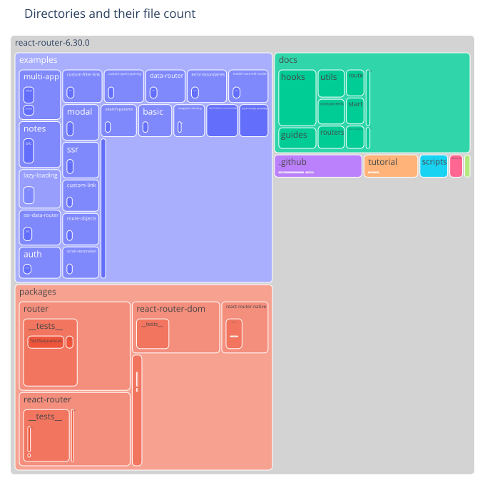
    

### Most frequent file extension per directory

    
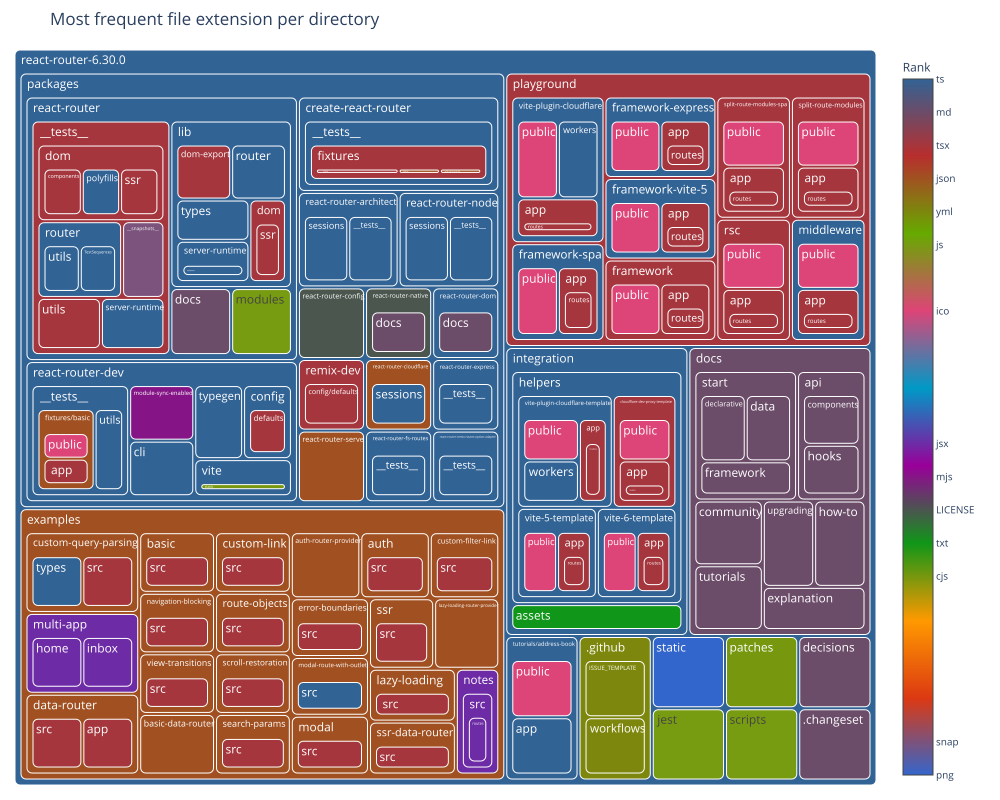
    

### Number of commits per directory

    
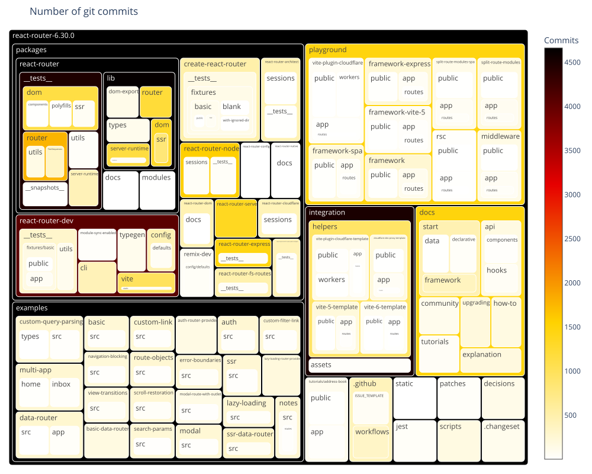
    

### Number of distinct authors per directory

    
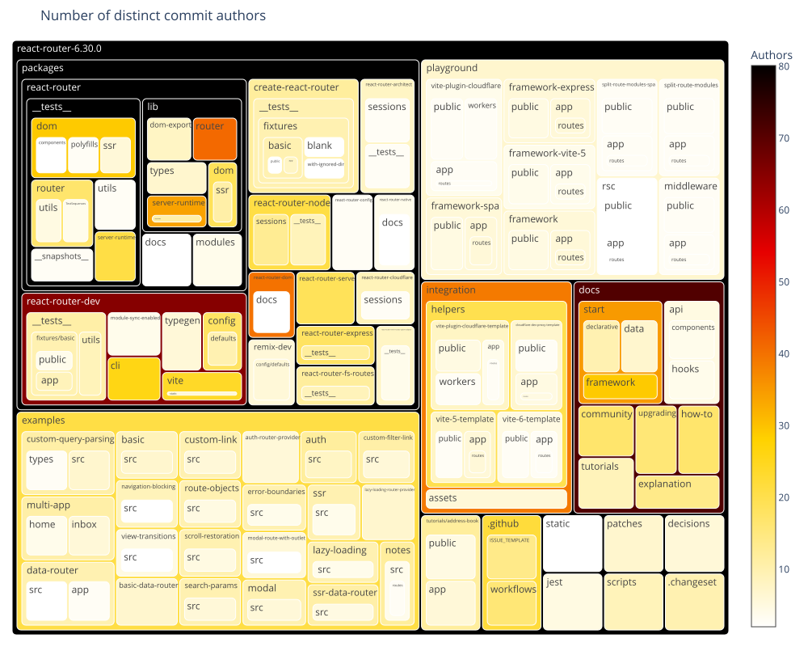
    

### Main author per directory

    
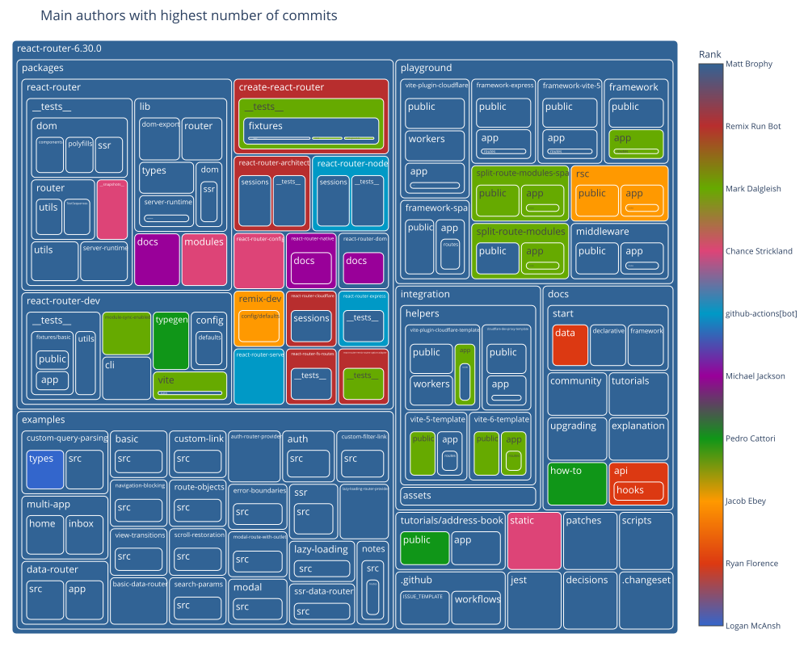
    

### Second author per directory

    
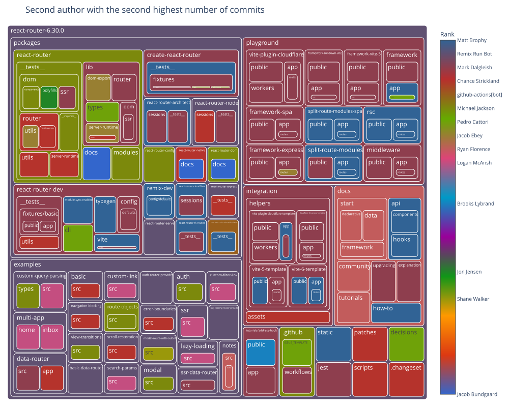
    

### Days since last commit per directory

    
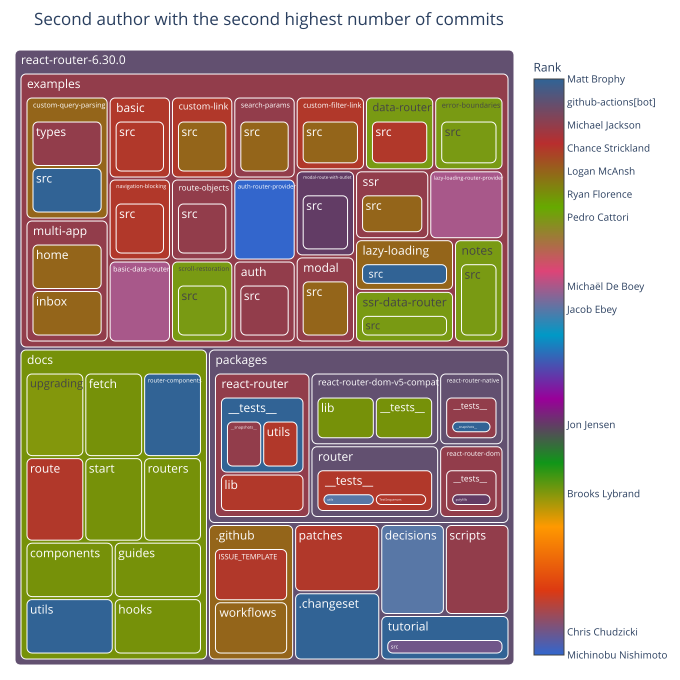
    

### Days since last commit per directory (ranked)

    
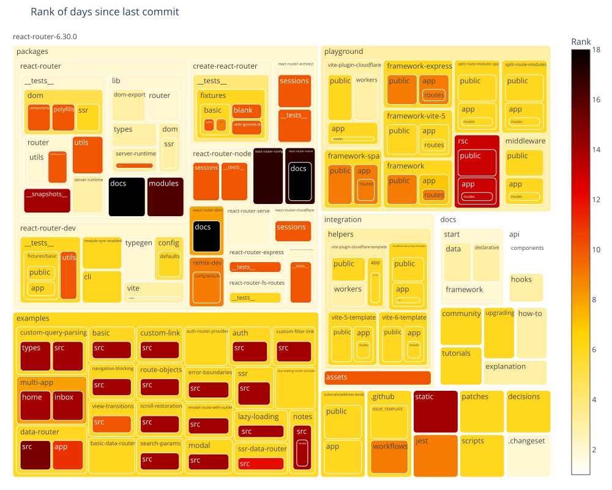
    

### Days since last file creation per directory

    
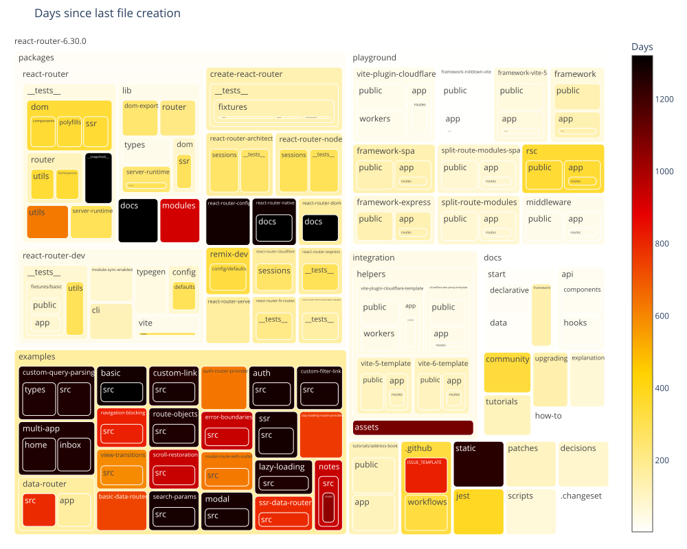
    

### Days since last file creation per directory (ranked)

    
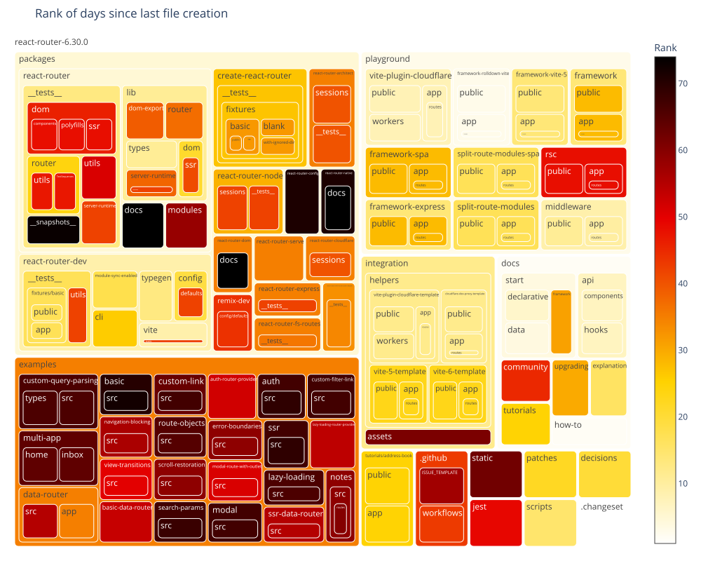
    

### Days since last file modification per directory

    
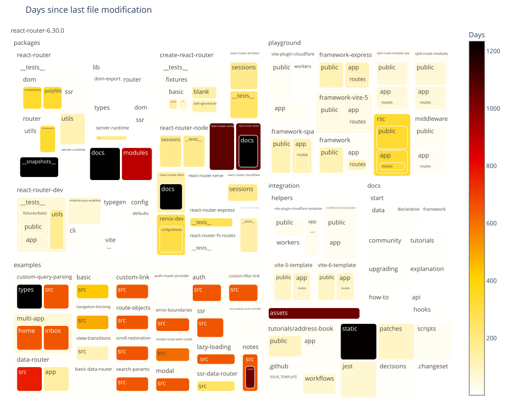
    

### Days since last file modification per directory (ranked)

    
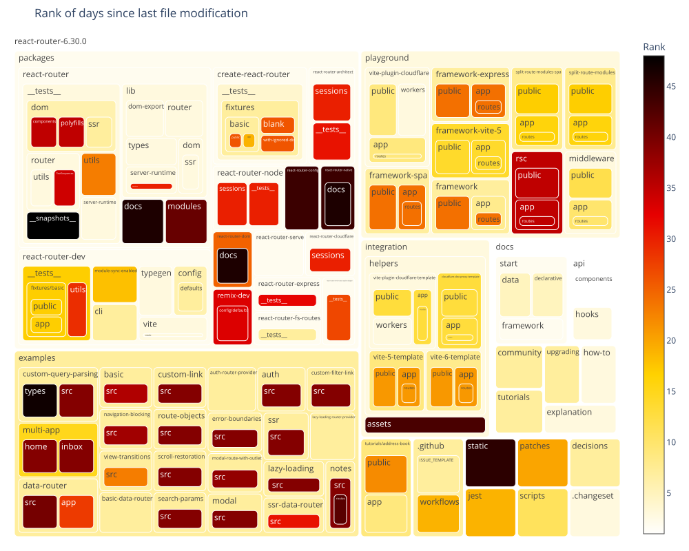
    

## Filecount per commit

Shows how many commits had changed one file, how many had changed two files, and so on.
The chart is limited to 30 lines for improved readability.
The data preview also includes overall statistics including the number of commits that are filtered out in the chart.

### Preview data

    Sum of commits that changed more than 30 files (each) = 462
    Max changed files with one commit = 1061

<table border="1" class="dataframe">
  <thead>
    <tr style="text-align: right;">
      <th></th>
      <th>filesPerCommit</th>
      <th>commitCount</th>
    </tr>
  </thead>
  <tbody>
    <tr>
      <th>count</th>
      <td>171.000000</td>
      <td>171.000000</td>
    </tr>
    <tr>
      <th>mean</th>
      <td>149.959064</td>
      <td>65.766082</td>
    </tr>
    <tr>
      <th>std</th>
      <td>193.597592</td>
      <td>390.426273</td>
    </tr>
    <tr>
      <th>min</th>
      <td>1.000000</td>
      <td>1.000000</td>
    </tr>
    <tr>
      <th>25%</th>
      <td>43.500000</td>
      <td>1.000000</td>
    </tr>
    <tr>
      <th>50%</th>
      <td>87.000000</td>
      <td>3.000000</td>
    </tr>
    <tr>
      <th>75%</th>
      <td>157.500000</td>
      <td>8.000000</td>
    </tr>
    <tr>
      <th>max</th>
      <td>1061.000000</td>
      <td>4633.000000</td>
    </tr>
  </tbody>
</table>

<table border="1" class="dataframe">
  <thead>
    <tr style="text-align: right;">
      <th></th>
      <th>filesPerCommit</th>
      <th>commitCount</th>
    </tr>
  </thead>
  <tbody>
    <tr>
      <th>0</th>
      <td>1</td>
      <td>4633</td>
    </tr>
    <tr>
      <th>1</th>
      <td>2</td>
      <td>1842</td>
    </tr>
    <tr>
      <th>2</th>
      <td>3</td>
      <td>899</td>
    </tr>
    <tr>
      <th>3</th>
      <td>4</td>
      <td>573</td>
    </tr>
    <tr>
      <th>4</th>
      <td>5</td>
      <td>499</td>
    </tr>
    <tr>
      <th>5</th>
      <td>6</td>
      <td>300</td>
    </tr>
    <tr>
      <th>6</th>
      <td>7</td>
      <td>232</td>
    </tr>
    <tr>
      <th>7</th>
      <td>8</td>
      <td>155</td>
    </tr>
    <tr>
      <th>8</th>
      <td>9</td>
      <td>116</td>
    </tr>
    <tr>
      <th>9</th>
      <td>10</td>
      <td>190</td>
    </tr>
    <tr>
      <th>10</th>
      <td>11</td>
      <td>275</td>
    </tr>
    <tr>
      <th>11</th>
      <td>12</td>
      <td>263</td>
    </tr>
    <tr>
      <th>12</th>
      <td>13</td>
      <td>102</td>
    </tr>
    <tr>
      <th>13</th>
      <td>14</td>
      <td>87</td>
    </tr>
    <tr>
      <th>14</th>
      <td>15</td>
      <td>58</td>
    </tr>
    <tr>
      <th>15</th>
      <td>16</td>
      <td>51</td>
    </tr>
    <tr>
      <th>16</th>
      <td>17</td>
      <td>46</td>
    </tr>
    <tr>
      <th>17</th>
      <td>18</td>
      <td>40</td>
    </tr>
    <tr>
      <th>18</th>
      <td>19</td>
      <td>47</td>
    </tr>
    <tr>
      <th>19</th>
      <td>20</td>
      <td>33</td>
    </tr>
    <tr>
      <th>20</th>
      <td>21</td>
      <td>36</td>
    </tr>
    <tr>
      <th>21</th>
      <td>22</td>
      <td>31</td>
    </tr>
    <tr>
      <th>22</th>
      <td>23</td>
      <td>53</td>
    </tr>
    <tr>
      <th>23</th>
      <td>24</td>
      <td>30</td>
    </tr>
    <tr>
      <th>24</th>
      <td>25</td>
      <td>30</td>
    </tr>
    <tr>
      <th>25</th>
      <td>26</td>
      <td>15</td>
    </tr>
    <tr>
      <th>26</th>
      <td>27</td>
      <td>56</td>
    </tr>
    <tr>
      <th>27</th>
      <td>28</td>
      <td>56</td>
    </tr>
    <tr>
      <th>28</th>
      <td>29</td>
      <td>19</td>
    </tr>
    <tr>
      <th>29</th>
      <td>30</td>
      <td>17</td>
    </tr>
  </tbody>
</table>

### Bar chart with the number of files per commit distribution

    
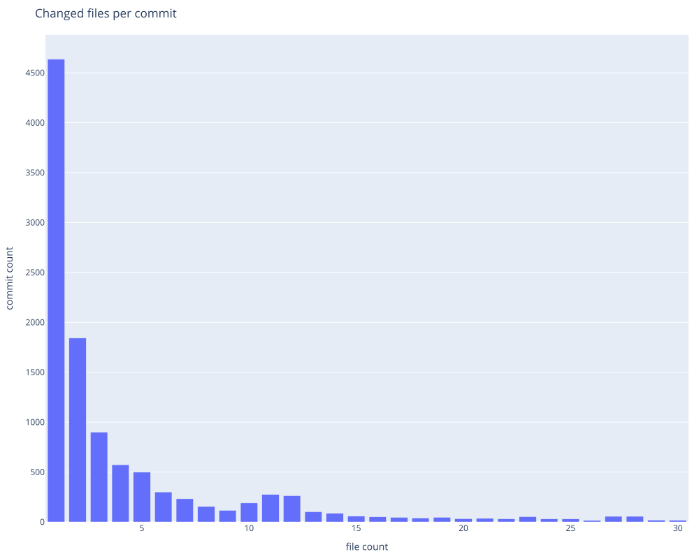
    

## WordCloud of git authors

<table border="1" class="dataframe">
  <thead>
    <tr style="text-align: right;">
      <th></th>
      <th>word</th>
      <th>frequency</th>
    </tr>
  </thead>
  <tbody>
    <tr>
      <th>0</th>
      <td>Matt Brophy</td>
      <td>2059</td>
    </tr>
    <tr>
      <th>1</th>
      <td>Michael Jackson</td>
      <td>1951</td>
    </tr>
    <tr>
      <th>2</th>
      <td>Ryan Florence</td>
      <td>1306</td>
    </tr>
    <tr>
      <th>3</th>
      <td>Chance Strickland</td>
      <td>511</td>
    </tr>
    <tr>
      <th>4</th>
      <td>Remix Run Bot</td>
      <td>493</td>
    </tr>
    <tr>
      <th>5</th>
      <td>Mark Dalgleish</td>
      <td>418</td>
    </tr>
    <tr>
      <th>6</th>
      <td>Pedro Cattori</td>
      <td>412</td>
    </tr>
    <tr>
      <th>7</th>
      <td>Jimmy Jia</td>
      <td>389</td>
    </tr>
    <tr>
      <th>8</th>
      <td>Tim Dorr</td>
      <td>388</td>
    </tr>
    <tr>
      <th>9</th>
      <td>Jacob Ebey</td>
      <td>290</td>
    </tr>
  </tbody>
</table>

    

    

