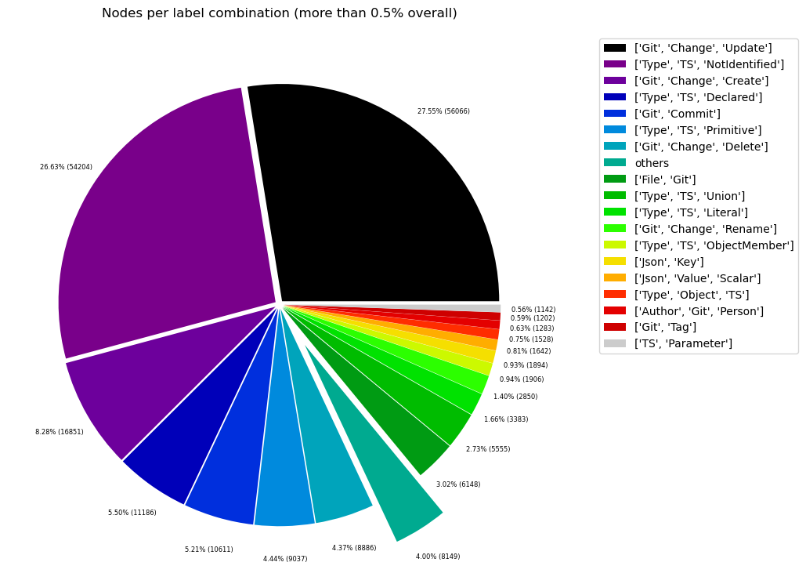
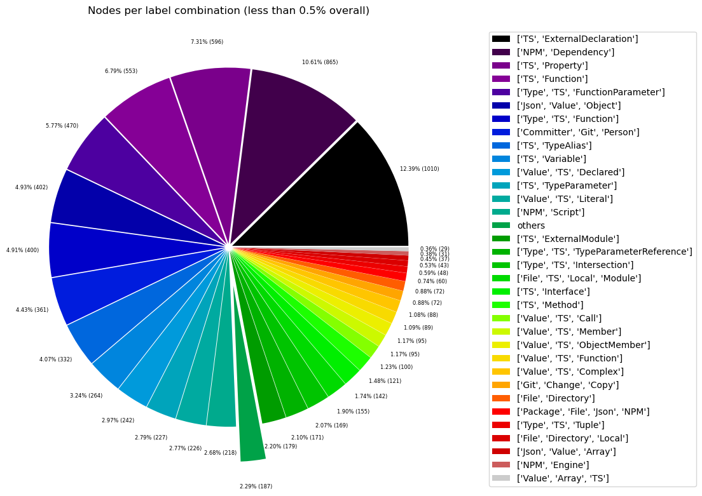
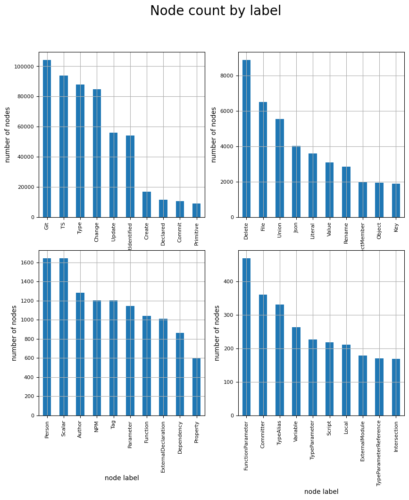
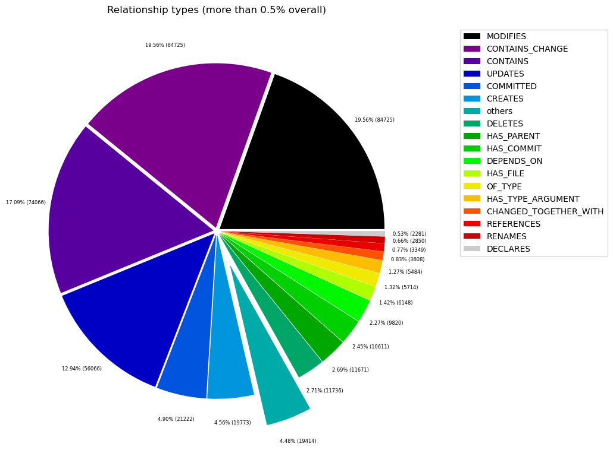
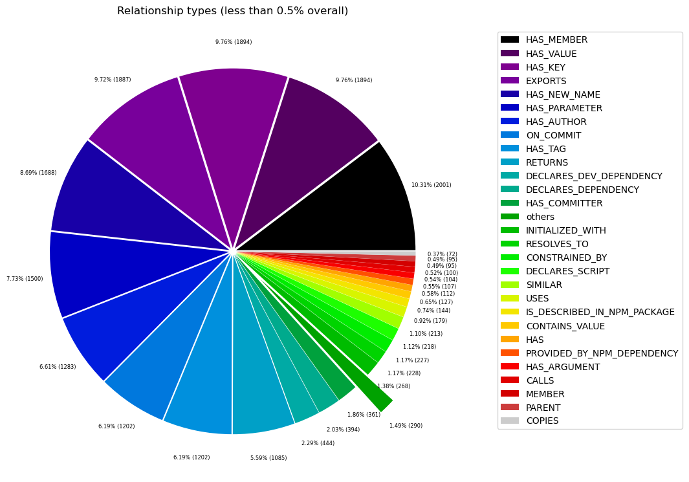

# Overview in General
   

This file contains a general overview of the data in the graph including node labels and relationships types.

### References
- [jqassistant](https://jqassistant.org)
- [Neo4j Python Driver](https://neo4j.com/docs/api/python-driver/current)

## Node Labels

### Table 1a - Highest node count by label combination

Lists the 30 label combinations with the highest number of nodes. The labels with the lowest node count are listed in table 1b.
The total list would sum up to the total number of labels (100%).

The whole table can be found in the CSV report `Node_label_combination_count`.

<table border="1" class="dataframe">
  <thead>
    <tr style="text-align: right;">
      <th></th>
      <th>nodeLabels</th>
      <th>nodesWithThatLabels</th>
      <th>nodesWithThatLabelsPercent</th>
    </tr>
  </thead>
  <tbody>
    <tr>
      <th>0</th>
      <td>[Git, Change, Update]</td>
      <td>56066</td>
      <td>27.547746</td>
    </tr>
    <tr>
      <th>1</th>
      <td>[Type, TS, NotIdentified]</td>
      <td>54204</td>
      <td>26.632862</td>
    </tr>
    <tr>
      <th>2</th>
      <td>[Git, Change, Create]</td>
      <td>16851</td>
      <td>8.279654</td>
    </tr>
    <tr>
      <th>3</th>
      <td>[Type, TS, Declared]</td>
      <td>11186</td>
      <td>5.496185</td>
    </tr>
    <tr>
      <th>4</th>
      <td>[Git, Commit]</td>
      <td>10611</td>
      <td>5.213661</td>
    </tr>
    <tr>
      <th>5</th>
      <td>[Type, TS, Primitive]</td>
      <td>9037</td>
      <td>4.440284</td>
    </tr>
    <tr>
      <th>6</th>
      <td>[Git, Change, Delete]</td>
      <td>8886</td>
      <td>4.366091</td>
    </tr>
    <tr>
      <th>7</th>
      <td>[File, Git]</td>
      <td>6148</td>
      <td>3.020789</td>
    </tr>
    <tr>
      <th>8</th>
      <td>[Type, TS, Union]</td>
      <td>5555</td>
      <td>2.729421</td>
    </tr>
    <tr>
      <th>9</th>
      <td>[Type, TS, Literal]</td>
      <td>3383</td>
      <td>1.662220</td>
    </tr>
    <tr>
      <th>10</th>
      <td>[Git, Change, Rename]</td>
      <td>2850</td>
      <td>1.400333</td>
    </tr>
    <tr>
      <th>11</th>
      <td>[Type, TS, ObjectMember]</td>
      <td>1906</td>
      <td>0.936503</td>
    </tr>
    <tr>
      <th>12</th>
      <td>[Json, Key]</td>
      <td>1894</td>
      <td>0.930607</td>
    </tr>
    <tr>
      <th>13</th>
      <td>[Json, Value, Scalar]</td>
      <td>1642</td>
      <td>0.806788</td>
    </tr>
    <tr>
      <th>14</th>
      <td>[Type, Object, TS]</td>
      <td>1528</td>
      <td>0.750775</td>
    </tr>
    <tr>
      <th>15</th>
      <td>[Author, Git, Person]</td>
      <td>1283</td>
      <td>0.630396</td>
    </tr>
    <tr>
      <th>16</th>
      <td>[Git, Tag]</td>
      <td>1202</td>
      <td>0.590597</td>
    </tr>
    <tr>
      <th>17</th>
      <td>[TS, Parameter]</td>
      <td>1142</td>
      <td>0.561116</td>
    </tr>
    <tr>
      <th>18</th>
      <td>[TS, ExternalDeclaration]</td>
      <td>1010</td>
      <td>0.496258</td>
    </tr>
    <tr>
      <th>19</th>
      <td>[NPM, Dependency]</td>
      <td>865</td>
      <td>0.425013</td>
    </tr>
    <tr>
      <th>20</th>
      <td>[TS, Property]</td>
      <td>596</td>
      <td>0.292842</td>
    </tr>
    <tr>
      <th>21</th>
      <td>[TS, Function]</td>
      <td>553</td>
      <td>0.271714</td>
    </tr>
    <tr>
      <th>22</th>
      <td>[Type, TS, FunctionParameter]</td>
      <td>470</td>
      <td>0.230932</td>
    </tr>
    <tr>
      <th>23</th>
      <td>[Json, Value, Object]</td>
      <td>402</td>
      <td>0.197521</td>
    </tr>
    <tr>
      <th>24</th>
      <td>[Type, TS, Function]</td>
      <td>400</td>
      <td>0.196538</td>
    </tr>
    <tr>
      <th>25</th>
      <td>[Committer, Git, Person]</td>
      <td>361</td>
      <td>0.177376</td>
    </tr>
    <tr>
      <th>26</th>
      <td>[TS, TypeAlias]</td>
      <td>332</td>
      <td>0.163127</td>
    </tr>
    <tr>
      <th>27</th>
      <td>[TS, Variable]</td>
      <td>264</td>
      <td>0.129715</td>
    </tr>
    <tr>
      <th>28</th>
      <td>[Value, TS, Declared]</td>
      <td>242</td>
      <td>0.118905</td>
    </tr>
    <tr>
      <th>29</th>
      <td>[TS, TypeParameter]</td>
      <td>227</td>
      <td>0.111535</td>
    </tr>
  </tbody>
</table>

### Chart 1a - Highest node count by label combination

Values under 0.5% will be grouped into "others" to get a cleaner plot. The group "others" is then broken down in Chart 1b.

    <Figure size 640x480 with 0 Axes>

    

    

### Table 1b - Lowest node count by label combination

Lists the 30 label combinations with the lowest number of nodes until they reach 0.5% of the total node count, which are shown above.

<table border="1" class="dataframe">
  <thead>
    <tr style="text-align: right;">
      <th></th>
      <th>nodeLabels</th>
      <th>nodesWithThatLabels</th>
      <th>nodesWithThatLabelsPercent</th>
    </tr>
  </thead>
  <tbody>
    <tr>
      <th>0</th>
      <td>[Analyze, Task, jQAssistant]</td>
      <td>1</td>
      <td>0.000491</td>
    </tr>
    <tr>
      <th>1</th>
      <td>[Repository, File, Git]</td>
      <td>1</td>
      <td>0.000491</td>
    </tr>
    <tr>
      <th>2</th>
      <td>[TS, Setter]</td>
      <td>1</td>
      <td>0.000491</td>
    </tr>
    <tr>
      <th>3</th>
      <td>[Git, Branch]</td>
      <td>1</td>
      <td>0.000491</td>
    </tr>
    <tr>
      <th>4</th>
      <td>[File, TS, Local, Module, TestRelated, TestEnv...</td>
      <td>2</td>
      <td>0.000983</td>
    </tr>
    <tr>
      <th>5</th>
      <td>[NPM, Overrides]</td>
      <td>2</td>
      <td>0.000983</td>
    </tr>
    <tr>
      <th>6</th>
      <td>[TS, Enum]</td>
      <td>3</td>
      <td>0.001474</td>
    </tr>
    <tr>
      <th>7</th>
      <td>[NPM, Binary]</td>
      <td>3</td>
      <td>0.001474</td>
    </tr>
    <tr>
      <th>8</th>
      <td>[File, NPM, Export]</td>
      <td>5</td>
      <td>0.002457</td>
    </tr>
    <tr>
      <th>9</th>
      <td>[TS, EnumMember]</td>
      <td>9</td>
      <td>0.004422</td>
    </tr>
    <tr>
      <th>10</th>
      <td>[NPM, BugTracker]</td>
      <td>9</td>
      <td>0.004422</td>
    </tr>
    <tr>
      <th>11</th>
      <td>[TS, AccessorProperty]</td>
      <td>11</td>
      <td>0.005405</td>
    </tr>
    <tr>
      <th>12</th>
      <td>[TS, Getter]</td>
      <td>11</td>
      <td>0.005405</td>
    </tr>
    <tr>
      <th>13</th>
      <td>[TS, Constructor]</td>
      <td>11</td>
      <td>0.005405</td>
    </tr>
    <tr>
      <th>14</th>
      <td>[File, Local]</td>
      <td>11</td>
      <td>0.005405</td>
    </tr>
    <tr>
      <th>15</th>
      <td>[Project, TS]</td>
      <td>11</td>
      <td>0.005405</td>
    </tr>
    <tr>
      <th>16</th>
      <td>[Repository, NPM]</td>
      <td>11</td>
      <td>0.005405</td>
    </tr>
    <tr>
      <th>17</th>
      <td>[TS, Class]</td>
      <td>12</td>
      <td>0.005896</td>
    </tr>
    <tr>
      <th>18</th>
      <td>[File, TS, Scan]</td>
      <td>13</td>
      <td>0.006387</td>
    </tr>
    <tr>
      <th>19</th>
      <td>[Value, Object, TS]</td>
      <td>17</td>
      <td>0.008353</td>
    </tr>
    <tr>
      <th>20</th>
      <td>[jQAssistant, Rule, Concept]</td>
      <td>19</td>
      <td>0.009336</td>
    </tr>
    <tr>
      <th>21</th>
      <td>[Value, TS, Null]</td>
      <td>23</td>
      <td>0.011301</td>
    </tr>
    <tr>
      <th>22</th>
      <td>[Value, Array, TS]</td>
      <td>29</td>
      <td>0.014249</td>
    </tr>
    <tr>
      <th>23</th>
      <td>[NPM, Engine]</td>
      <td>31</td>
      <td>0.015232</td>
    </tr>
    <tr>
      <th>24</th>
      <td>[Json, Value, Array]</td>
      <td>37</td>
      <td>0.018180</td>
    </tr>
    <tr>
      <th>25</th>
      <td>[File, Directory, Local]</td>
      <td>43</td>
      <td>0.021128</td>
    </tr>
    <tr>
      <th>26</th>
      <td>[Type, TS, Tuple]</td>
      <td>48</td>
      <td>0.023585</td>
    </tr>
    <tr>
      <th>27</th>
      <td>[Package, File, Json, NPM]</td>
      <td>60</td>
      <td>0.029481</td>
    </tr>
    <tr>
      <th>28</th>
      <td>[Git, Change, Copy]</td>
      <td>72</td>
      <td>0.035377</td>
    </tr>
    <tr>
      <th>29</th>
      <td>[File, Directory]</td>
      <td>72</td>
      <td>0.035377</td>
    </tr>
  </tbody>
</table>

### Chart 1b - Lowest node count by label combination

Shows the lowest (less than 0.5% overall) node count label combinations. Therefore, this plot breaks down the "others" slice of the pie chart above. Values under 0.01% will be grouped into "others" to get a cleaner plot.

    <Figure size 640x480 with 0 Axes>

    

    

### Table 1c - Highest node count by single label

Lists the 40 labels with the highest number of nodes.
Doesn't sum up to the total number of nodes or 100% because one node can have multiple labels.
Helps to identify commonly used labels.

<table border="1" class="dataframe">
  <thead>
    <tr style="text-align: right;">
      <th></th>
      <th>nodeLabel</th>
      <th>nodesWithThatLabel</th>
      <th>nodesWithThatLabelPercent</th>
    </tr>
  </thead>
  <tbody>
    <tr>
      <th>0</th>
      <td>Git</td>
      <td>104332</td>
      <td>51.263002</td>
    </tr>
    <tr>
      <th>1</th>
      <td>TS</td>
      <td>93866</td>
      <td>46.120586</td>
    </tr>
    <tr>
      <th>2</th>
      <td>Type</td>
      <td>88057</td>
      <td>43.266363</td>
    </tr>
    <tr>
      <th>3</th>
      <td>Change</td>
      <td>84725</td>
      <td>41.629202</td>
    </tr>
    <tr>
      <th>4</th>
      <td>Update</td>
      <td>56066</td>
      <td>27.547746</td>
    </tr>
    <tr>
      <th>5</th>
      <td>NotIdentified</td>
      <td>54204</td>
      <td>26.632862</td>
    </tr>
    <tr>
      <th>6</th>
      <td>Create</td>
      <td>16851</td>
      <td>8.279654</td>
    </tr>
    <tr>
      <th>7</th>
      <td>Declared</td>
      <td>11428</td>
      <td>5.615090</td>
    </tr>
    <tr>
      <th>8</th>
      <td>Commit</td>
      <td>10611</td>
      <td>5.213661</td>
    </tr>
    <tr>
      <th>9</th>
      <td>Primitive</td>
      <td>9037</td>
      <td>4.440284</td>
    </tr>
    <tr>
      <th>10</th>
      <td>Delete</td>
      <td>8886</td>
      <td>4.366091</td>
    </tr>
    <tr>
      <th>11</th>
      <td>File</td>
      <td>6510</td>
      <td>3.198656</td>
    </tr>
    <tr>
      <th>12</th>
      <td>Union</td>
      <td>5555</td>
      <td>2.729421</td>
    </tr>
    <tr>
      <th>13</th>
      <td>Json</td>
      <td>4035</td>
      <td>1.982577</td>
    </tr>
    <tr>
      <th>14</th>
      <td>Literal</td>
      <td>3609</td>
      <td>1.773264</td>
    </tr>
    <tr>
      <th>15</th>
      <td>Value</td>
      <td>3085</td>
      <td>1.515799</td>
    </tr>
    <tr>
      <th>16</th>
      <td>Rename</td>
      <td>2850</td>
      <td>1.400333</td>
    </tr>
    <tr>
      <th>17</th>
      <td>ObjectMember</td>
      <td>2001</td>
      <td>0.983181</td>
    </tr>
    <tr>
      <th>18</th>
      <td>Object</td>
      <td>1947</td>
      <td>0.956649</td>
    </tr>
    <tr>
      <th>19</th>
      <td>Key</td>
      <td>1894</td>
      <td>0.930607</td>
    </tr>
    <tr>
      <th>20</th>
      <td>Person</td>
      <td>1644</td>
      <td>0.807771</td>
    </tr>
    <tr>
      <th>21</th>
      <td>Scalar</td>
      <td>1642</td>
      <td>0.806788</td>
    </tr>
    <tr>
      <th>22</th>
      <td>Author</td>
      <td>1283</td>
      <td>0.630396</td>
    </tr>
    <tr>
      <th>23</th>
      <td>NPM</td>
      <td>1204</td>
      <td>0.591579</td>
    </tr>
    <tr>
      <th>24</th>
      <td>Tag</td>
      <td>1202</td>
      <td>0.590597</td>
    </tr>
    <tr>
      <th>25</th>
      <td>Parameter</td>
      <td>1142</td>
      <td>0.561116</td>
    </tr>
    <tr>
      <th>26</th>
      <td>Function</td>
      <td>1042</td>
      <td>0.511981</td>
    </tr>
    <tr>
      <th>27</th>
      <td>ExternalDeclaration</td>
      <td>1010</td>
      <td>0.496258</td>
    </tr>
    <tr>
      <th>28</th>
      <td>Dependency</td>
      <td>865</td>
      <td>0.425013</td>
    </tr>
    <tr>
      <th>29</th>
      <td>Property</td>
      <td>596</td>
      <td>0.292842</td>
    </tr>
    <tr>
      <th>30</th>
      <td>FunctionParameter</td>
      <td>470</td>
      <td>0.230932</td>
    </tr>
    <tr>
      <th>31</th>
      <td>Committer</td>
      <td>361</td>
      <td>0.177376</td>
    </tr>
    <tr>
      <th>32</th>
      <td>TypeAlias</td>
      <td>332</td>
      <td>0.163127</td>
    </tr>
    <tr>
      <th>33</th>
      <td>Variable</td>
      <td>264</td>
      <td>0.129715</td>
    </tr>
    <tr>
      <th>34</th>
      <td>TypeParameter</td>
      <td>227</td>
      <td>0.111535</td>
    </tr>
    <tr>
      <th>35</th>
      <td>Script</td>
      <td>218</td>
      <td>0.107113</td>
    </tr>
    <tr>
      <th>36</th>
      <td>Local</td>
      <td>211</td>
      <td>0.103674</td>
    </tr>
    <tr>
      <th>37</th>
      <td>ExternalModule</td>
      <td>179</td>
      <td>0.087951</td>
    </tr>
    <tr>
      <th>38</th>
      <td>TypeParameterReference</td>
      <td>171</td>
      <td>0.084020</td>
    </tr>
    <tr>
      <th>39</th>
      <td>Intersection</td>
      <td>169</td>
      <td>0.083037</td>
    </tr>
  </tbody>
</table>

### Chart 1c - Highest node count by label

Shows the 40 labels with the highest number of nodes.

    <Figure size 640x480 with 0 Axes>

    

    

## Relationship Types

### Table 2a - Highest relationship count by type

Lists the 30 relationship types with the highest number of occurrences.
The whole table can be found in the CSV report `Relationship_type_count`.

    Total number of relationships: 433263

<table border="1" class="dataframe">
  <thead>
    <tr style="text-align: right;">
      <th></th>
      <th>relationshipType</th>
      <th>nodesWithThatRelationshipType</th>
      <th>nodesWithThatRelationshipTypePercent</th>
    </tr>
  </thead>
  <tbody>
    <tr>
      <th>0</th>
      <td>CONTAINS_CHANGE</td>
      <td>84725</td>
      <td>19.555097</td>
    </tr>
    <tr>
      <th>1</th>
      <td>MODIFIES</td>
      <td>84725</td>
      <td>19.555097</td>
    </tr>
    <tr>
      <th>2</th>
      <td>CONTAINS</td>
      <td>74066</td>
      <td>17.094928</td>
    </tr>
    <tr>
      <th>3</th>
      <td>UPDATES</td>
      <td>56066</td>
      <td>12.940408</td>
    </tr>
    <tr>
      <th>4</th>
      <td>COMMITTED</td>
      <td>21222</td>
      <td>4.898180</td>
    </tr>
    <tr>
      <th>5</th>
      <td>CREATES</td>
      <td>19773</td>
      <td>4.563741</td>
    </tr>
    <tr>
      <th>6</th>
      <td>DELETES</td>
      <td>11736</td>
      <td>2.708747</td>
    </tr>
    <tr>
      <th>7</th>
      <td>HAS_PARENT</td>
      <td>11671</td>
      <td>2.693745</td>
    </tr>
    <tr>
      <th>8</th>
      <td>HAS_COMMIT</td>
      <td>10611</td>
      <td>2.449090</td>
    </tr>
    <tr>
      <th>9</th>
      <td>DEPENDS_ON</td>
      <td>9820</td>
      <td>2.266522</td>
    </tr>
    <tr>
      <th>10</th>
      <td>HAS_FILE</td>
      <td>6148</td>
      <td>1.419000</td>
    </tr>
    <tr>
      <th>11</th>
      <td>OF_TYPE</td>
      <td>5714</td>
      <td>1.318829</td>
    </tr>
    <tr>
      <th>12</th>
      <td>HAS_TYPE_ARGUMENT</td>
      <td>5484</td>
      <td>1.265744</td>
    </tr>
    <tr>
      <th>13</th>
      <td>CHANGED_TOGETHER_WITH</td>
      <td>3608</td>
      <td>0.832751</td>
    </tr>
    <tr>
      <th>14</th>
      <td>REFERENCES</td>
      <td>3349</td>
      <td>0.772972</td>
    </tr>
    <tr>
      <th>15</th>
      <td>RENAMES</td>
      <td>2850</td>
      <td>0.657799</td>
    </tr>
    <tr>
      <th>16</th>
      <td>DECLARES</td>
      <td>2281</td>
      <td>0.526470</td>
    </tr>
    <tr>
      <th>17</th>
      <td>HAS_MEMBER</td>
      <td>2001</td>
      <td>0.461844</td>
    </tr>
    <tr>
      <th>18</th>
      <td>HAS_KEY</td>
      <td>1894</td>
      <td>0.437148</td>
    </tr>
    <tr>
      <th>19</th>
      <td>HAS_VALUE</td>
      <td>1894</td>
      <td>0.437148</td>
    </tr>
    <tr>
      <th>20</th>
      <td>EXPORTS</td>
      <td>1887</td>
      <td>0.435532</td>
    </tr>
    <tr>
      <th>21</th>
      <td>HAS_NEW_NAME</td>
      <td>1688</td>
      <td>0.389602</td>
    </tr>
    <tr>
      <th>22</th>
      <td>HAS_PARAMETER</td>
      <td>1500</td>
      <td>0.346210</td>
    </tr>
    <tr>
      <th>23</th>
      <td>HAS_AUTHOR</td>
      <td>1283</td>
      <td>0.296125</td>
    </tr>
    <tr>
      <th>24</th>
      <td>HAS_TAG</td>
      <td>1202</td>
      <td>0.277430</td>
    </tr>
    <tr>
      <th>25</th>
      <td>ON_COMMIT</td>
      <td>1202</td>
      <td>0.277430</td>
    </tr>
    <tr>
      <th>26</th>
      <td>RETURNS</td>
      <td>1085</td>
      <td>0.250425</td>
    </tr>
    <tr>
      <th>27</th>
      <td>DECLARES_DEV_DEPENDENCY</td>
      <td>444</td>
      <td>0.102478</td>
    </tr>
    <tr>
      <th>28</th>
      <td>DECLARES_DEPENDENCY</td>
      <td>394</td>
      <td>0.090938</td>
    </tr>
    <tr>
      <th>29</th>
      <td>HAS_COMMITTER</td>
      <td>361</td>
      <td>0.083321</td>
    </tr>
  </tbody>
</table>

### Chart 2a - Highest relationship count by type

Values under 0.5% will be grouped into "others" to get a cleaner plot. The group "others" is then broken down in the second chart.

    <Figure size 640x480 with 0 Axes>

    

    

### Table 2b - Lowest relationship count by type

Lists the 30 relationships type with the lowest number of occurrences up to 0.5% of the total node count. This is essentially breaking down the "others" slice from the chart above.

<table border="1" class="dataframe">
  <thead>
    <tr style="text-align: right;">
      <th></th>
      <th>relationshipType</th>
      <th>nodesWithThatRelationshipType</th>
      <th>nodesWithThatRelationshipTypePercent</th>
    </tr>
  </thead>
  <tbody>
    <tr>
      <th>0</th>
      <td>IMPLEMENTS</td>
      <td>1</td>
      <td>0.000231</td>
    </tr>
    <tr>
      <th>1</th>
      <td>HAS_BRANCH</td>
      <td>1</td>
      <td>0.000231</td>
    </tr>
    <tr>
      <th>2</th>
      <td>DESCRIBED_BY_SETTER</td>
      <td>1</td>
      <td>0.000231</td>
    </tr>
    <tr>
      <th>3</th>
      <td>HAS_OVERRIDES</td>
      <td>2</td>
      <td>0.000462</td>
    </tr>
    <tr>
      <th>4</th>
      <td>HAS_HEAD</td>
      <td>2</td>
      <td>0.000462</td>
    </tr>
    <tr>
      <th>5</th>
      <td>HAS_BINARY</td>
      <td>3</td>
      <td>0.000692</td>
    </tr>
    <tr>
      <th>6</th>
      <td>REQUIRES</td>
      <td>5</td>
      <td>0.001154</td>
    </tr>
    <tr>
      <th>7</th>
      <td>HAS_BUG_TRACKER</td>
      <td>9</td>
      <td>0.002077</td>
    </tr>
    <tr>
      <th>8</th>
      <td>IN_REPOSITORY</td>
      <td>11</td>
      <td>0.002539</td>
    </tr>
    <tr>
      <th>9</th>
      <td>HAS_ROOT</td>
      <td>11</td>
      <td>0.002539</td>
    </tr>
    <tr>
      <th>10</th>
      <td>HAS_NPM_PACKAGE</td>
      <td>11</td>
      <td>0.002539</td>
    </tr>
    <tr>
      <th>11</th>
      <td>HAS_CONFIG</td>
      <td>11</td>
      <td>0.002539</td>
    </tr>
    <tr>
      <th>12</th>
      <td>DESCRIBED_BY_GETTER</td>
      <td>11</td>
      <td>0.002539</td>
    </tr>
    <tr>
      <th>13</th>
      <td>CONTAINS_PROJECT</td>
      <td>11</td>
      <td>0.002539</td>
    </tr>
    <tr>
      <th>14</th>
      <td>HAS_EXPORT</td>
      <td>15</td>
      <td>0.003462</td>
    </tr>
    <tr>
      <th>15</th>
      <td>INCLUDES_CONCEPT</td>
      <td>19</td>
      <td>0.004385</td>
    </tr>
    <tr>
      <th>16</th>
      <td>DECLARES_PEER_DEPENDENCY</td>
      <td>27</td>
      <td>0.006232</td>
    </tr>
    <tr>
      <th>17</th>
      <td>REQUIRES_CONCEPT</td>
      <td>28</td>
      <td>0.006463</td>
    </tr>
    <tr>
      <th>18</th>
      <td>DECLARES_ENGINE</td>
      <td>31</td>
      <td>0.007155</td>
    </tr>
    <tr>
      <th>19</th>
      <td>EXTENDS</td>
      <td>38</td>
      <td>0.008771</td>
    </tr>
    <tr>
      <th>20</th>
      <td>COPY_OF</td>
      <td>42</td>
      <td>0.009694</td>
    </tr>
    <tr>
      <th>21</th>
      <td>COPIES</td>
      <td>72</td>
      <td>0.016618</td>
    </tr>
    <tr>
      <th>22</th>
      <td>PARENT</td>
      <td>95</td>
      <td>0.021927</td>
    </tr>
    <tr>
      <th>23</th>
      <td>MEMBER</td>
      <td>95</td>
      <td>0.021927</td>
    </tr>
    <tr>
      <th>24</th>
      <td>CALLS</td>
      <td>100</td>
      <td>0.023081</td>
    </tr>
    <tr>
      <th>25</th>
      <td>HAS_ARGUMENT</td>
      <td>104</td>
      <td>0.024004</td>
    </tr>
    <tr>
      <th>26</th>
      <td>PROVIDED_BY_NPM_DEPENDENCY</td>
      <td>107</td>
      <td>0.024696</td>
    </tr>
    <tr>
      <th>27</th>
      <td>HAS</td>
      <td>112</td>
      <td>0.025850</td>
    </tr>
    <tr>
      <th>28</th>
      <td>CONTAINS_VALUE</td>
      <td>127</td>
      <td>0.029312</td>
    </tr>
    <tr>
      <th>29</th>
      <td>IS_DESCRIBED_IN_NPM_PACKAGE</td>
      <td>144</td>
      <td>0.033236</td>
    </tr>
  </tbody>
</table>

### Chart 2b - Lowest relationship count by type

Shows the lowest (less than 0.5% overall) relationship types. This plot breaks down the "others" slice of the pie chart above. Values under 0.01% will be grouped into "others" to get a cleaner plot.

    <Figure size 640x480 with 0 Axes>

    

    

## Node labels with their relationships

### Table 3a - Highest relationship count by node labels and relationship type

Lists the 30 node labels and their relationship types with the highest number of occurrences.

<table border="1" class="dataframe">
  <thead>
    <tr style="text-align: right;">
      <th></th>
      <th>sourceLabels</th>
      <th>relationType</th>
      <th>targetLabels</th>
      <th>numberOfRelationships</th>
      <th>numberOfNodesWithSameLabelsAsSource</th>
      <th>numberOfNodesWithSameLabelsAsTarget</th>
      <th>densityInPercent</th>
    </tr>
  </thead>
  <tbody>
    <tr>
      <th>0</th>
      <td>[Git, Change, Update]</td>
      <td>UPDATES</td>
      <td>[File, Git]</td>
      <td>56066</td>
      <td>56066</td>
      <td>6148</td>
      <td>0.016265</td>
    </tr>
    <tr>
      <th>1</th>
      <td>[Git, Change, Update]</td>
      <td>MODIFIES</td>
      <td>[File, Git]</td>
      <td>56066</td>
      <td>56066</td>
      <td>6148</td>
      <td>0.016265</td>
    </tr>
    <tr>
      <th>2</th>
      <td>[Git, Commit]</td>
      <td>CONTAINS_CHANGE</td>
      <td>[Git, Change, Update]</td>
      <td>56066</td>
      <td>10611</td>
      <td>56066</td>
      <td>0.009424</td>
    </tr>
    <tr>
      <th>3</th>
      <td>[Type, TS, Union]</td>
      <td>CONTAINS</td>
      <td>[Type, TS, NotIdentified]</td>
      <td>53911</td>
      <td>5555</td>
      <td>54204</td>
      <td>0.017904</td>
    </tr>
    <tr>
      <th>4</th>
      <td>[Git, Change, Create]</td>
      <td>MODIFIES</td>
      <td>[File, Git]</td>
      <td>16851</td>
      <td>16851</td>
      <td>6148</td>
      <td>0.016265</td>
    </tr>
    <tr>
      <th>5</th>
      <td>[Git, Change, Create]</td>
      <td>CREATES</td>
      <td>[File, Git]</td>
      <td>16851</td>
      <td>16851</td>
      <td>6148</td>
      <td>0.016265</td>
    </tr>
    <tr>
      <th>6</th>
      <td>[Git, Commit]</td>
      <td>CONTAINS_CHANGE</td>
      <td>[Git, Change, Create]</td>
      <td>16851</td>
      <td>10611</td>
      <td>16851</td>
      <td>0.009424</td>
    </tr>
    <tr>
      <th>7</th>
      <td>[Git, Commit]</td>
      <td>HAS_PARENT</td>
      <td>[Git, Commit]</td>
      <td>11671</td>
      <td>10611</td>
      <td>10611</td>
      <td>0.010366</td>
    </tr>
    <tr>
      <th>8</th>
      <td>[Repository, File, Git]</td>
      <td>HAS_COMMIT</td>
      <td>[Git, Commit]</td>
      <td>10611</td>
      <td>1</td>
      <td>10611</td>
      <td>100.000000</td>
    </tr>
    <tr>
      <th>9</th>
      <td>[Author, Git, Person]</td>
      <td>COMMITTED</td>
      <td>[Git, Commit]</td>
      <td>10611</td>
      <td>1283</td>
      <td>10611</td>
      <td>0.077942</td>
    </tr>
    <tr>
      <th>10</th>
      <td>[Committer, Git, Person]</td>
      <td>COMMITTED</td>
      <td>[Git, Commit]</td>
      <td>10611</td>
      <td>361</td>
      <td>10611</td>
      <td>0.277008</td>
    </tr>
    <tr>
      <th>11</th>
      <td>[Git, Commit]</td>
      <td>CONTAINS_CHANGE</td>
      <td>[Git, Change, Delete]</td>
      <td>8886</td>
      <td>10611</td>
      <td>8886</td>
      <td>0.009424</td>
    </tr>
    <tr>
      <th>12</th>
      <td>[Git, Change, Delete]</td>
      <td>MODIFIES</td>
      <td>[File, Git]</td>
      <td>8886</td>
      <td>8886</td>
      <td>6148</td>
      <td>0.016265</td>
    </tr>
    <tr>
      <th>13</th>
      <td>[Git, Change, Delete]</td>
      <td>DELETES</td>
      <td>[File, Git]</td>
      <td>8886</td>
      <td>8886</td>
      <td>6148</td>
      <td>0.016265</td>
    </tr>
    <tr>
      <th>14</th>
      <td>[Type, TS, Union]</td>
      <td>CONTAINS</td>
      <td>[Type, TS, Declared]</td>
      <td>8214</td>
      <td>5555</td>
      <td>11186</td>
      <td>0.013219</td>
    </tr>
    <tr>
      <th>15</th>
      <td>[Type, TS, Union]</td>
      <td>CONTAINS</td>
      <td>[Type, TS, Primitive]</td>
      <td>6366</td>
      <td>5555</td>
      <td>9037</td>
      <td>0.012681</td>
    </tr>
    <tr>
      <th>16</th>
      <td>[Repository, File, Git]</td>
      <td>HAS_FILE</td>
      <td>[File, Git]</td>
      <td>6148</td>
      <td>1</td>
      <td>6148</td>
      <td>100.000000</td>
    </tr>
    <tr>
      <th>17</th>
      <td>[Type, TS, Declared]</td>
      <td>HAS_TYPE_ARGUMENT</td>
      <td>[Type, TS, Union]</td>
      <td>4157</td>
      <td>11186</td>
      <td>5555</td>
      <td>0.006690</td>
    </tr>
    <tr>
      <th>18</th>
      <td>[File, Git]</td>
      <td>CHANGED_TOGETHER_WITH</td>
      <td>[File, Git]</td>
      <td>3149</td>
      <td>6148</td>
      <td>6148</td>
      <td>0.008331</td>
    </tr>
    <tr>
      <th>19</th>
      <td>[Type, TS, Union]</td>
      <td>CONTAINS</td>
      <td>[Type, TS, Literal]</td>
      <td>3120</td>
      <td>5555</td>
      <td>3383</td>
      <td>0.016602</td>
    </tr>
    <tr>
      <th>20</th>
      <td>[Git, Commit]</td>
      <td>CONTAINS_CHANGE</td>
      <td>[Git, Change, Rename]</td>
      <td>2850</td>
      <td>10611</td>
      <td>2850</td>
      <td>0.009424</td>
    </tr>
    <tr>
      <th>21</th>
      <td>[Git, Change, Rename]</td>
      <td>MODIFIES</td>
      <td>[File, Git]</td>
      <td>2850</td>
      <td>2850</td>
      <td>6148</td>
      <td>0.016265</td>
    </tr>
    <tr>
      <th>22</th>
      <td>[Git, Change, Rename]</td>
      <td>RENAMES</td>
      <td>[File, Git]</td>
      <td>2850</td>
      <td>2850</td>
      <td>6148</td>
      <td>0.016265</td>
    </tr>
    <tr>
      <th>23</th>
      <td>[Git, Change, Rename]</td>
      <td>CREATES</td>
      <td>[File, Git]</td>
      <td>2850</td>
      <td>2850</td>
      <td>6148</td>
      <td>0.016265</td>
    </tr>
    <tr>
      <th>24</th>
      <td>[Git, Change, Rename]</td>
      <td>DELETES</td>
      <td>[File, Git]</td>
      <td>2850</td>
      <td>2850</td>
      <td>6148</td>
      <td>0.016265</td>
    </tr>
    <tr>
      <th>25</th>
      <td>[Type, Object, TS]</td>
      <td>HAS_MEMBER</td>
      <td>[Type, TS, ObjectMember]</td>
      <td>1906</td>
      <td>1528</td>
      <td>1906</td>
      <td>0.065445</td>
    </tr>
    <tr>
      <th>26</th>
      <td>[Json, Value, Object]</td>
      <td>HAS_KEY</td>
      <td>[Json, Key]</td>
      <td>1894</td>
      <td>402</td>
      <td>1894</td>
      <td>0.248756</td>
    </tr>
    <tr>
      <th>27</th>
      <td>[File, Git]</td>
      <td>HAS_NEW_NAME</td>
      <td>[File, Git]</td>
      <td>1688</td>
      <td>6148</td>
      <td>6148</td>
      <td>0.004466</td>
    </tr>
    <tr>
      <th>28</th>
      <td>[Json, Key]</td>
      <td>HAS_VALUE</td>
      <td>[Json, Value, Scalar]</td>
      <td>1515</td>
      <td>1894</td>
      <td>1642</td>
      <td>0.048715</td>
    </tr>
    <tr>
      <th>29</th>
      <td>[Type, TS, Declared]</td>
      <td>REFERENCES</td>
      <td>[TS, ExternalDeclaration]</td>
      <td>1493</td>
      <td>11186</td>
      <td>1010</td>
      <td>0.013215</td>
    </tr>
  </tbody>
</table>

## Graph Density

    total_number_of_nodes (vertices): 203523
    total_number_of_relationships (edges): 433263
    -> total directed graph density: 1.0459881033914655e-05
    -> total directed graph density in percent: 0.0010459881033914654

