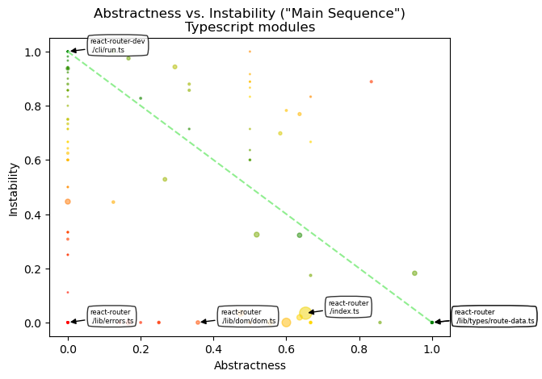

# Object Oriented Design Quality Metrics
   

### References
- [Analyze java package metrics in a graph database](https://joht.github.io/johtizen/data/2023/04/21/java-package-metrics-analysis.html)
- [Calculate metrics](https://101.jqassistant.org/calculate-metrics/index.html)
- [jqassistant](https://jqassistant.org)
- [notebook walks through examples for integrating various packages with Neo4j](https://nicolewhite.github.io/neo4j-jupyter/hello-world.html)
- [OO Design Quality Metrics](https://api.semanticscholar.org/CorpusID:18246616)
- [A Validation of Martin's Metric](https://www.researchgate.net/publication/31598248_A_Validation_of_Martin's_Metric)
- [Neo4j Python Driver](https://neo4j.com/docs/api/python-driver/current)

## Incoming Dependencies

Incoming dependencies are also denoted as "Fan-in", "Afferent Coupling" or "in-degree".
These are the ones that use the listed package. 
   
If these packages get changed, the incoming dependencies might be affected by the change. The more incoming dependencies, the harder it gets to change the code without the need to adapt the dependent code (“rigid code”). Even worse, it might affect the behavior of the dependent code in an unwanted way (“fragile code”).

Since Java Packages are organized hierarchically, incoming dependencies can be count for every package in isolation or by including all of its sub-packages. The latter one is done without top level packages like for example "org" or "org.company" by assuring that only packages are considered that have other packages or types in the same hierarchy level ("siblings").

#### Table 1a
- Show the top 20 Typescript modules with the most incoming dependencies
- Set the property "incomingDependencies" on Module nodes if not already done.

<table border="1" class="dataframe">
  <thead>
    <tr style="text-align: right;">
      <th></th>
      <th>fullQualifiedModuleName</th>
      <th>moduleName</th>
      <th>incomingDependencies</th>
      <th>incomingDependenciesWeight</th>
      <th>incomingDependentAbstractTypes</th>
      <th>incomingDependentAbstractTypeWeight</th>
      <th>incomingDependentModules</th>
      <th>incomingDependentPackages</th>
    </tr>
  </thead>
  <tbody>
    <tr>
      <th>0</th>
      <td>/home/runner/work/code-graph-analysis-examples...</td>
      <td>react-router</td>
      <td>365</td>
      <td>207956</td>
      <td>241</td>
      <td>22245</td>
      <td>34</td>
      <td>1</td>
    </tr>
    <tr>
      <th>1</th>
      <td>/home/runner/work/code-graph-analysis-examples...</td>
      <td>utils</td>
      <td>166</td>
      <td>226287</td>
      <td>99</td>
      <td>12879</td>
      <td>20</td>
      <td>1</td>
    </tr>
    <tr>
      <th>2</th>
      <td>/home/runner/work/code-graph-analysis-examples...</td>
      <td>react-router</td>
      <td>112</td>
      <td>18484</td>
      <td>53</td>
      <td>1023</td>
      <td>19</td>
      <td>1</td>
    </tr>
    <tr>
      <th>3</th>
      <td>/home/runner/work/code-graph-analysis-examples...</td>
      <td>router</td>
      <td>52</td>
      <td>92956</td>
      <td>33</td>
      <td>8640</td>
      <td>12</td>
      <td>1</td>
    </tr>
    <tr>
      <th>4</th>
      <td>/home/runner/work/code-graph-analysis-examples...</td>
      <td>utils</td>
      <td>46</td>
      <td>30690</td>
      <td>5</td>
      <td>1647</td>
      <td>3</td>
      <td>1</td>
    </tr>
    <tr>
      <th>5</th>
      <td>/home/runner/work/code-graph-analysis-examples...</td>
      <td>server</td>
      <td>40</td>
      <td>1377</td>
      <td>32</td>
      <td>57</td>
      <td>4</td>
      <td>1</td>
    </tr>
    <tr>
      <th>6</th>
      <td>/home/runner/work/code-graph-analysis-examples...</td>
      <td>history</td>
      <td>38</td>
      <td>75659</td>
      <td>16</td>
      <td>4234</td>
      <td>11</td>
      <td>1</td>
    </tr>
    <tr>
      <th>7</th>
      <td>/home/runner/work/code-graph-analysis-examples...</td>
      <td>utils</td>
      <td>36</td>
      <td>63365</td>
      <td>0</td>
      <td>0</td>
      <td>9</td>
      <td>1</td>
    </tr>
    <tr>
      <th>8</th>
      <td>/home/runner/work/code-graph-analysis-examples...</td>
      <td>routeModules</td>
      <td>27</td>
      <td>14200</td>
      <td>26</td>
      <td>1199</td>
      <td>10</td>
      <td>1</td>
    </tr>
    <tr>
      <th>9</th>
      <td>/home/runner/work/code-graph-analysis-examples...</td>
      <td>routes</td>
      <td>25</td>
      <td>8476</td>
      <td>16</td>
      <td>1702</td>
      <td>10</td>
      <td>1</td>
    </tr>
    <tr>
      <th>10</th>
      <td>/home/runner/work/code-graph-analysis-examples...</td>
      <td>context</td>
      <td>25</td>
      <td>2006</td>
      <td>16</td>
      <td>109</td>
      <td>6</td>
      <td>1</td>
    </tr>
    <tr>
      <th>11</th>
      <td>/home/runner/work/code-graph-analysis-examples...</td>
      <td>dom-export</td>
      <td>19</td>
      <td>636</td>
      <td>19</td>
      <td>21</td>
      <td>4</td>
      <td>1</td>
    </tr>
    <tr>
      <th>12</th>
      <td>/home/runner/work/code-graph-analysis-examples...</td>
      <td>cookies</td>
      <td>19</td>
      <td>9708</td>
      <td>11</td>
      <td>836</td>
      <td>4</td>
      <td>1</td>
    </tr>
    <tr>
      <th>13</th>
      <td>/home/runner/work/code-graph-analysis-examples...</td>
      <td>config</td>
      <td>16</td>
      <td>1732</td>
      <td>7</td>
      <td>20</td>
      <td>9</td>
      <td>1</td>
    </tr>
    <tr>
      <th>14</th>
      <td>/home/runner/work/code-graph-analysis-examples...</td>
      <td>vite</td>
      <td>15</td>
      <td>784</td>
      <td>0</td>
      <td>0</td>
      <td>10</td>
      <td>1</td>
    </tr>
    <tr>
      <th>15</th>
      <td>/home/runner/work/code-graph-analysis-examples...</td>
      <td>instrumentation</td>
      <td>14</td>
      <td>2856</td>
      <td>11</td>
      <td>132</td>
      <td>4</td>
      <td>1</td>
    </tr>
    <tr>
      <th>16</th>
      <td>/home/runner/work/code-graph-analysis-examples...</td>
      <td>entry</td>
      <td>11</td>
      <td>16864</td>
      <td>11</td>
      <td>1568</td>
      <td>8</td>
      <td>1</td>
    </tr>
    <tr>
      <th>17</th>
      <td>/home/runner/work/code-graph-analysis-examples...</td>
      <td>build</td>
      <td>11</td>
      <td>49144</td>
      <td>11</td>
      <td>4856</td>
      <td>4</td>
      <td>1</td>
    </tr>
    <tr>
      <th>18</th>
      <td>/home/runner/work/code-graph-analysis-examples...</td>
      <td>routes</td>
      <td>9</td>
      <td>1122</td>
      <td>3</td>
      <td>148</td>
      <td>2</td>
      <td>1</td>
    </tr>
    <tr>
      <th>19</th>
      <td>/home/runner/work/code-graph-analysis-examples...</td>
      <td>plugin</td>
      <td>9</td>
      <td>315</td>
      <td>1</td>
      <td>16</td>
      <td>3</td>
      <td>1</td>
    </tr>
  </tbody>
</table>

## Outgoing Dependencies

Outgoing dependencies are also denoted as "Fan-out", "Efferent Coupling" or "out-degree".
These are the ones that are used by the listed package. 

Code from other packages and libraries you’re depending on (outgoing) might change over time. The more outgoing changes, the more likely and frequently code changes are needed. This involves time and effort which can be reduced by automation of tests and version updates. Automated tests are crucial to reveal updates, that change the behavior of the code unexpectedly (“fragile code”). As soon as more effort is required, keeping up becomes difficult (“rigid code”). Not being able to use a newer version might not only restrict features, it can get problematic if there are security issues. This might force you to take “fast but ugly” solutions into account which further increases technical dept.

Since Java Packages are organized hierarchically, outgoing dependencies can be count for every package in isolation or by including all of its sub-packages. The latter one is done without top level packages like for example "org" or "org.company" by assuring that only packages are considered that have other packages or types in the same hierarchy level ("siblings").

#### Table 2a

- Show the top 20 Typescript modules with the most outgoing dependencies
- Set the "outgoingDependencies" properties on Module nodes if not already done

<table border="1" class="dataframe">
  <thead>
    <tr style="text-align: right;">
      <th></th>
      <th>fullQualifiedModuleName</th>
      <th>sourceName</th>
      <th>outgoingDependencies</th>
      <th>outgoingDependenciesWeight</th>
      <th>outgoingDependentAbstractTypes</th>
      <th>outgoingDependentAbstractTypeWeight</th>
      <th>outgoingDependentModules</th>
      <th>outgoingDependentPackages</th>
    </tr>
  </thead>
  <tbody>
    <tr>
      <th>0</th>
      <td>/home/runner/work/code-graph-analysis-examples...</td>
      <td>route-chunks</td>
      <td>310</td>
      <td>13344</td>
      <td>0</td>
      <td>0</td>
      <td>4</td>
      <td>0</td>
    </tr>
    <tr>
      <th>1</th>
      <td>/home/runner/work/code-graph-analysis-examples...</td>
      <td>plugin</td>
      <td>150</td>
      <td>6960</td>
      <td>0</td>
      <td>0</td>
      <td>25</td>
      <td>0</td>
    </tr>
    <tr>
      <th>2</th>
      <td>/home/runner/work/code-graph-analysis-examples...</td>
      <td>plugin</td>
      <td>54</td>
      <td>1248</td>
      <td>0</td>
      <td>0</td>
      <td>11</td>
      <td>0</td>
    </tr>
    <tr>
      <th>3</th>
      <td>/home/runner/work/code-graph-analysis-examples...</td>
      <td>config</td>
      <td>37</td>
      <td>1808</td>
      <td>0</td>
      <td>0</td>
      <td>16</td>
      <td>0</td>
    </tr>
    <tr>
      <th>4</th>
      <td>/home/runner/work/code-graph-analysis-examples...</td>
      <td>copy-template</td>
      <td>33</td>
      <td>8800</td>
      <td>0</td>
      <td>0</td>
      <td>16</td>
      <td>0</td>
    </tr>
    <tr>
      <th>5</th>
      <td>/home/runner/work/code-graph-analysis-examples...</td>
      <td>remove-exports</td>
      <td>30</td>
      <td>1776</td>
      <td>0</td>
      <td>0</td>
      <td>4</td>
      <td>0</td>
    </tr>
    <tr>
      <th>6</th>
      <td>/home/runner/work/code-graph-analysis-examples...</td>
      <td>utils</td>
      <td>29</td>
      <td>24100</td>
      <td>0</td>
      <td>0</td>
      <td>11</td>
      <td>0</td>
    </tr>
    <tr>
      <th>7</th>
      <td>/home/runner/work/code-graph-analysis-examples...</td>
      <td>with-props</td>
      <td>29</td>
      <td>720</td>
      <td>0</td>
      <td>0</td>
      <td>4</td>
      <td>0</td>
    </tr>
    <tr>
      <th>8</th>
      <td>/home/runner/work/code-graph-analysis-examples...</td>
      <td>create-react-router</td>
      <td>28</td>
      <td>8400</td>
      <td>0</td>
      <td>0</td>
      <td>14</td>
      <td>0</td>
    </tr>
    <tr>
      <th>9</th>
      <td>/home/runner/work/code-graph-analysis-examples...</td>
      <td>routes</td>
      <td>28</td>
      <td>1600</td>
      <td>0</td>
      <td>0</td>
      <td>4</td>
      <td>0</td>
    </tr>
    <tr>
      <th>10</th>
      <td>/home/runner/work/code-graph-analysis-examples...</td>
      <td>cli</td>
      <td>27</td>
      <td>2303</td>
      <td>0</td>
      <td>0</td>
      <td>13</td>
      <td>0</td>
    </tr>
    <tr>
      <th>11</th>
      <td>/home/runner/work/code-graph-analysis-examples...</td>
      <td>generate</td>
      <td>24</td>
      <td>1440</td>
      <td>0</td>
      <td>0</td>
      <td>5</td>
      <td>0</td>
    </tr>
    <tr>
      <th>12</th>
      <td>/home/runner/work/code-graph-analysis-examples...</td>
      <td>server</td>
      <td>22</td>
      <td>5746</td>
      <td>0</td>
      <td>0</td>
      <td>6</td>
      <td>0</td>
    </tr>
    <tr>
      <th>13</th>
      <td>/home/runner/work/code-graph-analysis-examples...</td>
      <td>styles</td>
      <td>22</td>
      <td>704</td>
      <td>0</td>
      <td>0</td>
      <td>5</td>
      <td>0</td>
    </tr>
    <tr>
      <th>14</th>
      <td>/home/runner/work/code-graph-analysis-examples...</td>
      <td>server</td>
      <td>19</td>
      <td>6885</td>
      <td>0</td>
      <td>0</td>
      <td>5</td>
      <td>0</td>
    </tr>
    <tr>
      <th>15</th>
      <td>/home/runner/work/code-graph-analysis-examples...</td>
      <td>worker</td>
      <td>18</td>
      <td>252</td>
      <td>0</td>
      <td>0</td>
      <td>2</td>
      <td>0</td>
    </tr>
    <tr>
      <th>16</th>
      <td>/home/runner/work/code-graph-analysis-examples...</td>
      <td>server</td>
      <td>18</td>
      <td>1984</td>
      <td>0</td>
      <td>0</td>
      <td>4</td>
      <td>0</td>
    </tr>
    <tr>
      <th>17</th>
      <td>/home/runner/work/code-graph-analysis-examples...</td>
      <td>prerender</td>
      <td>16</td>
      <td>320</td>
      <td>0</td>
      <td>0</td>
      <td>6</td>
      <td>0</td>
    </tr>
    <tr>
      <th>18</th>
      <td>/home/runner/work/code-graph-analysis-examples...</td>
      <td>commands</td>
      <td>15</td>
      <td>528</td>
      <td>0</td>
      <td>0</td>
      <td>9</td>
      <td>0</td>
    </tr>
    <tr>
      <th>19</th>
      <td>/home/runner/work/code-graph-analysis-examples...</td>
      <td>cloudflare-dev-proxy</td>
      <td>15</td>
      <td>336</td>
      <td>0</td>
      <td>0</td>
      <td>3</td>
      <td>0</td>
    </tr>
  </tbody>
</table>

## Instability

$$ Instability = \frac{Outgoing\:Dependencies}{Outgoing\:Dependencies + Incoming\:Dependencies} $$

*Instability* is expressed as the ratio of the number of outgoing dependencies of a module (i.e., the number of packages that depend on it) to the total number of dependencies (i.e., the sum of incoming and outgoing dependencies).

Small values near zero indicate low *Instability*. With no outgoing but some incoming dependencies the Instability is zero which is denoted as maximally stable. Such code units are more rigid and difficult to change without impacting other parts of the system. If they are changed less because of that, they are considered stable.

Conversely, high values approaching one indicate high *Instability*. With some outgoing dependencies but no incoming ones the *Instability* is denoted as maximally unstable. Such code units are easier to change without affecting other modules, making them more flexible and less prone to cascading changes throughout the system. If they are changed more often because of that, they are considered unstable.

Since Java Packages are organized hierarchically, *Instability* can be calculated for every package in isolation or by including all of its sub-packages. 

#### Table 3a

- Show the top 20 Typescript modules with the lowest *Instability*
- Set the property "instability" on Module nodes if not already done

<table border="1" class="dataframe">
  <thead>
    <tr style="text-align: right;">
      <th></th>
      <th>projectName</th>
      <th>fullQualifiedModuleName</th>
      <th>moduleName</th>
      <th>instability</th>
      <th>instabilityAbstractTypes</th>
      <th>instabilityModules</th>
      <th>instabilityPackages</th>
      <th>module.outgoingDependencies</th>
      <th>module.incomingDependencies</th>
      <th>module.outgoingDependentAbstractTypes</th>
      <th>module.incomingDependentAbstractTypes</th>
      <th>module.outgoingDependentModules</th>
      <th>module.incomingDependentModules</th>
      <th>module.outgoingDependentPackages</th>
      <th>module.incomingDependentPackages</th>
    </tr>
  </thead>
  <tbody>
    <tr>
      <th>0</th>
      <td>create-react-router</td>
      <td>/home/runner/work/code-graph-analysis-examples...</td>
      <td>package</td>
      <td>0.0</td>
      <td>0.0</td>
      <td>0.0</td>
      <td>0.0</td>
      <td>0</td>
      <td>0</td>
      <td>0</td>
      <td>0</td>
      <td>0</td>
      <td>0</td>
      <td>0</td>
      <td>0</td>
    </tr>
    <tr>
      <th>1</th>
      <td>create-react-router</td>
      <td>/home/runner/work/code-graph-analysis-examples...</td>
      <td>tsup</td>
      <td>0.0</td>
      <td>0.0</td>
      <td>0.0</td>
      <td>0.0</td>
      <td>0</td>
      <td>0</td>
      <td>0</td>
      <td>0</td>
      <td>0</td>
      <td>0</td>
      <td>0</td>
      <td>0</td>
    </tr>
    <tr>
      <th>2</th>
      <td>react-router-architect</td>
      <td>/home/runner/work/code-graph-analysis-examples...</td>
      <td>binaryTypes-test</td>
      <td>0.0</td>
      <td>0.0</td>
      <td>0.0</td>
      <td>0.0</td>
      <td>0</td>
      <td>0</td>
      <td>0</td>
      <td>0</td>
      <td>0</td>
      <td>0</td>
      <td>0</td>
      <td>0</td>
    </tr>
    <tr>
      <th>3</th>
      <td>react-router-architect</td>
      <td>/home/runner/work/code-graph-analysis-examples...</td>
      <td>binaryTypes</td>
      <td>0.0</td>
      <td>0.0</td>
      <td>0.0</td>
      <td>0.0</td>
      <td>0</td>
      <td>1</td>
      <td>0</td>
      <td>0</td>
      <td>0</td>
      <td>1</td>
      <td>0</td>
      <td>1</td>
    </tr>
    <tr>
      <th>4</th>
      <td>react-router-architect</td>
      <td>/home/runner/work/code-graph-analysis-examples...</td>
      <td>react-router-architect</td>
      <td>0.0</td>
      <td>0.0</td>
      <td>0.0</td>
      <td>0.0</td>
      <td>0</td>
      <td>3</td>
      <td>0</td>
      <td>2</td>
      <td>0</td>
      <td>1</td>
      <td>0</td>
      <td>1</td>
    </tr>
    <tr>
      <th>5</th>
      <td>react-router-architect</td>
      <td>/home/runner/work/code-graph-analysis-examples...</td>
      <td>tsup</td>
      <td>0.0</td>
      <td>0.0</td>
      <td>0.0</td>
      <td>0.0</td>
      <td>0</td>
      <td>0</td>
      <td>0</td>
      <td>0</td>
      <td>0</td>
      <td>0</td>
      <td>0</td>
      <td>0</td>
    </tr>
    <tr>
      <th>6</th>
      <td>react-router-cloudflare</td>
      <td>/home/runner/work/code-graph-analysis-examples...</td>
      <td>react-router-cloudflare</td>
      <td>0.0</td>
      <td>0.0</td>
      <td>0.0</td>
      <td>0.0</td>
      <td>0</td>
      <td>5</td>
      <td>0</td>
      <td>3</td>
      <td>0</td>
      <td>1</td>
      <td>0</td>
      <td>1</td>
    </tr>
    <tr>
      <th>7</th>
      <td>react-router-cloudflare</td>
      <td>/home/runner/work/code-graph-analysis-examples...</td>
      <td>tsup</td>
      <td>0.0</td>
      <td>0.0</td>
      <td>0.0</td>
      <td>0.0</td>
      <td>0</td>
      <td>0</td>
      <td>0</td>
      <td>0</td>
      <td>0</td>
      <td>0</td>
      <td>0</td>
      <td>0</td>
    </tr>
    <tr>
      <th>8</th>
      <td>react-router-dev</td>
      <td>/home/runner/work/code-graph-analysis-examples...</td>
      <td>cli</td>
      <td>0.0</td>
      <td>0.0</td>
      <td>0.0</td>
      <td>0.0</td>
      <td>0</td>
      <td>0</td>
      <td>0</td>
      <td>0</td>
      <td>0</td>
      <td>0</td>
      <td>0</td>
      <td>0</td>
    </tr>
    <tr>
      <th>9</th>
      <td>react-router-dev</td>
      <td>/home/runner/work/code-graph-analysis-examples...</td>
      <td>config</td>
      <td>0.0</td>
      <td>0.0</td>
      <td>0.0</td>
      <td>0.0</td>
      <td>0</td>
      <td>5</td>
      <td>0</td>
      <td>5</td>
      <td>0</td>
      <td>2</td>
      <td>0</td>
      <td>1</td>
    </tr>
    <tr>
      <th>10</th>
      <td>react-router-dev</td>
      <td>/home/runner/work/code-graph-analysis-examples...</td>
      <td>format</td>
      <td>0.0</td>
      <td>0.0</td>
      <td>0.0</td>
      <td>0.0</td>
      <td>0</td>
      <td>1</td>
      <td>0</td>
      <td>0</td>
      <td>0</td>
      <td>1</td>
      <td>0</td>
      <td>1</td>
    </tr>
    <tr>
      <th>11</th>
      <td>react-router-dev</td>
      <td>/home/runner/work/code-graph-analysis-examples...</td>
      <td>invariant</td>
      <td>0.0</td>
      <td>0.0</td>
      <td>0.0</td>
      <td>0.0</td>
      <td>0</td>
      <td>0</td>
      <td>0</td>
      <td>0</td>
      <td>0</td>
      <td>0</td>
      <td>0</td>
      <td>0</td>
    </tr>
    <tr>
      <th>12</th>
      <td>react-router-dev</td>
      <td>/home/runner/work/code-graph-analysis-examples...</td>
      <td>manifest</td>
      <td>0.0</td>
      <td>0.0</td>
      <td>0.0</td>
      <td>0.0</td>
      <td>0</td>
      <td>2</td>
      <td>0</td>
      <td>2</td>
      <td>0</td>
      <td>1</td>
      <td>0</td>
      <td>1</td>
    </tr>
    <tr>
      <th>13</th>
      <td>react-router-dev</td>
      <td>/home/runner/work/code-graph-analysis-examples...</td>
      <td>package</td>
      <td>0.0</td>
      <td>0.0</td>
      <td>0.0</td>
      <td>0.0</td>
      <td>0</td>
      <td>0</td>
      <td>0</td>
      <td>0</td>
      <td>0</td>
      <td>0</td>
      <td>0</td>
      <td>0</td>
    </tr>
    <tr>
      <th>14</th>
      <td>react-router-dev</td>
      <td>/home/runner/work/code-graph-analysis-examples...</td>
      <td>routes</td>
      <td>0.0</td>
      <td>0.0</td>
      <td>0.0</td>
      <td>0.0</td>
      <td>0</td>
      <td>9</td>
      <td>0</td>
      <td>3</td>
      <td>0</td>
      <td>2</td>
      <td>0</td>
      <td>1</td>
    </tr>
    <tr>
      <th>15</th>
      <td>react-router-dev</td>
      <td>/home/runner/work/code-graph-analysis-examples...</td>
      <td>rsc-types</td>
      <td>0.0</td>
      <td>0.0</td>
      <td>0.0</td>
      <td>0.0</td>
      <td>0</td>
      <td>0</td>
      <td>0</td>
      <td>0</td>
      <td>0</td>
      <td>0</td>
      <td>0</td>
      <td>0</td>
    </tr>
    <tr>
      <th>16</th>
      <td>react-router-dev</td>
      <td>/home/runner/work/code-graph-analysis-examples...</td>
      <td>tsup</td>
      <td>0.0</td>
      <td>0.0</td>
      <td>0.0</td>
      <td>0.0</td>
      <td>0</td>
      <td>0</td>
      <td>0</td>
      <td>0</td>
      <td>0</td>
      <td>0</td>
      <td>0</td>
      <td>0</td>
    </tr>
    <tr>
      <th>17</th>
      <td>react-router-dev</td>
      <td>/home/runner/work/code-graph-analysis-examples...</td>
      <td>context</td>
      <td>0.0</td>
      <td>0.0</td>
      <td>0.0</td>
      <td>0.0</td>
      <td>0</td>
      <td>3</td>
      <td>0</td>
      <td>2</td>
      <td>0</td>
      <td>2</td>
      <td>0</td>
      <td>1</td>
    </tr>
    <tr>
      <th>18</th>
      <td>react-router-dev</td>
      <td>/home/runner/work/code-graph-analysis-examples...</td>
      <td>params</td>
      <td>0.0</td>
      <td>0.0</td>
      <td>0.0</td>
      <td>0.0</td>
      <td>0</td>
      <td>1</td>
      <td>0</td>
      <td>0</td>
      <td>0</td>
      <td>1</td>
      <td>0</td>
      <td>1</td>
    </tr>
    <tr>
      <th>19</th>
      <td>react-router-dev</td>
      <td>/home/runner/work/code-graph-analysis-examples...</td>
      <td>route</td>
      <td>0.0</td>
      <td>0.0</td>
      <td>0.0</td>
      <td>0.0</td>
      <td>0</td>
      <td>2</td>
      <td>0</td>
      <td>0</td>
      <td>0</td>
      <td>1</td>
      <td>0</td>
      <td>1</td>
    </tr>
  </tbody>
</table>

## Abstractness

$$ Abstractness = \frac{abstract\:classes\:in\:category}{total\:number\:of\:classes\:in\:category} $$

Package *Abstractness* is expressed as the ratio of the number of abstract classes and interfaces to the total number of classes of a package.

Zero *Abstractness* means that there are no abstract types or interfaces in the package. On the other hand, a value of one means that there are only abstract types.

Since Java Packages are organized hierarchically, *Abstractness* can be calculated for every package in isolation or by including all of its sub-packages. 

#### Table 4a

- Show the top 30 Typescript modules with the lowest *Abstractness*
- Set the property "abstractness" on Module nodes if not already done.

    Received notification from DBMS server: {severity: WARNING} {code: Neo.ClientNotification.Statement.UnknownPropertyKeyWarning} {category: UNRECOGNIZED} {title: The provided property key is not in the database} {description: One of the property names in your query is not available in the database, make sure you didn't misspell it or that the label is available when you run this statement in your application (the missing property name is: numberAbstractTypes)} {position: line: 10, column: 16, offset: 500} for query: "// Get Typscript Modules with the lowest abstractness first (if set before)\n \n MATCH (module:TS:Module)\n WHERE module.abstractness IS NOT NULL \n OPTIONAL MATCH (projectdir:Directory)<-[:HAS_ROOT]-(project:TS:Project)-[:CONTAINS]->(module)\n RETURN reverse(split(reverse(projectdir.absoluteFileName), '/')[0]) AS projectName\n       ,module.globalFqn           AS fullQualifiedModuleName\n       ,module.name                AS moduleName\n       ,module.abstractness        AS abstractness\n       ,module.numberAbstractTypes AS numberAbstractTypes\n       ,module.numberTypes         AS numberTypes\n ORDER BY abstractness ASC, numberTypes DESC\nLIMIT 20"

    Received notification from DBMS server: {severity: WARNING} {code: Neo.ClientNotification.Statement.UnknownPropertyKeyWarning} {category: UNRECOGNIZED} {title: The provided property key is not in the database} {description: One of the property names in your query is not available in the database, make sure you didn't misspell it or that the label is available when you run this statement in your application (the missing property name is: numberTypes)} {position: line: 11, column: 16, offset: 558} for query: "// Get Typscript Modules with the lowest abstractness first (if set before)\n \n MATCH (module:TS:Module)\n WHERE module.abstractness IS NOT NULL \n OPTIONAL MATCH (projectdir:Directory)<-[:HAS_ROOT]-(project:TS:Project)-[:CONTAINS]->(module)\n RETURN reverse(split(reverse(projectdir.absoluteFileName), '/')[0]) AS projectName\n       ,module.globalFqn           AS fullQualifiedModuleName\n       ,module.name                AS moduleName\n       ,module.abstractness        AS abstractness\n       ,module.numberAbstractTypes AS numberAbstractTypes\n       ,module.numberTypes         AS numberTypes\n ORDER BY abstractness ASC, numberTypes DESC\nLIMIT 20"

<table border="1" class="dataframe">
  <thead>
    <tr style="text-align: right;">
      <th></th>
      <th>projectName</th>
      <th>fullQualifiedModuleName</th>
      <th>moduleName</th>
      <th>abstractness</th>
      <th>numberAbstractTypes</th>
      <th>numberTypes</th>
    </tr>
  </thead>
  <tbody>
    <tr>
      <th>0</th>
      <td>react-router-architect</td>
      <td>/home/runner/work/code-graph-analysis-examples...</td>
      <td>binaryTypes</td>
      <td>0.0</td>
      <td>None</td>
      <td>None</td>
    </tr>
    <tr>
      <th>1</th>
      <td>react-router-architect</td>
      <td>/home/runner/work/code-graph-analysis-examples...</td>
      <td>tsup</td>
      <td>0.0</td>
      <td>None</td>
      <td>None</td>
    </tr>
    <tr>
      <th>2</th>
      <td>react-router-architect</td>
      <td>/home/runner/work/code-graph-analysis-examples...</td>
      <td>binaryTypes-test</td>
      <td>0.0</td>
      <td>None</td>
      <td>None</td>
    </tr>
    <tr>
      <th>3</th>
      <td>react-router-architect</td>
      <td>/home/runner/work/code-graph-analysis-examples...</td>
      <td>server-test</td>
      <td>0.0</td>
      <td>None</td>
      <td>None</td>
    </tr>
    <tr>
      <th>4</th>
      <td>react-router-architect</td>
      <td>/home/runner/work/code-graph-analysis-examples...</td>
      <td>arcTableSessionStorage</td>
      <td>0.0</td>
      <td>None</td>
      <td>None</td>
    </tr>
    <tr>
      <th>5</th>
      <td>create-react-router</td>
      <td>/home/runner/work/code-graph-analysis-examples...</td>
      <td>cli</td>
      <td>0.0</td>
      <td>None</td>
      <td>None</td>
    </tr>
    <tr>
      <th>6</th>
      <td>create-react-router</td>
      <td>/home/runner/work/code-graph-analysis-examples...</td>
      <td>copy-template</td>
      <td>0.0</td>
      <td>None</td>
      <td>None</td>
    </tr>
    <tr>
      <th>7</th>
      <td>create-react-router</td>
      <td>/home/runner/work/code-graph-analysis-examples...</td>
      <td>loading-indicator</td>
      <td>0.0</td>
      <td>None</td>
      <td>None</td>
    </tr>
    <tr>
      <th>8</th>
      <td>create-react-router</td>
      <td>/home/runner/work/code-graph-analysis-examples...</td>
      <td>prompt</td>
      <td>0.0</td>
      <td>None</td>
      <td>None</td>
    </tr>
    <tr>
      <th>9</th>
      <td>create-react-router</td>
      <td>/home/runner/work/code-graph-analysis-examples...</td>
      <td>tsup</td>
      <td>0.0</td>
      <td>None</td>
      <td>None</td>
    </tr>
    <tr>
      <th>10</th>
      <td>create-react-router</td>
      <td>/home/runner/work/code-graph-analysis-examples...</td>
      <td>utils</td>
      <td>0.0</td>
      <td>None</td>
      <td>None</td>
    </tr>
    <tr>
      <th>11</th>
      <td>create-react-router</td>
      <td>/home/runner/work/code-graph-analysis-examples...</td>
      <td>package</td>
      <td>0.0</td>
      <td>None</td>
      <td>None</td>
    </tr>
    <tr>
      <th>12</th>
      <td>react-router</td>
      <td>/home/runner/work/code-graph-analysis-examples...</td>
      <td>react-router</td>
      <td>0.0</td>
      <td>None</td>
      <td>None</td>
    </tr>
    <tr>
      <th>13</th>
      <td>react-router</td>
      <td>/home/runner/work/code-graph-analysis-examples...</td>
      <td>tsup</td>
      <td>0.0</td>
      <td>None</td>
      <td>None</td>
    </tr>
    <tr>
      <th>14</th>
      <td>react-router</td>
      <td>/home/runner/work/code-graph-analysis-examples...</td>
      <td>tsup</td>
      <td>0.0</td>
      <td>None</td>
      <td>None</td>
    </tr>
    <tr>
      <th>15</th>
      <td>react-router</td>
      <td>/home/runner/work/code-graph-analysis-examples...</td>
      <td>actions</td>
      <td>0.0</td>
      <td>None</td>
      <td>None</td>
    </tr>
    <tr>
      <th>16</th>
      <td>react-router</td>
      <td>/home/runner/work/code-graph-analysis-examples...</td>
      <td>errors</td>
      <td>0.0</td>
      <td>None</td>
      <td>None</td>
    </tr>
    <tr>
      <th>17</th>
      <td>react-router</td>
      <td>/home/runner/work/code-graph-analysis-examples...</td>
      <td>href</td>
      <td>0.0</td>
      <td>None</td>
      <td>None</td>
    </tr>
    <tr>
      <th>18</th>
      <td>react-router</td>
      <td>/home/runner/work/code-graph-analysis-examples...</td>
      <td>data</td>
      <td>0.0</td>
      <td>None</td>
      <td>None</td>
    </tr>
    <tr>
      <th>19</th>
      <td>react-router</td>
      <td>/home/runner/work/code-graph-analysis-examples...</td>
      <td>errors</td>
      <td>0.0</td>
      <td>None</td>
      <td>None</td>
    </tr>
  </tbody>
</table>

## Distance from the main sequence

The *main sequence* is a imaginary line that represents a good compromise between *Abstractness* and *Instability*. A high distance to this line may indicate problems. For example is very *stable* (rigid) code with low abstractness hard to change.

Read more details on that in [OO Design Quality Metrics](https://api.semanticscholar.org/CorpusID:18246616) and [Calculate metrics](https://101.jqassistant.org/calculate-metrics/index.html).

#### Table 5a

- Show the top 30 Typescript modules with the highest distance from the "main sequence"

<table border="1" class="dataframe">
  <thead>
    <tr style="text-align: right;">
      <th></th>
      <th>artifactName</th>
      <th>fullQualifiedName</th>
      <th>name</th>
      <th>distance</th>
      <th>abstractness</th>
      <th>instability</th>
      <th>elementsCount</th>
    </tr>
  </thead>
  <tbody>
    <tr>
      <th>0</th>
      <td>react-router</td>
      <td>/home/runner/work/code-graph-analysis-examples...</td>
      <td>./lib/errors.ts</td>
      <td>1.0</td>
      <td>0.0</td>
      <td>0.0</td>
      <td>4</td>
    </tr>
    <tr>
      <th>1</th>
      <td>react-router</td>
      <td>/home/runner/work/code-graph-analysis-examples...</td>
      <td>./lib/dom/ssr/invariant.ts</td>
      <td>1.0</td>
      <td>0.0</td>
      <td>0.0</td>
      <td>3</td>
    </tr>
    <tr>
      <th>2</th>
      <td>react-router</td>
      <td>/home/runner/work/code-graph-analysis-examples...</td>
      <td>./lib/server-runtime/invariant.ts</td>
      <td>1.0</td>
      <td>0.0</td>
      <td>0.0</td>
      <td>3</td>
    </tr>
    <tr>
      <th>3</th>
      <td>react-router-dev</td>
      <td>/home/runner/work/code-graph-analysis-examples...</td>
      <td>./invariant.ts</td>
      <td>1.0</td>
      <td>0.0</td>
      <td>0.0</td>
      <td>3</td>
    </tr>
    <tr>
      <th>4</th>
      <td>react-router</td>
      <td>/home/runner/work/code-graph-analysis-examples...</td>
      <td>./lib/rsc/route-modules.ts</td>
      <td>1.0</td>
      <td>0.0</td>
      <td>0.0</td>
      <td>2</td>
    </tr>
    <tr>
      <th>5</th>
      <td>react-router</td>
      <td>/home/runner/work/code-graph-analysis-examples...</td>
      <td>./lib/server-runtime/crypto.ts</td>
      <td>1.0</td>
      <td>0.0</td>
      <td>0.0</td>
      <td>2</td>
    </tr>
    <tr>
      <th>6</th>
      <td>react-router</td>
      <td>/home/runner/work/code-graph-analysis-examples...</td>
      <td>./lib/server-runtime/mode.ts</td>
      <td>1.0</td>
      <td>0.0</td>
      <td>0.0</td>
      <td>2</td>
    </tr>
    <tr>
      <th>7</th>
      <td>react-router</td>
      <td>/home/runner/work/code-graph-analysis-examples...</td>
      <td>./vendor/turbo-stream-v2/turbo-stream.ts</td>
      <td>1.0</td>
      <td>0.0</td>
      <td>0.0</td>
      <td>2</td>
    </tr>
    <tr>
      <th>8</th>
      <td>react-router-dev</td>
      <td>/home/runner/work/code-graph-analysis-examples...</td>
      <td>./vite.ts</td>
      <td>1.0</td>
      <td>0.0</td>
      <td>0.0</td>
      <td>2</td>
    </tr>
    <tr>
      <th>9</th>
      <td>react-router-dev</td>
      <td>/home/runner/work/code-graph-analysis-examples...</td>
      <td>./typegen/route.ts</td>
      <td>1.0</td>
      <td>0.0</td>
      <td>0.0</td>
      <td>2</td>
    </tr>
    <tr>
      <th>10</th>
      <td>react-router-architect</td>
      <td>/home/runner/work/code-graph-analysis-examples...</td>
      <td>./binaryTypes.ts</td>
      <td>1.0</td>
      <td>0.0</td>
      <td>0.0</td>
      <td>1</td>
    </tr>
    <tr>
      <th>11</th>
      <td>react-router</td>
      <td>/home/runner/work/code-graph-analysis-examples...</td>
      <td>./lib/actions.ts</td>
      <td>1.0</td>
      <td>0.0</td>
      <td>0.0</td>
      <td>1</td>
    </tr>
    <tr>
      <th>12</th>
      <td>react-router</td>
      <td>/home/runner/work/code-graph-analysis-examples...</td>
      <td>./lib/href.ts</td>
      <td>1.0</td>
      <td>0.0</td>
      <td>0.0</td>
      <td>1</td>
    </tr>
    <tr>
      <th>13</th>
      <td>react-router</td>
      <td>/home/runner/work/code-graph-analysis-examples...</td>
      <td>./lib/dom/ssr/data.ts</td>
      <td>1.0</td>
      <td>0.0</td>
      <td>0.0</td>
      <td>1</td>
    </tr>
    <tr>
      <th>14</th>
      <td>react-router</td>
      <td>/home/runner/work/code-graph-analysis-examples...</td>
      <td>./lib/dom/ssr/errors.ts</td>
      <td>1.0</td>
      <td>0.0</td>
      <td>0.0</td>
      <td>1</td>
    </tr>
    <tr>
      <th>15</th>
      <td>react-router</td>
      <td>/home/runner/work/code-graph-analysis-examples...</td>
      <td>./lib/dom/ssr/markup.ts</td>
      <td>1.0</td>
      <td>0.0</td>
      <td>0.0</td>
      <td>1</td>
    </tr>
    <tr>
      <th>16</th>
      <td>react-router</td>
      <td>/home/runner/work/code-graph-analysis-examples...</td>
      <td>./lib/rsc/html-stream/browser.ts</td>
      <td>1.0</td>
      <td>0.0</td>
      <td>0.0</td>
      <td>1</td>
    </tr>
    <tr>
      <th>17</th>
      <td>react-router</td>
      <td>/home/runner/work/code-graph-analysis-examples...</td>
      <td>./lib/rsc/html-stream/server.ts</td>
      <td>1.0</td>
      <td>0.0</td>
      <td>0.0</td>
      <td>1</td>
    </tr>
    <tr>
      <th>18</th>
      <td>react-router</td>
      <td>/home/runner/work/code-graph-analysis-examples...</td>
      <td>./lib/server-runtime/entry.ts</td>
      <td>1.0</td>
      <td>0.0</td>
      <td>0.0</td>
      <td>1</td>
    </tr>
    <tr>
      <th>19</th>
      <td>react-router</td>
      <td>/home/runner/work/code-graph-analysis-examples...</td>
      <td>./lib/server-runtime/warnings.ts</td>
      <td>1.0</td>
      <td>0.0</td>
      <td>0.0</td>
      <td>1</td>
    </tr>
    <tr>
      <th>20</th>
      <td>react-router</td>
      <td>/home/runner/work/code-graph-analysis-examples...</td>
      <td>./vendor/turbo-stream-v2/flatten.ts</td>
      <td>1.0</td>
      <td>0.0</td>
      <td>0.0</td>
      <td>1</td>
    </tr>
    <tr>
      <th>21</th>
      <td>react-router</td>
      <td>/home/runner/work/code-graph-analysis-examples...</td>
      <td>./vendor/turbo-stream-v2/unflatten.ts</td>
      <td>1.0</td>
      <td>0.0</td>
      <td>0.0</td>
      <td>1</td>
    </tr>
    <tr>
      <th>22</th>
      <td>react-router-dev</td>
      <td>/home/runner/work/code-graph-analysis-examples...</td>
      <td>./typegen/params.ts</td>
      <td>1.0</td>
      <td>0.0</td>
      <td>0.0</td>
      <td>1</td>
    </tr>
    <tr>
      <th>23</th>
      <td>react-router-dev</td>
      <td>/home/runner/work/code-graph-analysis-examples...</td>
      <td>./vite/cloudflare.ts</td>
      <td>1.0</td>
      <td>0.0</td>
      <td>0.0</td>
      <td>1</td>
    </tr>
    <tr>
      <th>24</th>
      <td>react-router-dev</td>
      <td>/home/runner/work/code-graph-analysis-examples...</td>
      <td>./vite/combine-urls.ts</td>
      <td>1.0</td>
      <td>0.0</td>
      <td>0.0</td>
      <td>1</td>
    </tr>
    <tr>
      <th>25</th>
      <td>react-router-dev</td>
      <td>/home/runner/work/code-graph-analysis-examples...</td>
      <td>./vite/ssr-externals.ts</td>
      <td>1.0</td>
      <td>0.0</td>
      <td>0.0</td>
      <td>1</td>
    </tr>
    <tr>
      <th>26</th>
      <td>react-router-dev</td>
      <td>/home/runner/work/code-graph-analysis-examples...</td>
      <td>./vite/virtual-module.ts</td>
      <td>1.0</td>
      <td>0.0</td>
      <td>0.0</td>
      <td>1</td>
    </tr>
    <tr>
      <th>27</th>
      <td>react-router-remix-routes-option-adapter</td>
      <td>/home/runner/work/code-graph-analysis-examples...</td>
      <td>./index.ts</td>
      <td>1.0</td>
      <td>0.0</td>
      <td>0.0</td>
      <td>1</td>
    </tr>
    <tr>
      <th>28</th>
      <td>react-router-architect</td>
      <td>/home/runner/work/code-graph-analysis-examples...</td>
      <td>./tsup.config.ts</td>
      <td>1.0</td>
      <td>0.0</td>
      <td>0.0</td>
      <td>0</td>
    </tr>
    <tr>
      <th>29</th>
      <td>react-router-architect</td>
      <td>/home/runner/work/code-graph-analysis-examples...</td>
      <td>./__tests__/binaryTypes-test.ts</td>
      <td>1.0</td>
      <td>0.0</td>
      <td>0.0</td>
      <td>0</td>
    </tr>
  </tbody>
</table>

### *Abstractness* vs. *Instability* Plot with "Main Sequence" line as reference

- Plot *Abstractness* vs. *Instability* of all packages
- Draw the "main sequence" as dashed green diagonal line 
- Scale the packages by the number of types they contain
- Color the packages by their distance to the "main sequence" (blue=near, red=far)

#### Figure 5a - Typescript Modules

    

    

