# 📊 Archetypes Report

## 1. Executive Overview

This report classifies code units into structural archetypes based on graph-based features.
The goal is to identify code that plays a distinctive structural role — such as being a widely-referenced authority, a critical bottleneck, or a highly-connected hub — using centrality and clustering metrics.

## 📚 Table of Contents

1. [Executive Overview](#1-executive-overview)
1. [Deep Dives by Abstraction Level](#2-deep-dives-by-abstraction-level)

---

### 1.1 Archetypes in total

| Analyzed Units | Authorities | Bottlenecks | Hubs |
| --- | --- | --- | --- |
| 224 | 10 | 10 | 4 |

### 1.2 Overview of Analyzed Structures

| Abstraction Level | Units | Authorities | Bottlenecks | Hubs |
| --- | --- | --- | --- | --- |
| TS,Local,Module | 157 | 10 | 10 | 4 |
| Package,Json,NPM | 56 | 0 | 0 | 0 |
| Package,Json,NPM,NpmNonDevPackage | 7 | 0 | 0 | 0 |
| Package,Json,NPM,NpmDevPackage | 2 | 0 | 0 | 0 |
| TS,Local,Module,TestRelated,TestEnvironment | 2 | 0 | 0 | 0 |

### 1.3 Overview Charts

#### Treemap Charts

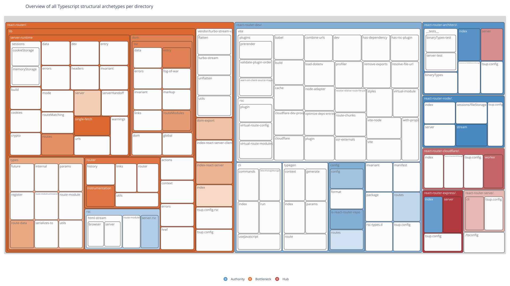

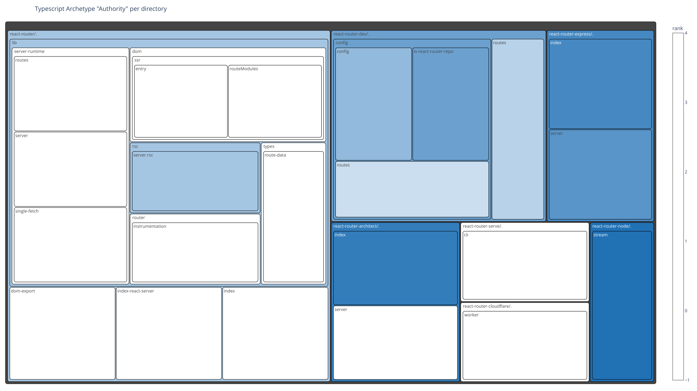

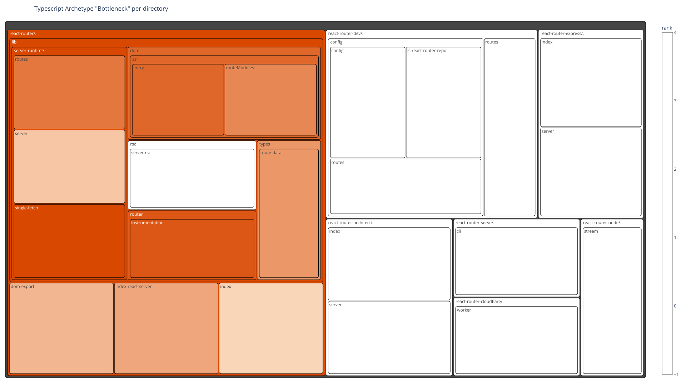

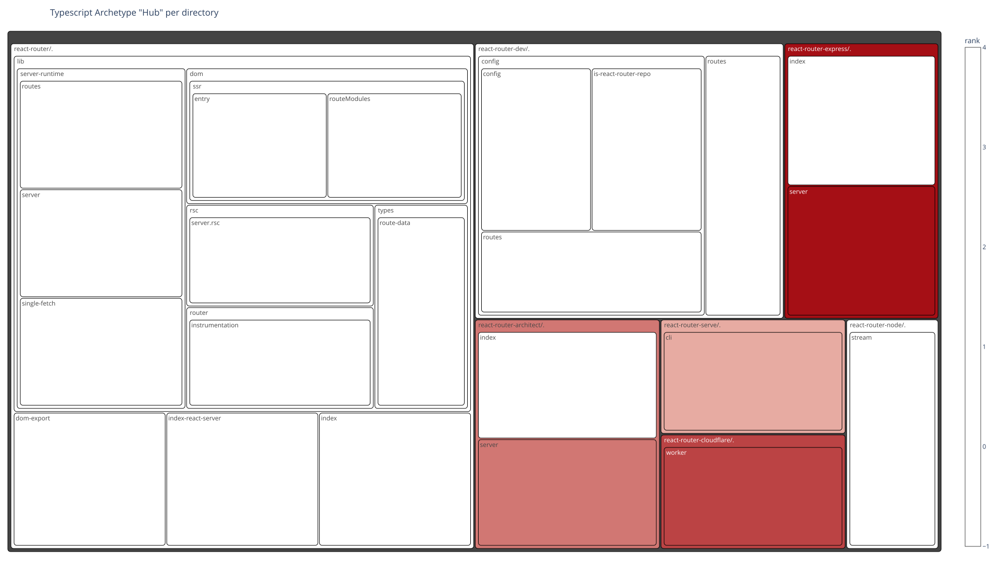

---

## 2. Deep Dives by Abstraction Level

### 2.1 Typescript Module

#### Archetype Distribution

| Archetype | Count | Max. Rank | Examples |
| --- | --- | --- | --- |
| Authority | 10 | 10 | /home/runner/work/code-graph-analysis-examples/code-graph-analysis-examples/temp/react-router-7.15.1/source/react-router-7.15.1/packages/react-router-dev/config/routes.ts, /home/runner/work/code-graph-analysis-examples/code-graph-analysis-examples/temp/react-router-7.15.1/source/react-router-7.15.1/packages/react-router-dev/routes.ts, /home/runner/work/code-graph-analysis-examples/code-graph-analysis-examples/temp/react-router-7.15.1/source/react-router-7.15.1/packages/react-router/lib/rsc/server.rsc.ts |
| Bottleneck | 10 | 10 | /home/runner/work/code-graph-analysis-examples/code-graph-analysis-examples/temp/react-router-7.15.1/source/react-router-7.15.1/packages/react-router/index.ts, /home/runner/work/code-graph-analysis-examples/code-graph-analysis-examples/temp/react-router-7.15.1/source/react-router-7.15.1/packages/react-router/lib/server-runtime/server.ts, /home/runner/work/code-graph-analysis-examples/code-graph-analysis-examples/temp/react-router-7.15.1/source/react-router-7.15.1/packages/react-router/dom-export.ts |
| Hub | 4 | 4 | /home/runner/work/code-graph-analysis-examples/code-graph-analysis-examples/temp/react-router-7.15.1/source/react-router-7.15.1/packages/react-router-serve/cli.ts, /home/runner/work/code-graph-analysis-examples/code-graph-analysis-examples/temp/react-router-7.15.1/source/react-router-7.15.1/packages/react-router-architect/server.ts, /home/runner/work/code-graph-analysis-examples/code-graph-analysis-examples/temp/react-router-7.15.1/source/react-router-7.15.1/packages/react-router-cloudflare/worker.ts |

#### Graph Visualizations

#### Graph Visualizations

##### TopBottleneck Graph Visualizations

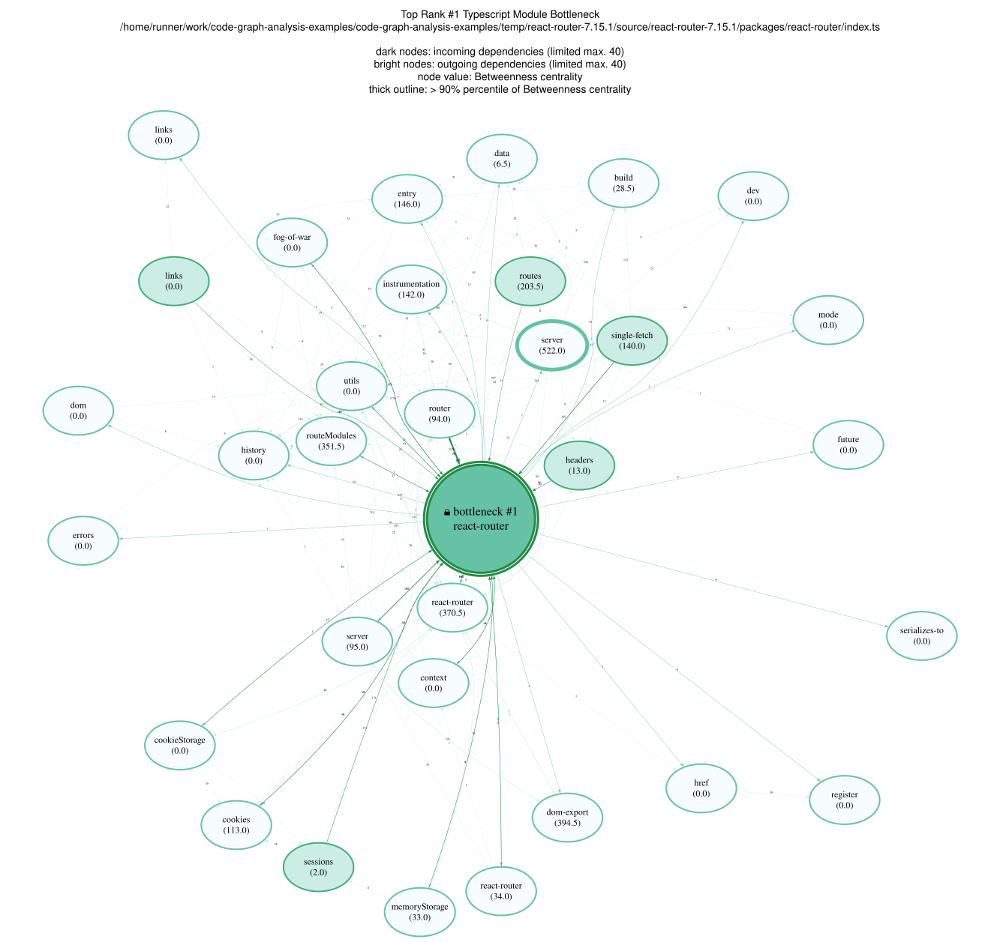

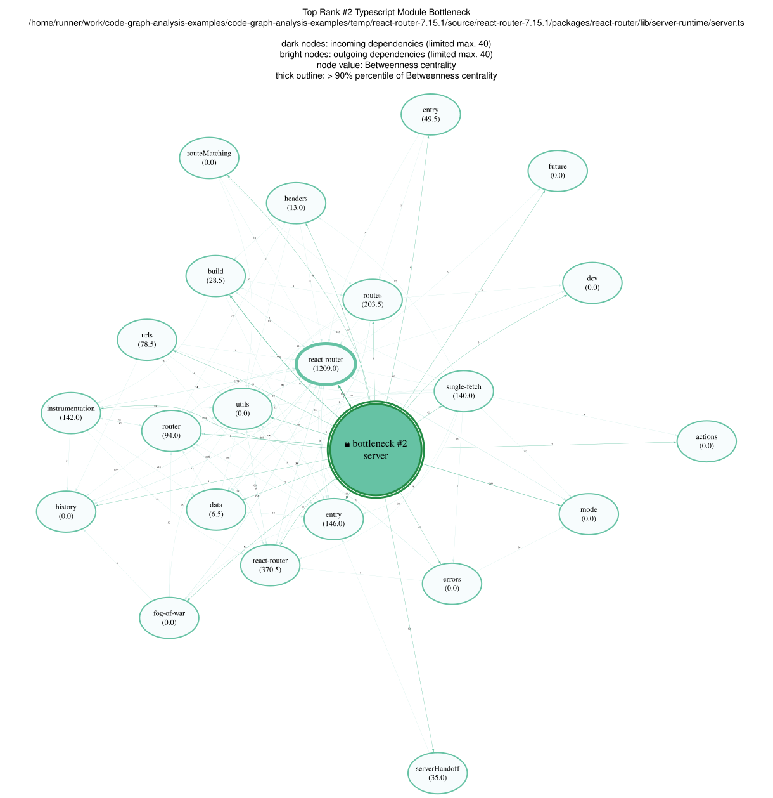

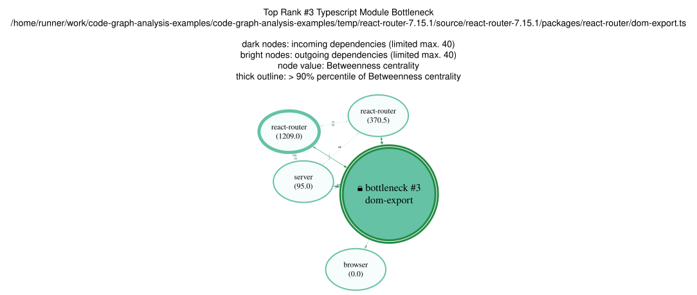

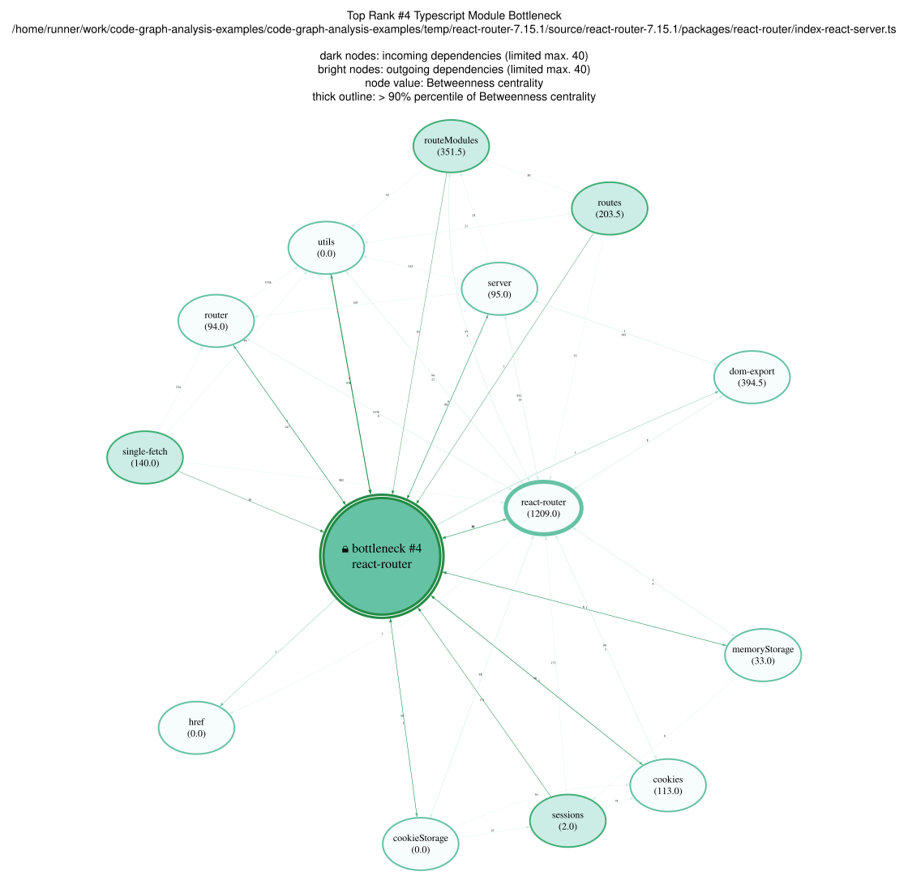

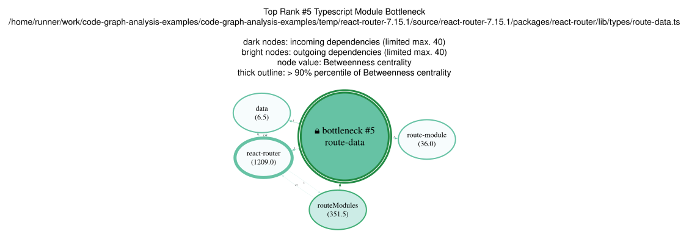

---

##### TopAuthority Graph Visualizations

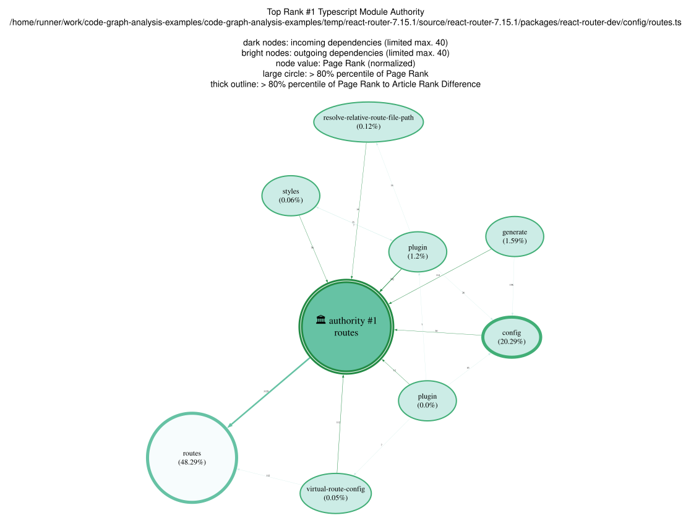

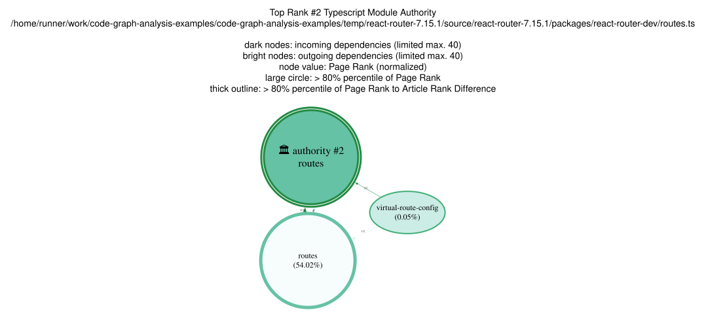

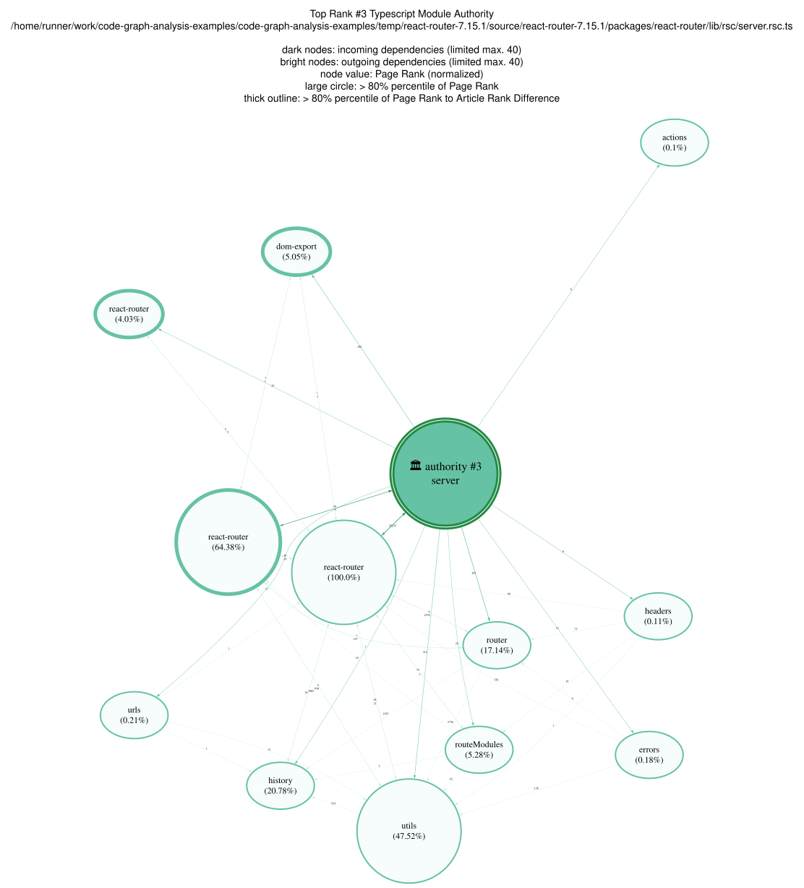

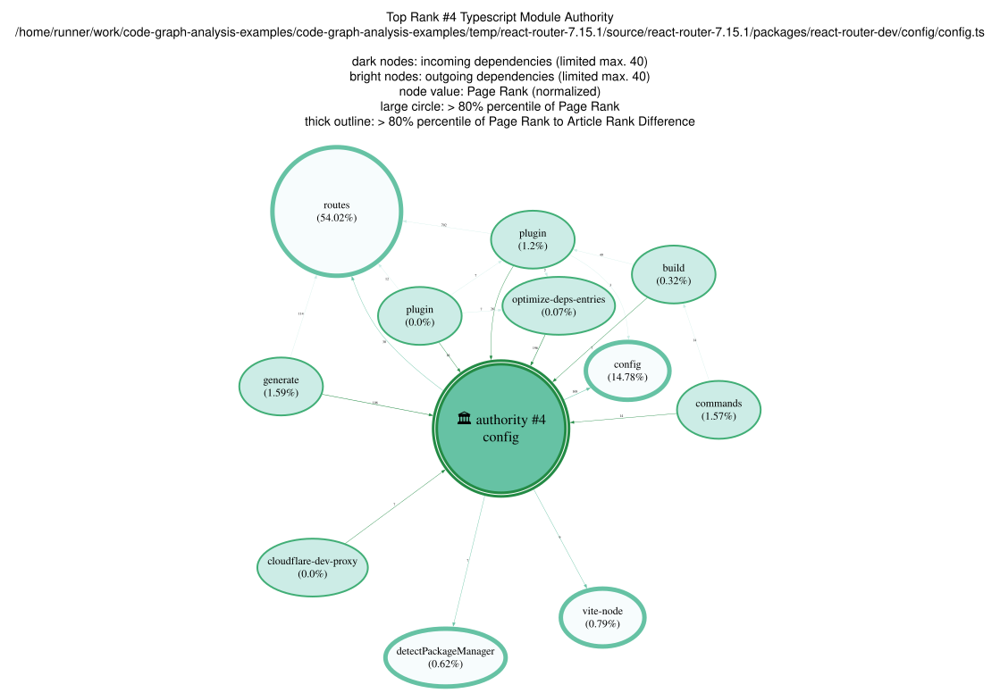

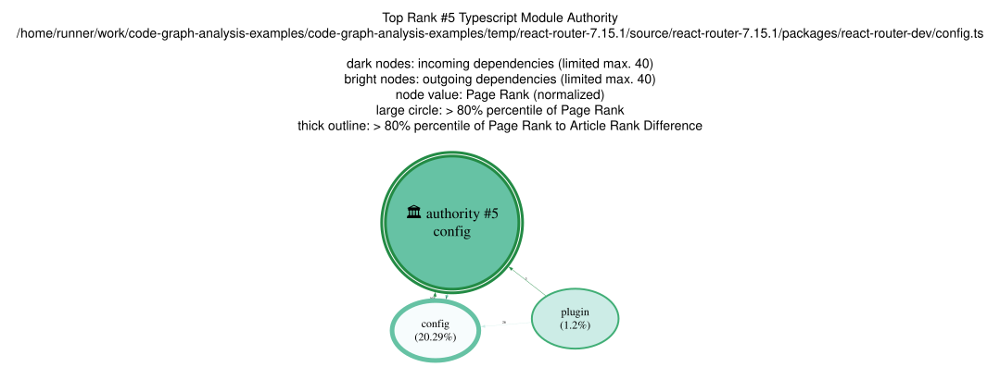

--

