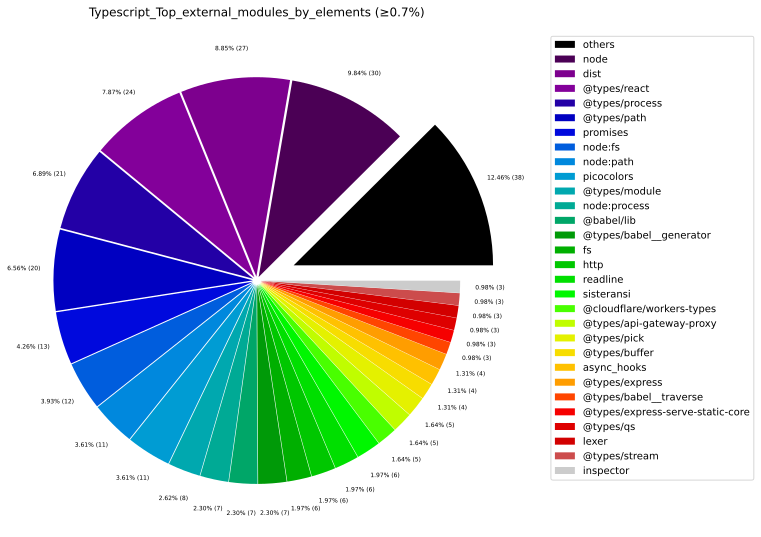
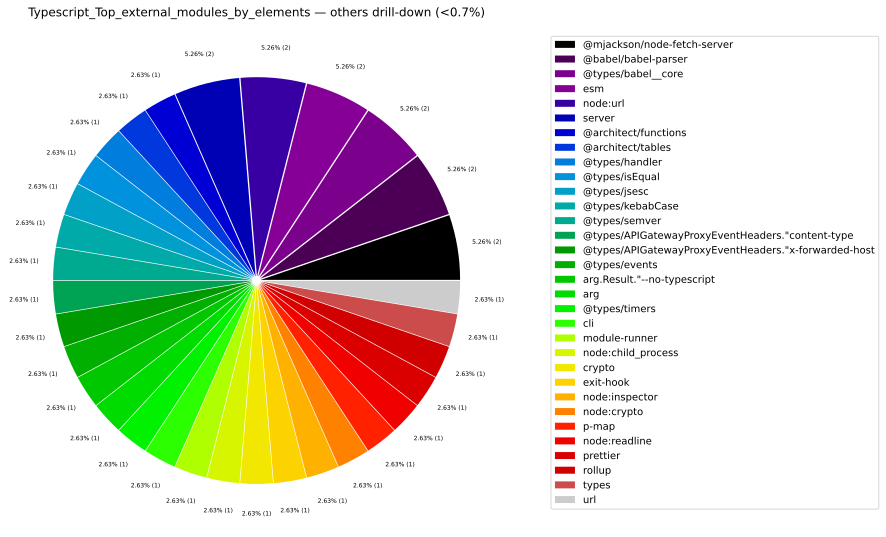
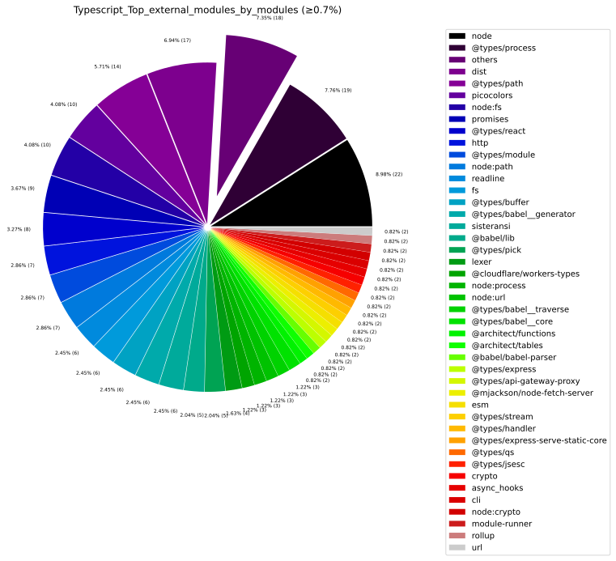
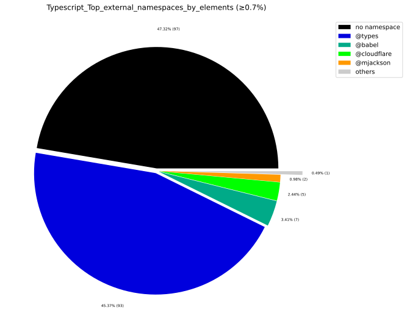
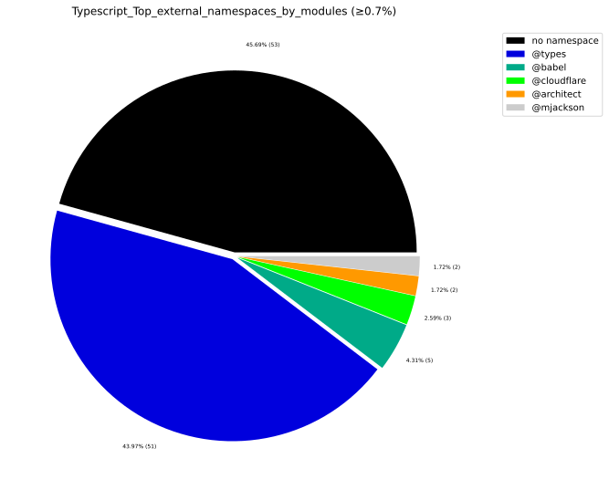
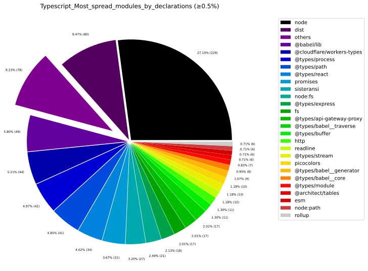
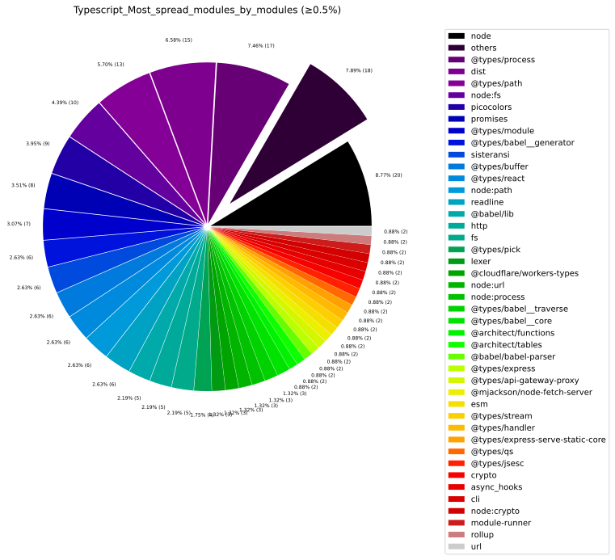
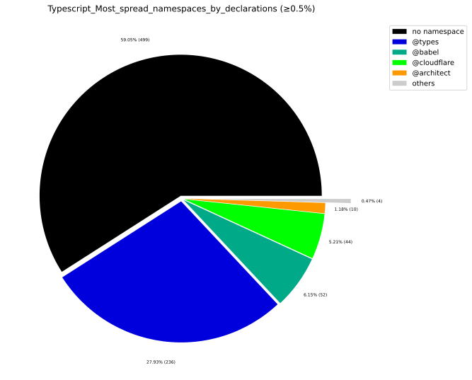
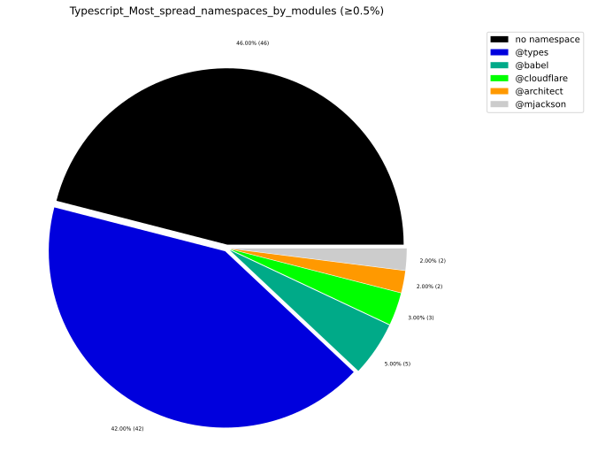

# 📦 External Dependencies Report

## 1. Executive Overview

Analyzes which external packages, modules, and namespaces the codebase depends on, their spread, and per-artifact usage.

> **Who imports whom?**
> High spread (many internal modules referencing the same external package) = candidate for a **facade** or **anti-corruption layer**.

## 📚 Table of Contents

1. [Executive Overview](#1-executive-overview)
1. [Java External Dependencies](#2-java-external-dependencies)
1. [TypeScript External Dependencies](#3-typescript-external-dependencies)
1. [Package Management](#4-package-management)
1. [Glossary](#5-glossary)

---

## 2. Java External Dependencies

### 2.1 Most Used External Packages

External Java packages by internal caller type count. High `numberOfExternalCallerTypes` = deeply embedded.

### 2.2 Most Used External Packages — Second-Level Grouping

Second-level package names (e.g. `javax.xml` from `javax.xml.stream`) reveal **framework-level** coupling that is hidden when viewing full package names.

### 2.3 Most Spread External Packages

Packages referenced from the highest number of **different internal packages**.  
High spread indicates a pervasive cross-cutting dependency that is hard to replace.

### 2.4 External Package Usage per Artifact (Top)

Artifacts ranked by number of internal packages with external dependencies.

### 2.5 Aggregated External Package Usage per Artifact

Per-artifact: how many internal packages use external ones and their percentage.

### 2.6 Java Charts

---

## 3. TypeScript External Dependencies

### 3.1 Most Used External Modules

External npm modules ranked by how many internal TypeScript elements import them.

| externalModuleName | numberOfExternalCallerModules | numberOfExternalCallerElements | numberOfExternalDeclarationCalls | numberOfExternalDeclarationCallsWeighted | allModules | allInternalElements | exampleStories |
| --- | --- | --- | --- | --- | --- | --- | --- |
| node | 22 | 30 | 261 | 416 | 139 | 639 | ["<reactRouterVitePlugin> of module <vite> imports <UserConfig.root> from external module <node>","<reactRouterVitePlugin> of module <vite> imports <ModuleNode.file> from external module <node>","<reactRouterVitePlugin> of module <vite> imports <UserConfig.base> from external module <node>","<reactRouterVitePlugin> of module <vite> imports <Environment.config> from external module <node>"] |
| @types/process | 19 | 21 | 48 | 145 | 139 | 639 | ["<Context> of module <create-react-router> imports <global.NodeJS.WriteStream> from external module <process>","<Context> of module <create-react-router> imports <global.NodeJS.ReadStream> from external module <process>","<renderLoadingIndicator> of module <loading-indicator> imports <global.NodeJS.ReadStream> from external module <process>","<renderLoadingIndicator> of module <loading-indicator> imports <global.NodeJS.WriteStream> from external module <process>"] |
| dist | 17 | 27 | 104 | 296 | 139 | 639 | ["<relative> of module <routes> imports <resolve> from external module <dist>","<relative> of module <routes> imports <resolve> from external module <dist>","<reactRouterRSCVitePlugin> of module <vite> imports <relative> from external module <dist>","<reactRouterRSCVitePlugin> of module <vite> imports <dist> from external module <dist>"] |
| @types/path | 14 | 20 | 55 | 122 | 139 | 639 | ["<getDirectoryFilesRecursive> of module <utils> imports <path.PlatformPath.sep> from external module <path>","<stripDirectoryFromPath> of module <utils> imports <path.PlatformPath.sep> from external module <path>","<createFileSessionStorage> of module <react-router-node> imports <path.PlatformPath.dirname> from external module <path>","<createFileSessionStorage> of module <fileStorage> imports <path.PlatformPath.dirname> from external module <path>"] |
| node:fs | 10 | 12 | 26 | 49 | 139 | 639 | ["<ensureDirectory> of module <utils> imports <.promises> from external module <node:fs>","<ensureDirectory> of module <utils> imports <node:fs> from external module <node:fs>","<directoryExists> of module <utils> imports <node:fs> from external module <node:fs>","<directoryExists> of module <utils> imports <.promises> from external module <node:fs>"] |
| picocolors | 10 | 11 | 14 | 85 | 139 | 639 | ["<color> of module <utils> imports <picocolors> from external module <picocolors>","<reactRouterVitePlugin> of module <vite> imports <picocolors> from external module <picocolors>","<reactRouterVitePlugin> of module <plugin> imports <picocolors> from external module <picocolors>","<reactRouterRSCVitePlugin> of module <vite> imports <picocolors> from external module <picocolors>"] |
| promises | 9 | 13 | 37 | 59 | 139 | 639 | ["<getDirectoryFilesRecursive> of module <utils> imports <readdir> from external module <promises>","<ensureDirectory> of module <utils> imports <.mkdir> from external module <promises>","<directoryExists> of module <utils> imports <.stat> from external module <promises>","<fileExists> of module <utils> imports <.stat> from external module <promises>"] |
| @types/react | 8 | 24 | 91 | 292 | 139 | 639 | ["<AwaitContextProvider> of module <context> imports <React.createElement> from external module <react>","<AwaitContextProvider> of module <context> imports <React.FunctionComponentElement> from external module <react>","<AwaitContextProvider> of module <context> imports <React.Context.Provider> from external module <react>","<AwaitContextProvider> of module <context> imports <React.ProviderProps> from external module <react>"] |
| @types/module | 7 | 8 | 9 | 11 | 139 | 639 | ["<reactRouterVitePlugin> of module <vite> imports <global.NodeJS.Require.resolve> from external module <module>","<reactRouterVitePlugin> of module <plugin> imports <global.NodeJS.Require.resolve> from external module <module>","<generateEntry> of module <commands> imports <global.NodeJS.Require.resolve> from external module <module>","<run> of module <run> imports <global.NodeJS.Require.main> from external module <module>"] |
| http | 7 | 6 | 16 | 22 | 139 | 639 | ["<createRemixHeaders> of module <server> imports <IncomingHttpHeaders> from external module <http>","<createRequestListener> of module <server> imports <RequestListener> from external module <http>","<createRequestListener> of module <react-router-node> imports <RequestListener> from external module <http>","<reactRouterVitePlugin> of module <vite> imports <ServerResponse.end> from external module <http>"] |
| node:path | 7 | 11 | 11 | 28 | 139 | 639 | ["<getDirectoryFilesRecursive> of module <utils> imports <node:path> from external module <node:path>","<pathContains> of module <utils> imports <node:path> from external module <node:path>","<stripDirectoryFromPath> of module <utils> imports <node:path> from external module <node:path>","<stop> of module <profiler> imports <node:path> from external module <node:path>"] |
| @types/babel__generator | 6 | 7 | 12 | 14 | 139 | 639 | ["<reactRouterVitePlugin> of module <vite> imports <GeneratorResult.code> from external module <babel__generator>","<reactRouterVitePlugin> of module <vite> imports <GeneratorResult> from external module <babel__generator>","<reactRouterVitePlugin> of module <plugin> imports <GeneratorResult.code> from external module <babel__generator>","<reactRouterVitePlugin> of module <plugin> imports <GeneratorResult> from external module <babel__generator>"] |
| @types/buffer | 6 | 4 | 12 | 13 | 139 | 639 | ["<createReactRouterRequest> of module <server> imports <global.Buffer.toString> from external module <buffer>","<createReactRouterRequest> of module <server> imports <global.BufferConstructor.from> from external module <buffer>","<createFileSessionStorage> of module <react-router-node> imports <global.BufferConstructor.from> from external module <buffer>","<createFileSessionStorage> of module <react-router-node> imports <global.Buffer.toString> from external module <buffer>"] |
| fs | 6 | 6 | 17 | 27 | 139 | 639 | ["<directoryExists> of module <utils> imports <Stats.isDirectory> from external module <fs>","<fileExists> of module <utils> imports <Stats.isFile> from external module <fs>","<reactRouterVitePlugin> of module <vite> imports <Dirent.parentPath> from external module <fs>","<reactRouterVitePlugin> of module <vite> imports <Dirent.path> from external module <fs>"] |
| readline | 6 | 6 | 10 | 104 | 139 | 639 | ["<ConfirmPrompt> of module <prompts-confirm> imports <Key> from external module <readline>","<MultiSelectPrompt> of module <prompts-multi-select> imports <Key> from external module <readline>","<Prompt> of module <prompts-prompt-base> imports <Interface.close> from external module <readline>","<Prompt> of module <prompts-prompt-base> imports <Key> from external module <readline>"] |
| sisteransi | 6 | 6 | 27 | 292 | 139 | 639 | ["<ConfirmPrompt> of module <prompts-confirm> imports <erase.line> from external module <sisteransi>","<ConfirmPrompt> of module <prompts-confirm> imports <cursor.to> from external module <sisteransi>","<ConfirmPrompt> of module <prompts-confirm> imports <cursor.hide> from external module <sisteransi>","<ConfirmPrompt> of module <prompts-confirm> imports <erase> from external module <sisteransi>"] |
| @babel/lib | 5 | 7 | 65 | 143 | 139 | 639 | ["<transpile> of module <useJavascript> imports <lib> from external module <lib>","<transpile> of module <useJavascript> imports <lib> from external module <lib>","<removeExports> of module <remove-exports> imports <ExportNamedDeclaration.declaration> from external module <lib>","<removeExports> of module <remove-exports> imports <AssignmentExpression.left> from external module <lib>"] |
| @types/pick | 5 | 5 | 9 | 9 | 139 | 639 | ["<index> of module <routes> imports <pick> from external module <pick>","<index> of module <routes> imports <pick> from external module <pick>","<layout> of module <routes> imports <pick> from external module <pick>","<layout> of module <routes> imports <pick> from external module <pick>"] |
| lexer | 4 | 3 | 6 | 6 | 139 | 639 | ["<reactRouterVitePlugin> of module <vite> imports <init> from external module <lexer>","<reactRouterVitePlugin> of module <plugin> imports <init> from external module <lexer>","<reactRouterRSCVitePlugin> of module <vite> imports <init> from external module <lexer>","<reactRouterRSCVitePlugin> of module <plugin> imports <init> from external module <lexer>"] |
| @cloudflare/workers-types | 3 | 5 | 52 | 68 | 139 | 639 | ["<createRequestHandler> of module <worker> imports <Request.cf> from external module <workers-types>","<createRequestHandler> of module <worker> imports <EventContext.passThroughOnException> from external module <workers-types>","<createRequestHandler> of module <worker> imports <EventContext.waitUntil> from external module <workers-types>","<createRequestHandler> of module <worker> imports <EventContext.request> from external module <workers-types>"] |
| @types/babel__core | 3 | 2 | 8 | 9 | 139 | 639 | ["<reactRouterVitePlugin> of module <vite> imports <BabelFileResult.map> from external module <babel__core>","<reactRouterVitePlugin> of module <vite> imports <BabelFileResult.code> from external module <babel__core>","<reactRouterVitePlugin> of module <vite> imports <transformAsync> from external module <babel__core>","<reactRouterVitePlugin> of module <plugin> imports <BabelFileResult.map> from external module <babel__core>"] |
| @types/babel__traverse | 3 | 3 | 17 | 49 | 139 | 639 | ["<removeExports> of module <remove-exports> imports <NodePath.isProgram> from external module <babel__traverse>","<removeExports> of module <remove-exports> imports <NodePath.remove> from external module <babel__traverse>","<removeExports> of module <remove-exports> imports <NodePath.parentPath> from external module <babel__traverse>","<removeExports> of module <remove-exports> imports <NodePath.node> from external module <babel__traverse>"] |
| node:process | 3 | 7 | 7 | 138 | 139 | 639 | ["<Context> of module <create-react-router> imports <node:process> from external module <node:process>","<PromptOptions> of module <prompts-prompt-base> imports <node:process> from external module <node:process>","<Prompt> of module <prompts-prompt-base> imports <node:process> from external module <node:process>","<stderr> of module <utils> imports <node:process> from external module <node:process>"] |
| node:url | 3 | 2 | 4 | 6 | 139 | 639 | ["<copyTemplate> of module <copy-template> imports <node:url> from external module <node:url>","<copyTemplate> of module <copy-template> imports <.fileURLToPath> from external module <node:url>","<reactRouterVitePlugin> of module <vite> imports <.pathToFileURL> from external module <node:url>","<reactRouterVitePlugin> of module <plugin> imports <.pathToFileURL> from external module <node:url>"] |
| @architect/functions | 2 | 1 | 4 | 4 | 139 | 639 | ["<createArcTableSessionStorage> of module <react-router-architect> imports <functions> from external module <functions>","<createArcTableSessionStorage> of module <react-router-architect> imports <tables> from external module <functions>","<createArcTableSessionStorage> of module <arcTableSessionStorage> imports <functions> from external module <functions>","<createArcTableSessionStorage> of module <arcTableSessionStorage> imports <tables> from external module <functions>"] |
| @architect/tables | 2 | 1 | 6 | 10 | 139 | 639 | ["<createArcTableSessionStorage> of module <react-router-architect> imports <ArcTable.delete> from external module <tables>","<createArcTableSessionStorage> of module <react-router-architect> imports <ArcTable.put> from external module <tables>","<createArcTableSessionStorage> of module <react-router-architect> imports <ArcTable.get> from external module <tables>","<createArcTableSessionStorage> of module <arcTableSessionStorage> imports <ArcTable.delete> from external module <tables>"] |
| @babel/babel-parser | 2 | 2 | 3 | 5 | 139 | 639 | ["<removeExports> of module <remove-exports> imports <ParseResult> from external module <babel-parser>","<decorateComponentExportsWithProps> of module <with-props> imports <ParseResult> from external module <babel-parser>","<decorateComponentExportsWithProps> of module <with-props> imports <ParseResult.program> from external module <babel-parser>"] |
| @mjackson/node-fetch-server | 2 | 2 | 4 | 18 | 139 | 639 | ["<createRequestListener> of module <server> imports <createRequestListener> from external module <node-fetch-server>","<createRequestListener> of module <react-router-node> imports <createRequestListener> from external module <node-fetch-server>","<RequestListenerOptions> of module <server> imports <ClientAddress> from external module <node-fetch-server>","<RequestListenerOptions> of module <react-router-node> imports <ClientAddress> from external module <node-fetch-server>"] |
| @types/api-gateway-proxy | 2 | 5 | 23 | 30 | 139 | 639 | ["<GetLoadContextFunction> of module <server> imports <APIGatewayEventRequestContextV2> from external module <api-gateway-proxy>","<GetLoadContextFunction> of module <server> imports <APIGatewayProxyEventV2> from external module <api-gateway-proxy>","<GetLoadContextFunction> of module <react-router-architect> imports <APIGatewayEventRequestContextV2> from external module <api-gateway-proxy>","<GetLoadContextFunction> of module <react-router-architect> imports <APIGatewayProxyEventV2> from external module <api-gateway-proxy>"] |
| @types/express | 2 | 4 | 25 | 29 | 139 | 639 | ["<GetLoadContextFunction> of module <server> imports <e.Response> from external module <express>","<GetLoadContextFunction> of module <server> imports <e.Request> from external module <express>","<GetLoadContextFunction> of module <react-router-express> imports <e.Response> from external module <express>","<GetLoadContextFunction> of module <react-router-express> imports <e.Request> from external module <express>"] |
| @types/express-serve-static-core | 2 | 3 | 5 | 5 | 139 | 639 | ["<GetLoadContextFunction> of module <server> imports <ParamsDictionary> from external module <express-serve-static-core>","<GetLoadContextFunction> of module <react-router-express> imports <ParamsDictionary> from external module <express-serve-static-core>","<RequestHandler> of module <server> imports <ParamsDictionary> from external module <express-serve-static-core>","<RequestHandler> of module <react-router-express> imports <ParamsDictionary> from external module <express-serve-static-core>"] |
| @types/handler | 2 | 1 | 4 | 4 | 139 | 639 | ["<RequestHandler> of module <server> imports <Context> from external module <handler>","<RequestHandler> of module <server> imports <Callback> from external module <handler>","<RequestHandler> of module <react-router-architect> imports <Context> from external module <handler>","<RequestHandler> of module <react-router-architect> imports <Callback> from external module <handler>"] |
| @types/jsesc | 2 | 1 | 2 | 4 | 139 | 639 | ["<reactRouterVitePlugin> of module <vite> imports <jsesc> from external module <jsesc>","<reactRouterVitePlugin> of module <plugin> imports <jsesc> from external module <jsesc>"] |
| @types/qs | 2 | 3 | 5 | 5 | 139 | 639 | ["<GetLoadContextFunction> of module <server> imports <QueryString.ParsedQs> from external module <qs>","<GetLoadContextFunction> of module <react-router-express> imports <QueryString.ParsedQs> from external module <qs>","<RequestHandler> of module <server> imports <QueryString.ParsedQs> from external module <qs>","<RequestHandler> of module <react-router-express> imports <QueryString.ParsedQs> from external module <qs>"] |
| @types/stream | 2 | 3 | 18 | 20 | 139 | 639 | ["<writeReadableStreamToWritable> of module <react-router-node> imports <Stream.Writable> from external module <stream>","<writeReadableStreamToWritable> of module <react-router-node> imports <Stream.Writable.destroy> from external module <stream>","<writeReadableStreamToWritable> of module <react-router-node> imports <Stream.Writable.end> from external module <stream>","<writeReadableStreamToWritable> of module <react-router-node> imports <Stream.Writable.write> from external module <stream>"] |
| async_hooks | 2 | 4 | 8 | 8 | 139 | 639 | ["<getRequest> of module <react-router> imports <AsyncLocalStorage.getStore> from external module <async_hooks>","<getRequest> of module <server> imports <AsyncLocalStorage.getStore> from external module <async_hooks>","<redirectDocument> of module <react-router> imports <AsyncLocalStorage.getStore> from external module <async_hooks>","<redirectDocument> of module <server> imports <AsyncLocalStorage.getStore> from external module <async_hooks>"] |
| cli | 2 | 1 | 2 | 4 | 139 | 639 | ["<cloudflareDevProxyVitePlugin> of module <cloudflare> imports <GetPlatformProxyOptions> from external module <cli>","<cloudflareDevProxyVitePlugin> of module <cloudflare-dev-proxy> imports <GetPlatformProxyOptions> from external module <cli>"] |
| crypto | 2 | 1 | 4 | 4 | 139 | 639 | ["<reactRouterVitePlugin> of module <vite> imports <Hash.digest> from external module <crypto>","<reactRouterVitePlugin> of module <vite> imports <Hash.update> from external module <crypto>","<reactRouterVitePlugin> of module <plugin> imports <Hash.digest> from external module <crypto>","<reactRouterVitePlugin> of module <plugin> imports <Hash.update> from external module <crypto>"] |
| esm | 2 | 2 | 6 | 7 | 139 | 639 | ["<createConfigLoader> of module <config> imports <FSWatcher.on> from external module <esm>","<createConfigLoader> of module <config> imports <_default.watch> from external module <esm>","<createConfigLoader> of module <config> imports <FSWatcher.add> from external module <esm>","<createConfigLoader> of module <config> imports <FSWatcher.unwatch> from external module <esm>"] |
| module-runner | 2 | 1 | 2 | 2 | 139 | 639 | ["<reactRouterVitePlugin> of module <vite> imports <ModuleRunner.import> from external module <module-runner>","<reactRouterVitePlugin> of module <plugin> imports <ModuleRunner.import> from external module <module-runner>"] |
| node:crypto | 2 | 1 | 2 | 2 | 139 | 639 | ["<reactRouterVitePlugin> of module <vite> imports <createHash> from external module <node:crypto>","<reactRouterVitePlugin> of module <plugin> imports <createHash> from external module <node:crypto>"] |
| rollup | 2 | 1 | 6 | 10 | 139 | 639 | ["<reactRouterVitePlugin> of module <vite> imports <PluginContext.resolve> from external module <rollup>","<reactRouterVitePlugin> of module <vite> imports <ResolvedId.id> from external module <rollup>","<reactRouterVitePlugin> of module <vite> imports <PluginContext.environment> from external module <rollup>","<reactRouterVitePlugin> of module <plugin> imports <PluginContext.resolve> from external module <rollup>"] |
| url | 2 | 1 | 2 | 4 | 139 | 639 | ["<reactRouterVitePlugin> of module <vite> imports <URL.href> from external module <url>","<reactRouterVitePlugin> of module <plugin> imports <URL.href> from external module <url>"] |
| @types/APIGatewayProxyEventHeaders."content-type | 1 | 1 | 1 | 1 | 139 | 639 | ["<createReactRouterRequest> of module <server> imports <APIGatewayProxyEventHeaders.\"content-type\"> from external module <APIGatewayProxyEventHeaders.\"content-type>"] |
| @types/APIGatewayProxyEventHeaders."x-forwarded-host | 1 | 1 | 1 | 1 | 139 | 639 | ["<createReactRouterRequest> of module <server> imports <APIGatewayProxyEventHeaders.\"x-forwarded-host\"> from external module <APIGatewayProxyEventHeaders.\"x-forwarded-host>"] |
| @types/events | 1 | 1 | 1 | 1 | 139 | 639 | ["<Prompt> of module <prompts-prompt-base> imports <EventEmitter> from external module <events>"] |
| @types/isEqual | 1 | 1 | 1 | 2 | 139 | 639 | ["<createConfigLoader> of module <config> imports <isEqual> from external module <isEqual>"] |
| @types/kebabCase | 1 | 1 | 1 | 1 | 139 | 639 | ["<getEnvironmentOptionsResolvers> of module <plugin> imports <kebabCase> from external module <kebabCase>"] |
| @types/semver | 1 | 1 | 2 | 2 | 139 | 639 | ["<run> of module <run> imports <semver> from external module <semver>","<run> of module <run> imports <major> from external module <semver>"] |
| @types/timers | 1 | 1 | 1 | 13 | 139 | 639 | ["<SelectPrompt> of module <prompts-select> imports <global.NodeJS.Timeout> from external module <timers>"] |
| arg | 1 | 1 | 2 | 3 | 139 | 639 | ["<run> of module <run> imports <arg> from external module <arg>","<run> of module <run> imports <arg.Result._> from external module <arg>"] |
| arg.Result."--no-typescript | 1 | 1 | 1 | 1 | 139 | 639 | ["<run> of module <run> imports <arg.Result.\"--no-typescript\"> from external module <arg.Result.\"--no-typescript>"] |
| exit-hook | 1 | 1 | 1 | 1 | 139 | 639 | ["<dev> of module <commands> imports <exit-hook> from external module <exit-hook>"] |
| inspector | 1 | 3 | 4 | 6 | 139 | 639 | ["<getSession> of module <profiler> imports <Session> from external module <inspector>","<start> of module <profiler> imports <Session.post> from external module <inspector>","<start> of module <profiler> imports <Session.connect> from external module <inspector>","<stop> of module <profiler> imports <Session.post> from external module <inspector>"] |
| node:child_process | 1 | 1 | 1 | 1 | 139 | 639 | ["<resolveEntryFiles> of module <config> imports <execSync> from external module <node:child_process>"] |
| node:inspector | 1 | 1 | 1 | 1 | 139 | 639 | ["<start> of module <profiler> imports <.Session> from external module <node:inspector>"] |
| node:readline | 1 | 1 | 3 | 52 | 139 | 639 | ["<Prompt> of module <prompts-prompt-base> imports <node:readline> from external module <node:readline>","<Prompt> of module <prompts-prompt-base> imports <.createInterface> from external module <node:readline>","<Prompt> of module <prompts-prompt-base> imports <.emitKeypressEvents> from external module <node:readline>"] |
| p-map | 1 | 1 | 1 | 1 | 139 | 639 | ["<prerender> of module <prerender> imports <p-map> from external module <p-map>"] |
| prettier | 1 | 1 | 2 | 2 | 139 | 639 | ["<transpile> of module <useJavascript> imports <prettier> from external module <prettier>","<transpile> of module <useJavascript> imports <format> from external module <prettier>"] |
| server | 1 | 2 | 4 | 4 | 139 | 639 | ["<createContext> of module <vite-node> imports <ViteNodeServer.fetchModule> from external module <server>","<createContext> of module <vite-node> imports <ViteNodeServer.resolveId> from external module <server>","<createContext> of module <vite-node> imports <ViteNodeServer.getSourceMap> from external module <server>","<Context> of module <vite-node> imports <ViteNodeServer> from external module <server>"] |
| types | 1 | 1 | 1 | 2 | 139 | 639 | ["<color> of module <utils> imports <Formatter> from external module <types>"] |

### 3.2 Most Used External Namespaces

Groups by namespace to reveal declaration-level coupling within npm packages.

| externalNamespaceName | numberOfExternalCallerModules | numberOfExternalCallerElements | numberOfExternalDeclarationCalls | numberOfExternalDeclarationCallsWeighted | allModules | allInternalElements | exampleStories |
| --- | --- | --- | --- | --- | --- | --- | --- |
| no namespace | 53 | 97 | 593 | 1643 | 139 | 639 | ["<copyTemplate> of module <copy-template> imports <node:url> from external namespace <>","<copyTemplate> of module <copy-template> imports <.fileURLToPath> from external namespace <>","<Context> of module <create-react-router> imports <node:process> from external namespace <>","<ConfirmPrompt> of module <prompts-confirm> imports <erase.line> from external namespace <>"] |
| @types | 51 | 93 | 351 | 782 | 139 | 639 | ["<Context> of module <create-react-router> imports <global.NodeJS.WriteStream> from external namespace <@types>","<Context> of module <create-react-router> imports <global.NodeJS.ReadStream> from external namespace <@types>","<renderLoadingIndicator> of module <loading-indicator> imports <global.NodeJS.ReadStream> from external namespace <@types>","<renderLoadingIndicator> of module <loading-indicator> imports <global.NodeJS.WriteStream> from external namespace <@types>"] |
| @babel | 5 | 7 | 68 | 148 | 139 | 639 | ["<transpile> of module <useJavascript> imports <lib> from external namespace <@babel>","<transpile> of module <useJavascript> imports <lib> from external namespace <@babel>","<removeExports> of module <remove-exports> imports <ExportNamedDeclaration.declaration> from external namespace <@babel>","<removeExports> of module <remove-exports> imports <AssignmentExpression.left> from external namespace <@babel>"] |
| @cloudflare | 3 | 5 | 52 | 68 | 139 | 639 | ["<createRequestHandler> of module <worker> imports <Request.cf> from external namespace <@cloudflare>","<createRequestHandler> of module <worker> imports <EventContext.passThroughOnException> from external namespace <@cloudflare>","<createRequestHandler> of module <worker> imports <EventContext.waitUntil> from external namespace <@cloudflare>","<createRequestHandler> of module <worker> imports <EventContext.request> from external namespace <@cloudflare>"] |
| @architect | 2 | 1 | 10 | 14 | 139 | 639 | ["<createArcTableSessionStorage> of module <react-router-architect> imports <ArcTable.delete> from external namespace <@architect>","<createArcTableSessionStorage> of module <react-router-architect> imports <functions> from external namespace <@architect>","<createArcTableSessionStorage> of module <react-router-architect> imports <ArcTable.put> from external namespace <@architect>","<createArcTableSessionStorage> of module <react-router-architect> imports <ArcTable.get> from external namespace <@architect>"] |
| @mjackson | 2 | 2 | 4 | 18 | 139 | 639 | ["<createRequestListener> of module <server> imports <createRequestListener> from external namespace <@mjackson>","<createRequestListener> of module <react-router-node> imports <createRequestListener> from external namespace <@mjackson>","<RequestListenerOptions> of module <server> imports <ClientAddress> from external namespace <@mjackson>","<RequestListenerOptions> of module <react-router-node> imports <ClientAddress> from external namespace <@mjackson>"] |

### 3.3 Most Spread External Modules

External modules referenced from the highest number of **different internal TypeScript modules**.

| externalModuleName | numberOfInternalModules | sumNumberOfUsedExternalDeclarations | minNumberOfUsedExternalDeclarations | maxNumberOfUsedExternalDeclarations | medNumberOfUsedExternalDeclarations | avgNumberOfUsedExternalDeclarations | stdNumberOfUsedExternalDeclarations | sumNumberOfInternalElements | minNumberOfInternalElements | maxNumberOfInternalElements | medNumberOfInternalElements | avgNumberOfInternalElements | stdNumberOfInternalElements | minNumberOfInternalElementsPercentage | maxNumberOfInternalElementsPercentage | medNumberOfInternalElementsPercentage | avgNumberOfInternalElementsPercentage | stdNumberOfInternalElementsPercentage | internalModuleExamples |
| --- | --- | --- | --- | --- | --- | --- | --- | --- | --- | --- | --- | --- | --- | --- | --- | --- | --- | --- | --- |
| node | 20 | 229 | 1 | 75 | 3 | 11.450000000000005 | 21.60768625427438 | 33 | 1 | 8 | 1 | 1.65 | 1.7554426642213128 | 0.1564945226917058 | 1.2519561815336464 | 0.1564945226917058 | 0.2582159624413146 | 0.27471716184997075 | ["vite","plugin","commands","config"] |
| @types/process | 17 | 42 | 1 | 5 | 2 | 2.4705882352941178 | 1.5458673560021057 | 24 | 1 | 4 | 1 | 1.411764705882353 | 0.7952062255644574 | 0.1564945226917058 | 0.6259780907668232 | 0.1564945226917058 | 0.22093344380005525 | 0.12444541871118267 | ["create-react-router","loading-indicator","prompts-prompt-base","utils"] |
| dist | 15 | 80 | 1 | 26 | 4 | 5.333333333333333 | 6.309478885734052 | 31 | 1 | 5 | 1 | 2.066666666666667 | 1.4375905768565218 | 0.1564945226917058 | 0.782472613458529 | 0.1564945226917058 | 0.32342201356285866 | 0.22497505115125535 | ["routes","vite","plugin","commands"] |
| @types/path | 13 | 41 | 1 | 7 | 2 | 3.1538461538461533 | 2.192645048267573 | 22 | 1 | 5 | 1 | 1.6923076923076923 | 1.1821319289469756 | 0.1564945226917058 | 0.782472613458529 | 0.1564945226917058 | 0.26483688455519444 | 0.18499717197918242 | ["utils","react-router-node","fileStorage","vite"] |
| node:fs | 10 | 21 | 1 | 4 | 2 | 2.1 | 0.9944289260117533 | 14 | 1 | 3 | 1 | 1.4 | 0.8432740427115679 | 0.1564945226917058 | 0.4694835680751174 | 0.1564945226917058 | 0.2190923317683881 | 0.13196776881245192 | ["utils","react-router-node","fileStorage","vite"] |
| picocolors | 9 | 10 | 1 | 2 | 1 | 1.1111111111111114 | 0.33333333333333337 | 13 | 1 | 3 | 1 | 1.4444444444444444 | 0.7264831572567788 | 0.1564945226917058 | 0.4694835680751174 | 0.1564945226917058 | 0.22604764388801948 | 0.11369063493846307 | ["utils","vite","plugin","commands"] |
| promises | 8 | 31 | 2 | 7 | 3.5 | 3.8750000000000004 | 2.100170061141308 | 16 | 1 | 4 | 1.5 | 2 | 1.3093073414159542 | 0.1564945226917058 | 0.6259780907668232 | 0.2347417840375587 | 0.3129890453834116 | 0.20489942745163606 | ["utils","react-router-node","fileStorage","vite"] |
| @types/module | 7 | 7 | 1 | 1 | 1 | 1 | 0 | 9 | 1 | 2 | 1 | 1.2857142857142856 | 0.4879500364742666 | 0.1564945226917058 | 0.3129890453834116 | 0.1564945226917058 | 0.20120724346076457 | 0.07636150805544079 | ["vite","plugin","commands","run"] |
| @types/babel__generator | 6 | 9 | 1 | 2 | 1.5 | 1.5 | 0.5477225575051661 | 8 | 1 | 3 | 1 | 1.3333333333333333 | 0.816496580927726 | 0.1564945226917058 | 0.4694835680751174 | 0.1564945226917058 | 0.20865936358894105 | 0.1277772427116942 | ["vite","plugin","generate","babel"] |
| @types/buffer | 6 | 11 | 1 | 3 | 2 | 1.8333333333333333 | 0.752772652709081 | 7 | 1 | 2 | 1 | 1.1666666666666665 | 0.408248290463863 | 0.1564945226917058 | 0.3129890453834116 | 0.1564945226917058 | 0.1825769431403234 | 0.06388862135584711 | ["server","react-router-node","fileStorage","stream"] |
| @types/react | 6 | 34 | 1 | 12 | 4.5 | 5.666666666666667 | 4.179314138308661 | 38 | 1 | 14 | 4 | 6.333333333333333 | 5.715476066494082 | 0.1564945226917058 | 2.190923317683881 | 0.6259780907668232 | 0.9911319770474698 | 0.8944406989818594 | ["context","react-router","server","utils"] |
| node:path | 6 | 6 | 1 | 1 | 1 | 1 | 0 | 11 | 1 | 3 | 1.5 | 1.8333333333333333 | 0.983192080250175 | 0.1564945226917058 | 0.4694835680751174 | 0.2347417840375587 | 0.28690662493479396 | 0.15386417531301644 | ["utils","profiler","prerender","normalizeSlashes"] |
| readline | 6 | 10 | 1 | 4 | 1 | 1.6666666666666665 | 1.2110601416389966 | 6 | 1 | 1 | 1 | 1 | 0 | 0.1564945226917058 | 0.1564945226917058 | 0.1564945226917058 | 0.1564945226917058 | 0 | ["prompts-confirm","prompts-multi-select","prompts-prompt-base","prompts-select"] |
| sisteransi | 6 | 27 | 3 | 7 | 4 | 4.5 | 1.378404875209022 | 6 | 1 | 1 | 1 | 1 | 0 | 0.1564945226917058 | 0.1564945226917058 | 0.1564945226917058 | 0.1564945226917058 | 0 | ["prompts-confirm","prompts-multi-select","prompts-prompt-base","prompts-select"] |
| @babel/lib | 5 | 49 | 2 | 17 | 8 | 9.8 | 6.496152707564686 | 7 | 1 | 3 | 1 | 1.4 | 0.8944271909999159 | 0.1564945226917058 | 0.4694835680751174 | 0.1564945226917058 | 0.2190923317683881 | 0.139972956338015 | ["useJavascript","remove-exports","route-chunks","styles"] |
| fs | 5 | 17 | 2 | 5 | 3 | 3.4 | 1.51657508881031 | 8 | 1 | 2 | 2 | 1.6 | 0.5477225575051662 | 0.1564945226917058 | 0.3129890453834116 | 0.3129890453834116 | 0.25039123630672927 | 0.08571558020425135 | ["utils","vite","plugin","config"] |
| http | 5 | 11 | 1 | 3 | 2 | 2.2 | 0.8366600265340756 | 9 | 1 | 2 | 2 | 1.8 | 0.4472135954999579 | 0.1564945226917058 | 0.3129890453834116 | 0.3129890453834116 | 0.28169014084507044 | 0.06998647816900751 | ["server","react-router-node","vite","plugin"] |
| @types/pick | 4 | 4 | 1 | 1 | 1 | 1 | 0 | 6 | 1 | 3 | 1 | 1.5 | 1 | 0.1564945226917058 | 0.4694835680751174 | 0.1564945226917058 | 0.2347417840375587 | 0.15649452269170577 | ["routes","vite","plugin","config"] |
| @cloudflare/workers-types | 3 | 44 | 4 | 22 | 18 | 14.666666666666668 | 9.451631252505218 | 10 | 1 | 5 | 4 | 3.333333333333333 | 2.0816659994661326 | 0.1564945226917058 | 0.782472613458529 | 0.6259780907668232 | 0.5216484089723527 | 0.3257693269900051 | ["worker","react-router-cloudflare","workersKVStorage"] |
| @types/babel__core | 3 | 8 | 2 | 3 | 3 | 2.6666666666666665 | 0.5773502691896257 | 3 | 1 | 1 | 1 | 1 | 0 | 0.1564945226917058 | 0.1564945226917058 | 0.1564945226917058 | 0.1564945226917058 | 0 | ["vite","plugin","useJavascript"] |
| @types/babel__traverse | 3 | 17 | 2 | 11 | 4 | 5.666666666666666 | 4.725815626252609 | 3 | 1 | 1 | 1 | 1 | 0 | 0.1564945226917058 | 0.1564945226917058 | 0.1564945226917058 | 0.1564945226917058 | 0 | ["remove-exports","styles","with-props"] |
| lexer | 3 | 4 | 1 | 2 | 1 | 1.3333333333333333 | 0.5773502691896258 | 5 | 1 | 2 | 2 | 1.6666666666666667 | 0.5773502691896258 | 0.1564945226917058 | 0.3129890453834116 | 0.3129890453834116 | 0.2608242044861763 | 0.09035215480275834 | ["vite","plugin","virtual-route-modules"] |
| node:process | 3 | 3 | 1 | 1 | 1 | 1 | 0 | 7 | 1 | 4 | 2 | 2.3333333333333335 | 1.5275252316519465 | 0.1564945226917058 | 0.6259780907668232 | 0.3129890453834116 | 0.3651538862806468 | 0.23904933202690876 | ["create-react-router","prompts-prompt-base","utils"] |
| node:url | 3 | 4 | 1 | 2 | 1 | 1.3333333333333333 | 0.5773502691896257 | 3 | 1 | 1 | 1 | 1 | 0 | 0.1564945226917058 | 0.1564945226917058 | 0.1564945226917058 | 0.1564945226917058 | 0 | ["copy-template","vite","plugin"] |
| @architect/functions | 2 | 4 | 2 | 2 | 2 | 2 | 0 | 2 | 1 | 1 | 1 | 1 | 0 | 0.1564945226917058 | 0.1564945226917058 | 0.1564945226917058 | 0.1564945226917058 | 0 | ["react-router-architect","arcTableSessionStorage"] |
| @architect/tables | 2 | 6 | 3 | 3 | 3 | 3 | 0 | 2 | 1 | 1 | 1 | 1 | 0 | 0.1564945226917058 | 0.1564945226917058 | 0.1564945226917058 | 0.1564945226917058 | 0 | ["react-router-architect","arcTableSessionStorage"] |
| @babel/babel-parser | 2 | 3 | 1 | 2 | 1.5 | 1.5 | 0.7071067811865476 | 2 | 1 | 1 | 1 | 1 | 0 | 0.1564945226917058 | 0.1564945226917058 | 0.1564945226917058 | 0.1564945226917058 | 0 | ["remove-exports","with-props"] |
| @mjackson/node-fetch-server | 2 | 4 | 2 | 2 | 2 | 2 | 0 | 4 | 2 | 2 | 2 | 2 | 0 | 0.3129890453834116 | 0.3129890453834116 | 0.3129890453834116 | 0.3129890453834116 | 0 | ["server","react-router-node"] |
| @types/api-gateway-proxy | 2 | 17 | 3 | 14 | 8.5 | 8.5 | 7.7781745930520225 | 7 | 2 | 5 | 3.5 | 3.5 | 2.1213203435596424 | 0.3129890453834116 | 0.782472613458529 | 0.5477308294209703 | 0.5477308294209703 | 0.33197501464157164 | ["server","react-router-architect"] |
| @types/express | 2 | 18 | 3 | 15 | 9 | 9 | 8.48528137423857 | 6 | 2 | 4 | 3 | 3 | 1.4142135623730951 | 0.3129890453834116 | 0.6259780907668232 | 0.4694835680751174 | 0.4694835680751174 | 0.2213166764277144 | ["server","react-router-express"] |
| @types/express-serve-static-core | 2 | 2 | 1 | 1 | 1 | 1 | 0 | 5 | 2 | 3 | 2.5 | 2.5 | 0.7071067811865476 | 0.3129890453834116 | 0.4694835680751174 | 0.39123630672926446 | 0.39123630672926446 | 0.11065833821385716 | ["server","react-router-express"] |
| @types/handler | 2 | 4 | 2 | 2 | 2 | 2 | 0 | 2 | 1 | 1 | 1 | 1 | 0 | 0.1564945226917058 | 0.1564945226917058 | 0.1564945226917058 | 0.1564945226917058 | 0 | ["server","react-router-architect"] |
| @types/jsesc | 2 | 2 | 1 | 1 | 1 | 1 | 0 | 2 | 1 | 1 | 1 | 1 | 0 | 0.1564945226917058 | 0.1564945226917058 | 0.1564945226917058 | 0.1564945226917058 | 0 | ["vite","plugin"] |
| @types/qs | 2 | 2 | 1 | 1 | 1 | 1 | 0 | 5 | 2 | 3 | 2.5 | 2.5 | 0.7071067811865476 | 0.3129890453834116 | 0.4694835680751174 | 0.39123630672926446 | 0.39123630672926446 | 0.11065833821385716 | ["server","react-router-express"] |
| @types/stream | 2 | 10 | 5 | 5 | 5 | 5 | 0 | 6 | 3 | 3 | 3 | 3 | 0 | 0.4694835680751174 | 0.4694835680751174 | 0.4694835680751174 | 0.4694835680751174 | 0 | ["react-router-node","stream"] |
| async_hooks | 2 | 2 | 1 | 1 | 1 | 1 | 0 | 8 | 4 | 4 | 4 | 4 | 0 | 0.6259780907668232 | 0.6259780907668232 | 0.6259780907668232 | 0.6259780907668232 | 0 | ["react-router","server"] |
| cli | 2 | 2 | 1 | 1 | 1 | 1 | 0 | 2 | 1 | 1 | 1 | 1 | 0 | 0.1564945226917058 | 0.1564945226917058 | 0.1564945226917058 | 0.1564945226917058 | 0 | ["cloudflare","cloudflare-dev-proxy"] |
| crypto | 2 | 4 | 2 | 2 | 2 | 2 | 0 | 2 | 1 | 1 | 1 | 1 | 0 | 0.1564945226917058 | 0.1564945226917058 | 0.1564945226917058 | 0.1564945226917058 | 0 | ["vite","plugin"] |
| esm | 2 | 6 | 1 | 5 | 3 | 3 | 2.8284271247461903 | 2 | 1 | 1 | 1 | 1 | 0 | 0.1564945226917058 | 0.1564945226917058 | 0.1564945226917058 | 0.1564945226917058 | 0 | ["config","flatRoutes"] |
| module-runner | 2 | 2 | 1 | 1 | 1 | 1 | 0 | 2 | 1 | 1 | 1 | 1 | 0 | 0.1564945226917058 | 0.1564945226917058 | 0.1564945226917058 | 0.1564945226917058 | 0 | ["vite","plugin"] |
| node:crypto | 2 | 2 | 1 | 1 | 1 | 1 | 0 | 2 | 1 | 1 | 1 | 1 | 0 | 0.1564945226917058 | 0.1564945226917058 | 0.1564945226917058 | 0.1564945226917058 | 0 | ["vite","plugin"] |
| rollup | 2 | 6 | 3 | 3 | 3 | 3 | 0 | 2 | 1 | 1 | 1 | 1 | 0 | 0.1564945226917058 | 0.1564945226917058 | 0.1564945226917058 | 0.1564945226917058 | 0 | ["vite","plugin"] |
| url | 2 | 2 | 1 | 1 | 1 | 1 | 0 | 2 | 1 | 1 | 1 | 1 | 0 | 0.1564945226917058 | 0.1564945226917058 | 0.1564945226917058 | 0.1564945226917058 | 0 | ["vite","plugin"] |
| @types/APIGatewayProxyEventHeaders."content-type | 1 | 1 | 1 | 1 | 1 | 1 | 0 | 1 | 1 | 1 | 1 | 1 | 0 | 0.1564945226917058 | 0.1564945226917058 | 0.1564945226917058 | 0.1564945226917058 | 0 | ["server"] |
| @types/APIGatewayProxyEventHeaders."x-forwarded-host | 1 | 1 | 1 | 1 | 1 | 1 | 0 | 1 | 1 | 1 | 1 | 1 | 0 | 0.1564945226917058 | 0.1564945226917058 | 0.1564945226917058 | 0.1564945226917058 | 0 | ["server"] |
| @types/events | 1 | 1 | 1 | 1 | 1 | 1 | 0 | 1 | 1 | 1 | 1 | 1 | 0 | 0.1564945226917058 | 0.1564945226917058 | 0.1564945226917058 | 0.1564945226917058 | 0 | ["prompts-prompt-base"] |
| @types/isEqual | 1 | 1 | 1 | 1 | 1 | 1 | 0 | 1 | 1 | 1 | 1 | 1 | 0 | 0.1564945226917058 | 0.1564945226917058 | 0.1564945226917058 | 0.1564945226917058 | 0 | ["config"] |
| @types/kebabCase | 1 | 1 | 1 | 1 | 1 | 1 | 0 | 1 | 1 | 1 | 1 | 1 | 0 | 0.1564945226917058 | 0.1564945226917058 | 0.1564945226917058 | 0.1564945226917058 | 0 | ["plugin"] |
| @types/semver | 1 | 2 | 2 | 2 | 2 | 2 | 0 | 1 | 1 | 1 | 1 | 1 | 0 | 0.1564945226917058 | 0.1564945226917058 | 0.1564945226917058 | 0.1564945226917058 | 0 | ["run"] |
| @types/timers | 1 | 1 | 1 | 1 | 1 | 1 | 0 | 1 | 1 | 1 | 1 | 1 | 0 | 0.1564945226917058 | 0.1564945226917058 | 0.1564945226917058 | 0.1564945226917058 | 0 | ["prompts-select"] |
| arg | 1 | 2 | 2 | 2 | 2 | 2 | 0 | 1 | 1 | 1 | 1 | 1 | 0 | 0.1564945226917058 | 0.1564945226917058 | 0.1564945226917058 | 0.1564945226917058 | 0 | ["run"] |
| arg.Result."--no-typescript | 1 | 1 | 1 | 1 | 1 | 1 | 0 | 1 | 1 | 1 | 1 | 1 | 0 | 0.1564945226917058 | 0.1564945226917058 | 0.1564945226917058 | 0.1564945226917058 | 0 | ["run"] |
| exit-hook | 1 | 1 | 1 | 1 | 1 | 1 | 0 | 1 | 1 | 1 | 1 | 1 | 0 | 0.1564945226917058 | 0.1564945226917058 | 0.1564945226917058 | 0.1564945226917058 | 0 | ["commands"] |
| inspector | 1 | 3 | 3 | 3 | 3 | 3 | 0 | 3 | 3 | 3 | 3 | 3 | 0 | 0.4694835680751174 | 0.4694835680751174 | 0.4694835680751174 | 0.4694835680751174 | 0 | ["profiler"] |
| node:child_process | 1 | 1 | 1 | 1 | 1 | 1 | 0 | 1 | 1 | 1 | 1 | 1 | 0 | 0.1564945226917058 | 0.1564945226917058 | 0.1564945226917058 | 0.1564945226917058 | 0 | ["config"] |
| node:inspector | 1 | 1 | 1 | 1 | 1 | 1 | 0 | 1 | 1 | 1 | 1 | 1 | 0 | 0.1564945226917058 | 0.1564945226917058 | 0.1564945226917058 | 0.1564945226917058 | 0 | ["profiler"] |
| node:readline | 1 | 3 | 3 | 3 | 3 | 3 | 0 | 1 | 1 | 1 | 1 | 1 | 0 | 0.1564945226917058 | 0.1564945226917058 | 0.1564945226917058 | 0.1564945226917058 | 0 | ["prompts-prompt-base"] |
| p-map | 1 | 1 | 1 | 1 | 1 | 1 | 0 | 1 | 1 | 1 | 1 | 1 | 0 | 0.1564945226917058 | 0.1564945226917058 | 0.1564945226917058 | 0.1564945226917058 | 0 | ["prerender"] |
| prettier | 1 | 2 | 2 | 2 | 2 | 2 | 0 | 1 | 1 | 1 | 1 | 1 | 0 | 0.1564945226917058 | 0.1564945226917058 | 0.1564945226917058 | 0.1564945226917058 | 0 | ["useJavascript"] |
| server | 1 | 4 | 4 | 4 | 4 | 4 | 0 | 2 | 2 | 2 | 2 | 2 | 0 | 0.3129890453834116 | 0.3129890453834116 | 0.3129890453834116 | 0.3129890453834116 | 0 | ["vite-node"] |
| types | 1 | 1 | 1 | 1 | 1 | 1 | 0 | 1 | 1 | 1 | 1 | 1 | 0 | 0.1564945226917058 | 0.1564945226917058 | 0.1564945226917058 | 0.1564945226917058 | 0 | ["utils"] |

### 3.4 External Module Usage per Internal Module (Sorted)

Which internal TypeScript modules depend on the most external modules?

| internalModuleName | externalModuleName | numberOfExternalDeclarationCaller | numberOfExternalDeclarationCalls | numberOfAllElementsInInternalModule | numberOfAllExternalDeclarationsUsedInInternalModule | numberOfAllExternalModulesUsedInInternalModule | externalDeclarationRate | externalDeclarationNames |
| --- | --- | --- | --- | --- | --- | --- | --- | --- |
| remove-exports | @babel/lib | 16 | 56 | 1 | 23 | 4 | 2300 | ["ExportNamedDeclaration.declaration","AssignmentExpression.left","Identifier.name","ExportSpecifier.exported","VariableDeclarator.id","ExpressionStatement.expression","VariableDeclaration.declarations","ExportDeclaration.type","ExportDefaultDeclaration.declaration","ExportSpecifier.local","ClassDeclaration.id","Expression.type","LVal.type","FunctionDeclaration.id","MemberExpression.object","ExportNamedDeclaration.specifiers"] |
| remove-exports | @types/babel__traverse | 4 | 24 | 1 | 23 | 4 | 2300 | ["NodePath.isProgram","NodePath.remove","NodePath.parentPath","NodePath.node"] |
| remove-exports | dist | 2 | 2 | 1 | 23 | 4 | 2300 | ["findReferencedIdentifiers","deadCodeElimination"] |
| remove-exports | @babel/babel-parser | 1 | 2 | 1 | 23 | 4 | 2300 | ["ParseResult"] |
| vite | node | 83 | 145 | 6 | 128 | 25 | 2133.3333333333335 | ["UserConfig.root","ModuleNode.file","UserConfig.base","Environment.config","Logger.info","PreviewServer","Logger.warn","ViteDevServer.hot","createServer","DevEnvironment.moduleGraph","ViteDevServer.pluginContainer","DevEnvironment.reloadModule","Logger.error","ResolvedConfig.command","ViteDevServer.config","ViteBuilder.build","ManifestChunk.css","ManifestChunk.file","defaultClientConditions","ViteDevServer","EnvironmentOptions","RunnableDevEnvironment.runner","EnvironmentOptions.resolve","Connect.IncomingMessage.url","ModuleNode.url","ResolvedConfig.build","UserConfig.server","EnvironmentOptions.optimizeDeps","ViteDevServer.ssrFixStacktrace","ResolvedConfig.mode","ConfigEnv.isSsrBuild","ViteDevServer.transformRequest","UserConfig.environments","PreviewServer.middlewares","ConfigEnv.command","loadConfigFromFile","ResolvedServerOptions.middlewareMode","createLogger","isRunnableDevEnvironment","HotUpdatePluginContext.environment","ResolvedConfig.root","ViteBuilder.environments","ConfigEnv.mode","HotBroadcaster.send","normalizePath","ResolvedBuildOptions.assetsDir","UserConfig.logLevel","Plugin","ViteDevServer.middlewares","Connect.Server.use","ViteDevServer.ssrLoadModule","ViteDevServer.environments","ManifestChunk.assets","Environment.name","PluginContainer.buildStart","ResolvedConfig.server","UserConfig.plugins","UserConfig.build","DevEnvironment.name","Plugin.name","ResolvedConfig","ResolvedConfig.configFile","ResolvedConfig.logger","ResolvedBuildEnvironmentOptions.outDir","ResolvedConfig.base","PluginOption","ResolvedConfig.environments","ResolvedEnvironmentOptions.build","transformWithEsbuild","version","node","ESBuildOptions"] |
| vite | @types/process | 7 | 15 | 6 | 128 | 25 | 2133.3333333333335 | ["global.NodeJS.Process.exit","global.NodeJS.Process.cwd","global.NodeJS.ProcessEnv.REACT_ROUTER_ROOT","global.NodeJS.ProcessEnv.IS_RR_BUILD_REQUEST","global.NodeJS.Process.env"] |
| vite | dist | 7 | 23 | 6 | 128 | 25 | 2133.3333333333335 | ["relative","dist","join","resolve","path.join","path.normalize","path.extname"] |
| vite | promises | 7 | 14 | 6 | 128 | 25 | 2133.3333333333335 | ["readFile","rename","mkdir","readdir","cp","rm"] |
| vite | @types/path | 6 | 25 | 6 | 128 | 25 | 2133.3333333333335 | ["path.PlatformPath.resolve","path.PlatformPath.posix","path.PlatformPath.relative","path.PlatformPath.dirname","path.PlatformPath.join","path.PlatformPath.basename"] |
| vite | fs | 5 | 10 | 6 | 128 | 25 | 2133.3333333333335 | ["Dirent.parentPath","Dirent.path","Dirent.isFile","Dirent.name","existsSync"] |
| vite | http | 5 | 8 | 6 | 128 | 25 | 2133.3333333333335 | ["ServerResponse.end","ServerResponse.setHeader","ServerResponse.statusCode"] |
| vite | @types/babel__core | 3 | 3 | 6 | 128 | 25 | 2133.3333333333335 | ["BabelFileResult.map","BabelFileResult.code","transformAsync"] |
| vite | node:fs | 3 | 8 | 6 | 128 | 25 | 2133.3333333333335 | ["existsSync","readdirSync","rmSync"] |
| vite | rollup | 3 | 5 | 6 | 128 | 25 | 2133.3333333333335 | ["PluginContext.resolve","ResolvedId.id","PluginContext.environment"] |
| vite | @types/babel__generator | 2 | 2 | 6 | 128 | 25 | 2133.3333333333335 | ["GeneratorResult.code","GeneratorResult"] |
| vite | crypto | 2 | 2 | 6 | 128 | 25 | 2133.3333333333335 | ["Hash.digest","Hash.update"] |
| vite | lexer | 2 | 2 | 6 | 128 | 25 | 2133.3333333333335 | ["init"] |
| vite | picocolors | 2 | 14 | 6 | 128 | 25 | 2133.3333333333335 | ["picocolors"] |
| vite | @types/buffer | 1 | 1 | 6 | 128 | 25 | 2133.3333333333335 | ["global.NonSharedBuffer.toString"] |
| vite | @types/jsesc | 1 | 2 | 6 | 128 | 25 | 2133.3333333333335 | ["jsesc"] |
| vite | @types/module | 1 | 2 | 6 | 128 | 25 | 2133.3333333333335 | ["global.NodeJS.Require.resolve"] |
| vite | @types/pick | 1 | 1 | 6 | 128 | 25 | 2133.3333333333335 | ["pick"] |
| vite | module-runner | 1 | 1 | 6 | 128 | 25 | 2133.3333333333335 | ["ModuleRunner.import"] |
| vite | node:crypto | 1 | 1 | 6 | 128 | 25 | 2133.3333333333335 | ["createHash"] |
| vite | node:url | 1 | 2 | 6 | 128 | 25 | 2133.3333333333335 | [".pathToFileURL"] |
| vite | url | 1 | 2 | 6 | 128 | 25 | 2133.3333333333335 | ["URL.href"] |
| with-props | @types/babel__traverse | 11 | 23 | 1 | 21 | 4 | 2100 | ["NodePath.isExportDefaultDeclaration","NodePath.isVariableDeclaration","NodePath.get","NodePath.isFunctionDeclaration","NodePath.replaceWith","NodePath.isExportNamedDeclaration","NodePath.node","NodePath.scope","Scope.generateUidIdentifier","NodePath.isExpression","NodePath.isIdentifier"] |
| with-props | @babel/lib | 8 | 11 | 1 | 21 | 4 | 2100 | ["callExpression","variableDeclarator","identifier","variableDeclaration","stringLiteral","importDeclaration","Program.body","importSpecifier"] |
| with-props | @babel/babel-parser | 2 | 3 | 1 | 21 | 4 | 2100 | ["ParseResult","ParseResult.program"] |
| cloudflare | node | 13 | 18 | 1 | 15 | 4 | 1500 | ["ViteDevServer.config","ResolvedServerOptions.middlewareMode","ViteDevServer.middlewares","Connect.Server.use","ResolvedConfig.server","ResolvedConfig.plugins","EnvironmentResolveOptions.externalConditions","UserConfig.root","ConfigEnv.mode","Plugin","Plugin.name","ViteDevServer.ssrLoadModule","EnvironmentOptions.resolve"] |
| cloudflare | @types/process | 1 | 1 | 1 | 15 | 4 | 1500 | ["global.NodeJS.Process.cwd"] |
| cloudflare | cli | 1 | 2 | 1 | 15 | 4 | 1500 | ["GetPlatformProxyOptions"] |
| cloudflare-dev-proxy | node | 13 | 18 | 1 | 15 | 4 | 1500 | ["ViteDevServer.config","ResolvedServerOptions.middlewareMode","ViteDevServer.middlewares","Connect.Server.use","ResolvedConfig.server","ResolvedConfig.plugins","EnvironmentResolveOptions.externalConditions","UserConfig.root","ConfigEnv.mode","Plugin","Plugin.name","ViteDevServer.ssrLoadModule","EnvironmentOptions.resolve"] |
| cloudflare-dev-proxy | @types/process | 1 | 1 | 1 | 15 | 4 | 1500 | ["global.NodeJS.Process.cwd"] |
| cloudflare-dev-proxy | cli | 1 | 2 | 1 | 15 | 4 | 1500 | ["GetPlatformProxyOptions"] |
| warn-on-client-source-maps | node | 11 | 12 | 1 | 12 | 2 | 1200 | ["ResolvedConfig.logger","ResolvedConfig.build","ResolvedBuildOptions.ssr","ConfigEnv.command","Logger.warn","ResolvedBuildEnvironmentOptions.sourcemap","Plugin","ResolvedBuildOptions.sourcemap","ResolvedEnvironmentOptions.build","ResolvedConfig.environments","ResolvedConfig.mode"] |
| warn-on-client-source-maps | picocolors | 1 | 2 | 1 | 12 | 2 | 1200 | ["picocolors"] |
| run | @types/process | 2 | 4 | 1 | 8 | 5 | 800 | ["global.NodeJS.ProcessVersions.node","global.NodeJS.Process.versions"] |
| run | @types/semver | 2 | 2 | 1 | 8 | 5 | 800 | ["semver","major"] |
| run | arg | 2 | 3 | 1 | 8 | 5 | 800 | ["arg","arg.Result._"] |
| run | @types/module | 1 | 1 | 1 | 8 | 5 | 800 | ["global.NodeJS.Require.main"] |
| run | arg.Result."--no-typescript | 1 | 1 | 1 | 8 | 5 | 800 | ["arg.Result.\"--no-typescript\""] |
| plugin | node | 95 | 162 | 18 | 134 | 26 | 744.4444444444445 | ["UserConfig","UserConfig.root","ModuleNode.file","UserConfig.base","Environment.config","Logger.info","PreviewServer","Logger.warn","ViteDevServer.hot","createServer","DevEnvironment.moduleGraph","ViteDevServer.pluginContainer","DevEnvironment.reloadModule","Logger.error","ResolvedConfig.command","ViteDevServer.config","ViteBuilder.build","ManifestChunk.css","ManifestChunk.file","defaultClientConditions","ViteDevServer","EnvironmentOptions","RunnableDevEnvironment.runner","EnvironmentOptions.resolve","Connect.IncomingMessage.url","ModuleNode.url","ResolvedConfig.build","UserConfig.server","EnvironmentOptions.optimizeDeps","ViteDevServer.ssrFixStacktrace","ResolvedConfig.mode","ConfigEnv.isSsrBuild","ViteDevServer.transformRequest","UserConfig.environments","PreviewServer.middlewares","ConfigEnv.command","loadConfigFromFile","ResolvedServerOptions.middlewareMode","createLogger","isRunnableDevEnvironment","HotUpdatePluginContext.environment","ResolvedConfig.root","ViteBuilder.environments","ConfigEnv.mode","HotBroadcaster.send","normalizePath","ResolvedBuildOptions.assetsDir","UserConfig.logLevel","Plugin","ViteDevServer.middlewares","Connect.Server.use","ViteDevServer.ssrLoadModule","ViteDevServer.environments","ManifestChunk.assets","Environment.name","PluginContainer.buildStart","ResolvedConfig.server","UserConfig.plugins","UserConfig.build","DevEnvironment.name","Plugin.name","ResolvedConfig","ResolvedConfig.configFile","ResolvedConfig.logger","ModuleNode","ResolvedBuildOptions.manifest","resolveConfig","defaultServerConditions","ResolvedBuildOptions.emptyOutDir","ResolvedBuildEnvironmentOptions.outDir","ResolvedConfig.base","PluginOption","ResolvedConfig.environments","ResolvedEnvironmentOptions.build","transformWithEsbuild"] |
| plugin | @types/path | 17 | 41 | 18 | 134 | 26 | 744.4444444444445 | ["path.PlatformPath.resolve","path.PlatformPath.join","path.PlatformPath.relative","path.PlatformPath.posix","path.PlatformPath.dirname","path.PlatformPath.basename","path.PlatformPath.isAbsolute"] |
| plugin | promises | 10 | 18 | 18 | 134 | 26 | 744.4444444444445 | ["readFile","rename","mkdir","readdir","cp","rm"] |
| plugin | @types/process | 7 | 15 | 18 | 134 | 26 | 744.4444444444445 | ["global.NodeJS.Process.exit","global.NodeJS.Process.cwd","global.NodeJS.ProcessEnv.REACT_ROUTER_ROOT","global.NodeJS.ProcessEnv.IS_RR_BUILD_REQUEST","global.NodeJS.Process.env"] |
| plugin | dist | 7 | 23 | 18 | 134 | 26 | 744.4444444444445 | ["relative","dist","join","resolve","path.join","path.normalize","path.extname"] |
| plugin | fs | 5 | 10 | 18 | 134 | 26 | 744.4444444444445 | ["Dirent.parentPath","Dirent.path","Dirent.isFile","Dirent.name","existsSync"] |
| plugin | http | 5 | 8 | 18 | 134 | 26 | 744.4444444444445 | ["ServerResponse.end","ServerResponse.setHeader","ServerResponse.statusCode"] |
| plugin | node:fs | 5 | 10 | 18 | 134 | 26 | 744.4444444444445 | ["existsSync","readdirSync","rmSync","readFileSync"] |
| plugin | @types/babel__core | 3 | 3 | 18 | 134 | 26 | 744.4444444444445 | ["BabelFileResult.map","BabelFileResult.code","transformAsync"] |
| plugin | picocolors | 3 | 15 | 18 | 134 | 26 | 744.4444444444445 | ["picocolors"] |
| plugin | rollup | 3 | 5 | 18 | 134 | 26 | 744.4444444444445 | ["PluginContext.resolve","ResolvedId.id","PluginContext.environment"] |
| plugin | @types/babel__generator | 2 | 2 | 18 | 134 | 26 | 744.4444444444445 | ["GeneratorResult.code","GeneratorResult"] |
| plugin | @types/module | 2 | 3 | 18 | 134 | 26 | 744.4444444444445 | ["global.NodeJS.Require.resolve"] |
| plugin | crypto | 2 | 2 | 18 | 134 | 26 | 744.4444444444445 | ["Hash.digest","Hash.update"] |
| plugin | lexer | 2 | 2 | 18 | 134 | 26 | 744.4444444444445 | ["init"] |
| plugin | @types/buffer | 1 | 1 | 18 | 134 | 26 | 744.4444444444445 | ["global.NonSharedBuffer.toString"] |
| plugin | @types/jsesc | 1 | 2 | 18 | 134 | 26 | 744.4444444444445 | ["jsesc"] |
| plugin | @types/kebabCase | 1 | 1 | 18 | 134 | 26 | 744.4444444444445 | ["kebabCase"] |
| plugin | @types/pick | 1 | 1 | 18 | 134 | 26 | 744.4444444444445 | ["pick"] |
| plugin | module-runner | 1 | 1 | 18 | 134 | 26 | 744.4444444444445 | ["ModuleRunner.import"] |
| plugin | node:crypto | 1 | 1 | 18 | 134 | 26 | 744.4444444444445 | ["createHash"] |
| plugin | node:url | 1 | 2 | 18 | 134 | 26 | 744.4444444444445 | [".pathToFileURL"] |
| plugin | url | 1 | 2 | 18 | 134 | 26 | 744.4444444444445 | ["URL.href"] |
| prompts-prompt-base | @types/process | 4 | 52 | 2 | 14 | 6 | 700 | ["global.NodeJS.ReadStream","global.NodeJS.WriteStream","global.NodeJS.Process.stdin","global.NodeJS.Process.stdout"] |
| prompts-prompt-base | node:readline | 3 | 52 | 2 | 14 | 6 | 700 | ["node:readline",".createInterface",".emitKeypressEvents"] |
| prompts-prompt-base | sisteransi | 3 | 39 | 2 | 14 | 6 | 700 | ["beep","cursor.show","cursor"] |
| prompts-prompt-base | node:process | 2 | 78 | 2 | 14 | 6 | 700 | ["node:process"] |
| prompts-prompt-base | readline | 2 | 26 | 2 | 14 | 6 | 700 | ["Interface.close","Key"] |
| prompts-prompt-base | @types/events | 1 | 1 | 2 | 14 | 6 | 700 | ["EventEmitter"] |
| vite-node | node | 8 | 9 | 2 | 13 | 4 | 650 | ["ViteDevServer.pluginContainer","PluginContainer.buildStart","createServer","ViteDevServer.config","Logger","ResolvedConfig.base","ResolvedConfig.root","ViteDevServer"] |
| vite-node | server | 4 | 4 | 2 | 13 | 4 | 650 | ["ViteNodeServer.fetchModule","ViteNodeServer.resolveId","ViteNodeServer.getSourceMap","ViteNodeServer"] |
| vite-node | dist | 1 | 1 | 2 | 13 | 4 | 650 | ["ViteNodeRunner"] |
| useJavascript | @babel/lib | 2 | 2 | 1 | 6 | 5 | 600 | ["lib"] |
| useJavascript | @types/babel__core | 2 | 3 | 1 | 6 | 5 | 600 | ["BabelFileResult.code","transformSync"] |
| useJavascript | prettier | 2 | 2 | 1 | 6 | 5 | 600 | ["prettier","format"] |
| arcTableSessionStorage | @architect/tables | 3 | 5 | 1 | 5 | 2 | 500 | ["ArcTable.delete","ArcTable.put","ArcTable.get"] |
| arcTableSessionStorage | @architect/functions | 2 | 2 | 1 | 5 | 2 | 500 | ["functions","tables"] |
| is-react-router-repo | dist | 4 | 6 | 1 | 5 | 2 | 500 | ["path.resolve","dist","path.dirname","path.basename"] |
| is-react-router-repo | @types/module | 1 | 1 | 1 | 5 | 2 | 500 | ["global.NodeJS.Require.resolve"] |
| react-router-fs-routes | @types/path | 2 | 2 | 1 | 5 | 3 | 500 | ["path.PlatformPath.relative","path.PlatformPath.resolve"] |
| react-router-fs-routes | node:fs | 2 | 2 | 1 | 5 | 3 | 500 | ["node:fs",".existsSync"] |
| react-router-fs-routes | node:path | 1 | 2 | 1 | 5 | 3 | 500 | ["node:path"] |
| resolve-file-url | @types/path | 4 | 6 | 1 | 5 | 2 | 500 | ["path.PlatformPath.relative","path.PlatformPath.join","path.PlatformPath.isAbsolute","path.PlatformPath.posix"] |
| resolve-file-url | node | 1 | 3 | 1 | 5 | 2 | 500 | ["normalizePath"] |
| fileStorage | promises | 4 | 7 | 2 | 9 | 5 | 450 | [".writeFile",".readFile",".mkdir",".unlink"] |
| fileStorage | @types/buffer | 2 | 2 | 2 | 9 | 5 | 450 | ["global.BufferConstructor.from","global.Buffer.toString"] |
| fileStorage | @types/path | 2 | 3 | 2 | 9 | 5 | 450 | ["path.PlatformPath.dirname","path.PlatformPath.join"] |
| fileStorage | node:fs | 1 | 7 | 2 | 9 | 5 | 450 | ["promises"] |
| load-dotenv | node | 3 | 3 | 1 | 4 | 2 | 400 | ["loadEnv","UserConfig","UserConfig.envDir"] |
| load-dotenv | @types/process | 1 | 1 | 1 | 4 | 2 | 400 | ["global.NodeJS.Process.env"] |
| prompts-text | sisteransi | 7 | 91 | 2 | 8 | 2 | 400 | ["cursor.move","cursor.to","erase","erase.line","cursor.restore","cursor.down","cursor.save"] |
| prompts-text | readline | 1 | 13 | 2 | 8 | 2 | 400 | ["Key"] |
| workersKVStorage | @cloudflare/workers-types | 4 | 6 | 1 | 4 | 1 | 400 | ["KVNamespace.delete","Crypto.getRandomValues","KVNamespace.get","KVNamespace.put"] |
| react-router-cloudflare | @cloudflare/workers-types | 26 | 34 | 6 | 22 | 2 | 366.6666666666667 | ["Request.cf","EventContext.passThroughOnException","EventContext.waitUntil","EventContext.request","CfProperties","EventContext","CacheStorage","Request","IncomingRequestCfProperties","Response.body","Console.error","EventContext.env","Request.clone","Request.headers","Response.status","Headers.delete","Request.url","Response","KVNamespace.delete","Crypto.getRandomValues","KVNamespace.get","KVNamespace.put"] |
| worker | @cloudflare/workers-types | 22 | 28 | 5 | 18 | 2 | 360 | ["Request.cf","EventContext.passThroughOnException","EventContext.waitUntil","EventContext.request","CfProperties","EventContext","CacheStorage","Request","IncomingRequestCfProperties","Response","Response.body","Console.error","EventContext.env","Request.clone","Request.headers","Response.status","Headers.delete","Request.url"] |
| has-rsc-plugin | node | 3 | 3 | 1 | 3 | 2 | 300 | ["Plugin.name","ResolvedConfig.plugins","resolveConfig"] |
| optimize-deps-entries | node | 2 | 2 | 1 | 3 | 2 | 300 | ["normalizePath","version"] |
| optimize-deps-entries | dist | 1 | 1 | 1 | 3 | 2 | 300 | ["escapePath"] |
| profiler | inspector | 4 | 6 | 3 | 9 | 6 | 300 | ["Session","Session.post","Session.connect"] |
| profiler | node:fs | 2 | 2 | 3 | 9 | 6 | 300 | [".writeFileSync","node:fs"] |
| profiler | @types/path | 1 | 1 | 3 | 9 | 6 | 300 | ["path.PlatformPath.resolve"] |
| profiler | node:inspector | 1 | 1 | 3 | 9 | 6 | 300 | [".Session"] |
| profiler | node:path | 1 | 1 | 3 | 9 | 6 | 300 | ["node:path"] |
| profiler | picocolors | 1 | 3 | 3 | 9 | 6 | 300 | ["picocolors"] |
| resolve-relative-route-file-path | dist | 2 | 2 | 1 | 3 | 2 | 300 | ["path.resolve","dist"] |
| resolve-relative-route-file-path | node | 1 | 1 | 1 | 3 | 2 | 300 | ["normalizePath"] |
| styles | @babel/lib | 6 | 8 | 4 | 12 | 5 | 300 | ["StringLiteral.value","Identifier.name","VariableDeclarator.init","LVal.type","VariableDeclaration.declarations","VariableDeclarator.id"] |
| styles | @types/babel__traverse | 2 | 2 | 4 | 12 | 5 | 300 | ["NodePath.node","NodePath.stop"] |
| styles | @types/path | 2 | 3 | 4 | 12 | 5 | 300 | ["path.PlatformPath.relative","path.PlatformPath.resolve"] |
| styles | @types/process | 1 | 1 | 4 | 12 | 5 | 300 | ["global.NodeJS.Process.cwd"] |
| styles | node | 1 | 2 | 4 | 12 | 5 | 300 | ["ViteDevServer"] |
| validate-plugin-order | node | 3 | 3 | 1 | 3 | 1 | 300 | ["Plugin","ResolvedConfig.plugins","Plugin.name"] |
| dev | node | 9 | 14 | 5 | 14 | 5 | 280 | ["createServer","ResolvedConfig.plugins","ViteDevServer.bindCLIShortcuts","Plugin.name","Logger.info","ViteDevServer.config","ViteDevServer.listen","ViteDevServer.printUrls","ResolvedConfig.logger"] |
| dev | @types/process | 4 | 5 | 5 | 14 | 5 | 280 | ["global.NodeJS.Process.exit","global.NodeJS.ProcessEnv.IS_RR_BUILD_REQUEST","global.NodeJS.ProcessEnv.hasOwnProperty","global.NodeJS.Process.env"] |
| dev | picocolors | 1 | 1 | 5 | 14 | 5 | 280 | ["picocolors"] |
| node-adapter | node | 4 | 6 | 2 | 5 | 2 | 250 | ["Connect.IncomingMessage","Connect.IncomingMessage.url","Connect.IncomingMessage.originalUrl"] |
| node-adapter | http | 3 | 3 | 2 | 5 | 2 | 250 | ["IncomingMessage","ServerResponse"] |
| prompts-multi-select | sisteransi | 4 | 52 | 2 | 5 | 2 | 250 | ["cursor.hide","cursor.to","erase.line","erase"] |
| prompts-multi-select | readline | 1 | 13 | 2 | 5 | 2 | 250 | ["Key"] |
| react-router-architect | @types/api-gateway-proxy | 5 | 5 | 4 | 10 | 4 | 250 | ["APIGatewayEventRequestContextV2","APIGatewayProxyEventV2","APIGatewayProxyResultV2"] |
| react-router-architect | @architect/tables | 3 | 5 | 4 | 10 | 4 | 250 | ["ArcTable.delete","ArcTable.put","ArcTable.get"] |
| react-router-architect | @architect/functions | 2 | 2 | 4 | 10 | 4 | 250 | ["functions","tables"] |
| react-router-architect | @types/handler | 2 | 2 | 4 | 10 | 4 | 250 | ["Context","Callback"] |
| react-router-node | @types/stream | 9 | 10 | 7 | 17 | 8 | 242.85714285714286 | ["Stream.Writable","Stream.Writable.destroy","Stream.Writable.end","Stream.Writable.write","Stream.Readable"] |
| react-router-node | @types/buffer | 4 | 4 | 7 | 17 | 8 | 242.85714285714286 | ["global.BufferConstructor.from","global.Buffer.toString","global.BufferConstructor.concat"] |
| react-router-node | promises | 4 | 7 | 7 | 17 | 8 | 242.85714285714286 | [".writeFile",".readFile",".mkdir",".unlink"] |
| react-router-node | @mjackson/node-fetch-server | 2 | 9 | 7 | 17 | 8 | 242.85714285714286 | ["createRequestListener","ClientAddress"] |
| react-router-node | @types/path | 1 | 2 | 7 | 17 | 8 | 242.85714285714286 | ["path.PlatformPath.dirname"] |
| react-router-node | http | 1 | 1 | 7 | 17 | 8 | 242.85714285714286 | ["RequestListener"] |
| react-router-node | node:fs | 1 | 7 | 7 | 17 | 8 | 242.85714285714286 | ["promises"] |
| commands | @types/path | 3 | 9 | 5 | 12 | 9 | 240 | ["path.PlatformPath.dirname","path.PlatformPath.relative","path.PlatformPath.resolve"] |
| commands | picocolors | 2 | 6 | 5 | 12 | 9 | 240 | ["picocolors"] |
| commands | promises | 2 | 3 | 5 | 12 | 9 | 240 | ["copyFile","writeFile"] |
| commands | @types/module | 1 | 1 | 5 | 12 | 9 | 240 | ["global.NodeJS.Require.resolve"] |
| commands | @types/process | 1 | 1 | 5 | 12 | 9 | 240 | ["global.NodeJS.Process.exit"] |
| commands | dist | 1 | 1 | 5 | 12 | 9 | 240 | ["PackageJson.dependencies"] |
| commands | exit-hook | 1 | 1 | 5 | 12 | 9 | 240 | ["exit-hook"] |
| commands | node | 1 | 1 | 5 | 12 | 9 | 240 | ["createLogger"] |
| commands | node:fs | 1 | 1 | 5 | 12 | 9 | 240 | ["existsSync"] |
| config | dist | 15 | 43 | 13 | 31 | 15 | 238.46153846153848 | ["path.dirname","PackageJson.dependencies","path.resolve","dist","ViteNodeRunner.moduleCache","ModuleCacheMap.clear","path.normalize","path.relative","path.join"] |
| config | esm | 5 | 6 | 13 | 31 | 15 | 238.46153846153848 | ["FSWatcher.on","_default.watch","FSWatcher.add","FSWatcher.unwatch","esm"] |
| config | node | 5 | 8 | 13 | 31 | 15 | 238.46153846153848 | ["ModuleGraph.getModuleById","ViteDevServer.close","ViteDevServer.moduleGraph","createLogger","ModuleGraph.invalidateAll"] |
| config | @types/process | 3 | 3 | 13 | 31 | 15 | 238.46153846153848 | ["global.NodeJS.Process.cwd","global.NodeJS.Process.env","global.NodeJS.ProcessEnv.REACT_ROUTER_ROOT"] |
| config | @types/module | 2 | 2 | 13 | 31 | 15 | 238.46153846153848 | ["global.NodeJS.Require.resolve"] |
| config | fs | 2 | 2 | 13 | 31 | 15 | 238.46153846153848 | ["Stats.isDirectory","Stats.isFile"] |
| config | node:fs | 2 | 2 | 13 | 31 | 15 | 238.46153846153848 | [".statSync","node:fs"] |
| config | @types/isEqual | 1 | 2 | 13 | 31 | 15 | 238.46153846153848 | ["isEqual"] |
| config | @types/pick | 1 | 1 | 13 | 31 | 15 | 238.46153846153848 | ["pick"] |
| config | node:child_process | 1 | 1 | 13 | 31 | 15 | 238.46153846153848 | ["execSync"] |
| config | picocolors | 1 | 1 | 13 | 31 | 15 | 238.46153846153848 | ["picocolors"] |
| loading-indicator | @types/process | 2 | 2 | 1 | 2 | 1 | 200 | ["global.NodeJS.ReadStream","global.NodeJS.WriteStream"] |
| prerender | @types/path | 3 | 3 | 6 | 12 | 6 | 200 | ["path.PlatformPath.relative","path.PlatformPath.dirname","path.PlatformPath.join"] |
| prerender | node | 3 | 3 | 6 | 12 | 6 | 200 | ["Plugin","PreviewServer.close","ResolvedConfig.root"] |
| prerender | @types/process | 2 | 6 | 6 | 12 | 6 | 200 | ["global.NodeJS.Process.env","global.NodeJS.ProcessEnv.IS_RR_BUILD_REQUEST"] |
| prerender | promises | 2 | 2 | 6 | 12 | 6 | 200 | ["writeFile","mkdir"] |
| prerender | node:path | 1 | 3 | 6 | 12 | 6 | 200 | ["node:path"] |
| prerender | p-map | 1 | 1 | 6 | 12 | 6 | 200 | ["p-map"] |
| prompts-select | sisteransi | 4 | 52 | 3 | 6 | 3 | 200 | ["cursor.to","erase.line","cursor.hide","erase"] |
| prompts-select | @types/timers | 1 | 13 | 3 | 6 | 3 | 200 | ["global.NodeJS.Timeout"] |
| prompts-select | readline | 1 | 13 | 3 | 6 | 3 | 200 | ["Key"] |
| virtual-route-config | dist | 2 | 2 | 1 | 2 | 1 | 200 | ["dist","path.resolve"] |
| stream | @types/stream | 9 | 10 | 4 | 7 | 3 | 175 | ["Stream.Writable.write","Stream.Writable","Stream.Writable.destroy","Stream.Writable.end","Stream.Readable"] |
| stream | @types/buffer | 2 | 2 | 4 | 7 | 3 | 175 | ["global.Buffer.toString","global.BufferConstructor.concat"] |
| prompts-confirm | sisteransi | 4 | 52 | 3 | 5 | 2 | 166.66666666666669 | ["erase.line","cursor.to","cursor.hide","erase"] |
| prompts-confirm | readline | 1 | 13 | 3 | 5 | 2 | 166.66666666666669 | ["Key"] |
| react-router-express | @types/express | 5 | 5 | 3 | 5 | 3 | 166.66666666666669 | ["e.Response","e.Request","e.NextFunction"] |
| react-router-express | @types/express-serve-static-core | 2 | 2 | 3 | 5 | 3 | 166.66666666666669 | ["ParamsDictionary"] |
| react-router-express | @types/qs | 2 | 2 | 3 | 5 | 3 | 166.66666666666669 | ["QueryString.ParsedQs"] |
| typegen | promises | 4 | 4 | 3 | 5 | 3 | 166.66666666666669 | [".rm","promises"] |
| typegen | picocolors | 2 | 4 | 3 | 5 | 3 | 166.66666666666669 | ["green","red"] |
| typegen | node | 1 | 2 | 3 | 5 | 3 | 166.66666666666669 | ["node"] |
| create-react-router | @types/process | 2 | 26 | 2 | 3 | 2 | 150 | ["global.NodeJS.WriteStream","global.NodeJS.ReadStream"] |
| create-react-router | node:process | 1 | 52 | 2 | 3 | 2 | 150 | ["node:process"] |
| normalizeSlashes | @types/path | 4 | 4 | 2 | 3 | 2 | 150 | ["path.PlatformPath.win32","path.PlatformPath.sep"] |
| normalizeSlashes | node:path | 2 | 2 | 2 | 3 | 2 | 150 | ["node:path"] |
| routes | dist | 30 | 96 | 18 | 27 | 4 | 150 | ["resolve","pipe","custom","BaseSchema","CustomSchema","CustomIssue","string","BaseIssue","object","boolean","array","notValue","OptionalSchema","ArraySchema","StringSchema","ObjectSchema","NotValueAction","SchemaWithPipe","lazy","LazySchema","BooleanSchema","optional","isAbsolute","relative","flatten","safeParse"] |
| routes | @types/pick | 3 | 3 | 18 | 27 | 4 | 150 | ["pick"] |
| route-chunks | @babel/lib | 33 | 66 | 13 | 19 | 3 | 146.15384615384616 | ["isFunctionDeclaration","ExportNamedDeclaration.specifiers","ExportNamedDeclaration.declaration","isExportDefaultDeclaration","Identifier.name","Program.body","isVariableDeclaration","isImportDeclaration","isClassDeclaration","File.program","isExportAllDeclaration","isExportDeclaration","ImportDeclaration.specifiers","VariableDeclaration.declarations","isExportNamedDeclaration","isNodesEquivalent","File"] |
| route-chunks | @types/babel__generator | 5 | 5 | 13 | 19 | 3 | 146.15384615384616 | ["GeneratorResult","GeneratorOptions"] |
| server | @types/express | 20 | 24 | 41 | 50 | 14 | 121.95121951219512 | ["e.Response.statusMessage","e.Response","e.Response.flushHeaders","e.Response.end","e.Response.status","e.Response.append","e.NextFunction","e.Request","e.Request.headers","e.Request.method","e.Request.hostname","e.Request.get","e.Response.on","e.Request.originalUrl","e.Request.protocol"] |
| server | @types/api-gateway-proxy | 18 | 25 | 41 | 50 | 14 | 121.95121951219512 | ["APIGatewayProxyEventHeaders.host","APIGatewayProxyEventV2.headers","APIGatewayProxyEventV2.isBase64Encoded","APIGatewayProxyEventV2.rawQueryString","APIGatewayProxyEventV2.body","APIGatewayProxyEventV2.requestContext","APIGatewayEventRequestContextV2.http","APIGatewayEventRequestContextV2","APIGatewayProxyEventV2.cookies","APIGatewayProxyEventV2","APIGatewayProxyEventV2.rawPath","APIGatewayProxyEventHeaders","APIGatewayProxyStructuredResultV2","APIGatewayProxyResultV2"] |
| server | @types/react | 6 | 22 | 41 | 50 | 14 | 121.95121951219512 | ["React.Fragment","React.createElement","React.ReactElement","React.ReactNode","React.ComponentClass","React.FunctionComponent"] |
| server | async_hooks | 4 | 4 | 41 | 50 | 14 | 121.95121951219512 | ["AsyncLocalStorage.getStore"] |
| server | @types/express-serve-static-core | 3 | 3 | 41 | 50 | 14 | 121.95121951219512 | ["ParamsDictionary"] |
| server | @types/qs | 3 | 3 | 41 | 50 | 14 | 121.95121951219512 | ["QueryString.ParsedQs"] |
| server | @mjackson/node-fetch-server | 2 | 9 | 41 | 50 | 14 | 121.95121951219512 | ["createRequestListener","ClientAddress"] |
| server | @types/buffer | 2 | 3 | 41 | 50 | 14 | 121.95121951219512 | ["global.Buffer.toString","global.BufferConstructor.from"] |
| server | @types/handler | 2 | 2 | 41 | 50 | 14 | 121.95121951219512 | ["Context","Callback"] |
| server | @types/process | 2 | 2 | 41 | 50 | 14 | 121.95121951219512 | ["global.NodeJS.ProcessEnv.ARC_SANDBOX","global.NodeJS.Process.env"] |
| server | http | 2 | 2 | 41 | 50 | 14 | 121.95121951219512 | ["IncomingHttpHeaders","RequestListener"] |
| server | @types/APIGatewayProxyEventHeaders."content-type | 1 | 1 | 41 | 50 | 14 | 121.95121951219512 | ["APIGatewayProxyEventHeaders.\"content-type\""] |
| server | @types/APIGatewayProxyEventHeaders."x-forwarded-host | 1 | 1 | 41 | 50 | 14 | 121.95121951219512 | ["APIGatewayProxyEventHeaders.\"x-forwarded-host\""] |
| flatRoutes | @types/path | 8 | 18 | 13 | 15 | 5 | 115.38461538461539 | ["path.PlatformPath.join","path.PlatformPath.posix","path.PlatformPath.relative","path.PlatformPath.dirname","path.PlatformPath.extname","path.PlatformPath.win32","path.PlatformPath.sep"] |
| flatRoutes | fs | 3 | 3 | 13 | 15 | 5 | 115.38461538461539 | ["Dirent.name","Dirent.isFile","Dirent.isDirectory"] |
| flatRoutes | node:fs | 3 | 4 | 13 | 15 | 5 | 115.38461538461539 | [".readdirSync",".existsSync","node:fs"] |
| flatRoutes | node:path | 3 | 13 | 13 | 15 | 5 | 115.38461538461539 | ["node:path"] |
| flatRoutes | esm | 1 | 1 | 13 | 15 | 5 | 115.38461538461539 | ["makeRe"] |
| cookies | dist | 7 | 19 | 6 | 6 | 2 | 100 | ["ParseOptions","SerializeOptions","StringifyOptions","serialize","Cookies.name","parse"] |
| copy-template | node:url | 2 | 2 | 2 | 2 | 1 | 100 | ["node:url",".fileURLToPath"] |
| detectPackageManager | @types/process | 1 | 1 | 1 | 1 | 1 | 100 | ["global.NodeJS.Process.env"] |
| has-dependency | @types/module | 1 | 1 | 1 | 1 | 1 | 100 | ["global.NodeJS.Require.resolve"] |
| virtual-route-modules | lexer | 2 | 2 | 3 | 3 | 2 | 100 | ["parse","init"] |
| virtual-route-modules | @types/babel__generator | 1 | 1 | 3 | 3 | 2 | 100 | ["GeneratorResult.code"] |
| babel | @types/babel__generator | 1 | 1 | 2 | 1 | 1 | 50 | ["generate"] |
| sessions | dist | 6 | 32 | 11 | 5 | 1 | 45.45454545454546 | ["SerializeOptions.maxAge","SerializeOptions.expires","StringifyOptions","ParseOptions","SerializeOptions"] |
| context | @types/react | 27 | 51 | 21 | 9 | 1 | 42.857142857142854 | ["React.createContext","React.Context","React.createElement","React.FunctionComponentElement","React.Context.Provider","React.ProviderProps","React.ReactElement","React.ReactNode","React.useContext"] |
| generate | dist | 4 | 4 | 5 | 2 | 2 | 40 | ["join"] |
| generate | @types/babel__generator | 1 | 3 | 5 | 2 | 2 | 40 | ["GeneratorResult.code"] |
| utils | @types/process | 7 | 9 | 149 | 29 | 12 | 19.46308724832215 | ["global.NodeJS.WriteStream","global.NodeJS.Process.stderr","global.NodeJS.Process.stdout","global.NodeJS.ProcessEnv.TERM","global.NodeJS.Process.env"] |
| utils | @types/react | 6 | 27 | 149 | 29 | 12 | 19.46308724832215 | ["React.ComponentClass","React.FunctionComponent","React.ReactNode"] |
| utils | node:fs | 6 | 6 | 149 | 29 | 12 | 19.46308724832215 | [".promises","node:fs"] |
| utils | sisteransi | 5 | 6 | 149 | 29 | 12 | 19.46308724832215 | ["cursor","cursor.to","erase.line","erase","erase.lines"] |
| utils | node:process | 4 | 8 | 149 | 29 | 12 | 19.46308724832215 | ["node:process"] |
| utils | promises | 4 | 4 | 149 | 29 | 12 | 19.46308724832215 | ["readdir",".mkdir",".stat"] |
| utils | readline | 4 | 26 | 149 | 29 | 12 | 19.46308724832215 | ["Key.name","Key.ctrl","Key.meta","Key"] |
| utils | node:path | 3 | 7 | 149 | 29 | 12 | 19.46308724832215 | ["node:path"] |
| utils | @types/path | 2 | 5 | 149 | 29 | 12 | 19.46308724832215 | ["path.PlatformPath.sep"] |
| utils | fs | 2 | 2 | 149 | 29 | 12 | 19.46308724832215 | ["Stats.isDirectory","Stats.isFile"] |
| utils | picocolors | 1 | 39 | 149 | 29 | 12 | 19.46308724832215 | ["picocolors"] |
| utils | types | 1 | 2 | 149 | 29 | 12 | 19.46308724832215 | ["Formatter"] |
| build | node | 1 | 1 | 7 | 1 | 1 | 14.285714285714286 | ["version"] |
| fog-of-war | @types/react | 1 | 1 | 7 | 1 | 1 | 14.285714285714286 | ["React.useEffect"] |
| routeModules | @types/react | 12 | 86 | 21 | 3 | 1 | 14.285714285714285 | ["React.ReactElement","React.FunctionComponent","React.ComponentClass"] |
| react-router | @types/react | 31 | 79 | 179 | 19 | 4 | 10.614525139664805 | ["React.createElement","React.FunctionComponentElement","React.Context.Provider","React.ProviderProps","React.Fragment","React.ComponentClass","React.FunctionComponent","React.ReactElement","React.ReactNode","React.createContext","React.Context","React.useEffect"] |
| react-router | dist | 7 | 19 | 179 | 19 | 4 | 10.614525139664805 | ["ParseOptions","StringifyOptions","SerializeOptions","serialize","Cookies.name","parse"] |
| react-router | async_hooks | 4 | 4 | 179 | 19 | 4 | 10.614525139664805 | ["AsyncLocalStorage.getStore"] |

### 3.5 TypeScript Charts

---

## 4. Package Management

### 4.1 Maven POM Declared Dependencies

Java dependencies declared in Maven `pom.xml` files.

### 4.2 package.json Declared Dependencies

Node.js dependencies declared in `package.json` files, ranked by occurrence across repository packages.

| dependencyName | usingPackageCount | dependencyVersionCount | packageNameExamples | dependencyVersionExamples | packageDirectory |
| --- | --- | --- | --- | --- | --- |
| react | 49 | 0 | ["integration-rsc-vite","@playground/framework-vite-5","@playground/perf-routes","@playground/framework-vite-7-beta","@playground/rsc-vite-7-framework","@playground/middleware","@playground/rsc-vite-framework","@playground/framework-express","@playground/framework"] | [] | ["/home/runner/work/code-graph-analysis-examples/code-graph-analysis-examples/temp/react-router-7.15.1/./source/react-router-7.15.1/integration/helpers/rsc-vite","/home/runner/work/code-graph-analysis-examples/code-graph-analysis-examples/temp/react-router-7.15.1/./source/react-router-7.15.1/playground/framework-vite-5","/home/runner/work/code-graph-analysis-examples/code-graph-analysis-examples/temp/react-router-7.15.1/./source/react-router-7.15.1/playground/performance","/home/runner/work/code-graph-analysis-examples/code-graph-analysis-examples/temp/react-router-7.15.1/./source/react-router-7.15.1/playground/framework-vite-7-beta"] |
| react-dom | 49 | 0 | ["integration-rsc-vite","@playground/framework-vite-5","@playground/perf-routes","@playground/framework-vite-7-beta","@playground/rsc-vite-7-framework","@playground/middleware","@playground/rsc-vite-framework","@playground/framework-express","@playground/framework"] | [] | ["/home/runner/work/code-graph-analysis-examples/code-graph-analysis-examples/temp/react-router-7.15.1/./source/react-router-7.15.1/integration/helpers/rsc-vite","/home/runner/work/code-graph-analysis-examples/code-graph-analysis-examples/temp/react-router-7.15.1/./source/react-router-7.15.1/playground/framework-vite-5","/home/runner/work/code-graph-analysis-examples/code-graph-analysis-examples/temp/react-router-7.15.1/./source/react-router-7.15.1/playground/performance","/home/runner/work/code-graph-analysis-examples/code-graph-analysis-examples/temp/react-router-7.15.1/./source/react-router-7.15.1/playground/framework-vite-7-beta"] |
| react-router | 30 | 0 | ["integration-rsc-vite","@playground/framework-vite-5","@playground/perf-routes","@playground/framework-vite-7-beta","@playground/rsc-vite-7-framework","@playground/middleware","@playground/rsc-vite-framework","@playground/framework-express","@playground/framework"] | [] | ["/home/runner/work/code-graph-analysis-examples/code-graph-analysis-examples/temp/react-router-7.15.1/./source/react-router-7.15.1/integration/helpers/rsc-vite","/home/runner/work/code-graph-analysis-examples/code-graph-analysis-examples/temp/react-router-7.15.1/./source/react-router-7.15.1/playground/framework-vite-5","/home/runner/work/code-graph-analysis-examples/code-graph-analysis-examples/temp/react-router-7.15.1/./source/react-router-7.15.1/playground/performance","/home/runner/work/code-graph-analysis-examples/code-graph-analysis-examples/temp/react-router-7.15.1/./source/react-router-7.15.1/playground/framework-vite-7-beta"] |
| react-router-dom | 23 | 0 | ["search-params","ssr","custom-query-parse-serialization","basic","error-boundaries","ssr-data-router","basic-data-router","auth","custom-link"] | [] | ["/home/runner/work/code-graph-analysis-examples/code-graph-analysis-examples/temp/react-router-7.15.1/./source/react-router-7.15.1/examples/search-params","/home/runner/work/code-graph-analysis-examples/code-graph-analysis-examples/temp/react-router-7.15.1/./source/react-router-7.15.1/examples/ssr","/home/runner/work/code-graph-analysis-examples/code-graph-analysis-examples/temp/react-router-7.15.1/./source/react-router-7.15.1/examples/custom-query-parsing","/home/runner/work/code-graph-analysis-examples/code-graph-analysis-examples/temp/react-router-7.15.1/./source/react-router-7.15.1/examples/basic"] |
| isbot | 22 | 0 | ["@playground/framework-vite-5","@playground/perf-routes","@playground/framework-vite-7-beta","@playground/middleware","@playground/framework-express","@playground/framework","@playground/split-route-modules-spa","@remix-run/react-router","@playground/vite-plugin-cloudflare"] | [] | ["/home/runner/work/code-graph-analysis-examples/code-graph-analysis-examples/temp/react-router-7.15.1/./source/react-router-7.15.1/playground/framework-vite-5","/home/runner/work/code-graph-analysis-examples/code-graph-analysis-examples/temp/react-router-7.15.1/./source/react-router-7.15.1/playground/performance","/home/runner/work/code-graph-analysis-examples/code-graph-analysis-examples/temp/react-router-7.15.1/./source/react-router-7.15.1/playground/framework-vite-7-beta","/home/runner/work/code-graph-analysis-examples/code-graph-analysis-examples/temp/react-router-7.15.1/./source/react-router-7.15.1/playground/middleware"] |
| @react-router/node | 21 | 0 | ["@playground/framework-vite-5","@playground/perf-routes","@playground/framework-vite-7-beta","@playground/middleware","@playground/framework-express","@playground/framework","@playground/split-route-modules-spa","@playground/split-route-modules","@playground/framework-vite-6"] | [] | ["/home/runner/work/code-graph-analysis-examples/code-graph-analysis-examples/temp/react-router-7.15.1/./source/react-router-7.15.1/playground/framework-vite-5","/home/runner/work/code-graph-analysis-examples/code-graph-analysis-examples/temp/react-router-7.15.1/./source/react-router-7.15.1/playground/performance","/home/runner/work/code-graph-analysis-examples/code-graph-analysis-examples/temp/react-router-7.15.1/./source/react-router-7.15.1/playground/framework-vite-7-beta","/home/runner/work/code-graph-analysis-examples/code-graph-analysis-examples/temp/react-router-7.15.1/./source/react-router-7.15.1/playground/middleware"] |
| express | 18 | 0 | ["integration-rsc-vite","@playground/rsc-vite-7-framework","@playground/middleware","@playground/rsc-vite-framework","@playground/framework-express","@playground/vite-plugin-cloudflare","@playground/rsc-vite","ssr","integration"] | [] | ["/home/runner/work/code-graph-analysis-examples/code-graph-analysis-examples/temp/react-router-7.15.1/./source/react-router-7.15.1/integration/helpers/rsc-vite","/home/runner/work/code-graph-analysis-examples/code-graph-analysis-examples/temp/react-router-7.15.1/./source/react-router-7.15.1/playground/rsc-vite-7-framework","/home/runner/work/code-graph-analysis-examples/code-graph-analysis-examples/temp/react-router-7.15.1/./source/react-router-7.15.1/playground/middleware","/home/runner/work/code-graph-analysis-examples/code-graph-analysis-examples/temp/react-router-7.15.1/./source/react-router-7.15.1/playground/rsc-vite-framework"] |
| @react-router/serve | 13 | 0 | ["@playground/framework-vite-5","@playground/perf-routes","@playground/framework-vite-7-beta","@playground/framework","@playground/split-route-modules","@playground/framework-vite-6","integration-vite-6-template","integration-vite-5-template","integration-vite-7-beta-template"] | [] | ["/home/runner/work/code-graph-analysis-examples/code-graph-analysis-examples/temp/react-router-7.15.1/./source/react-router-7.15.1/playground/framework-vite-5","/home/runner/work/code-graph-analysis-examples/code-graph-analysis-examples/temp/react-router-7.15.1/./source/react-router-7.15.1/playground/performance","/home/runner/work/code-graph-analysis-examples/code-graph-analysis-examples/temp/react-router-7.15.1/./source/react-router-7.15.1/playground/framework-vite-7-beta","/home/runner/work/code-graph-analysis-examples/code-graph-analysis-examples/temp/react-router-7.15.1/./source/react-router-7.15.1/playground/framework"] |
| compression | 11 | 0 | ["integration-rsc-vite","@playground/rsc-vite-7-framework","@playground/middleware","@playground/rsc-vite-framework","@playground/framework-express","@playground/rsc-vite","ssr","ssr-data-router","multi-app"] | [] | ["/home/runner/work/code-graph-analysis-examples/code-graph-analysis-examples/temp/react-router-7.15.1/./source/react-router-7.15.1/integration/helpers/rsc-vite","/home/runner/work/code-graph-analysis-examples/code-graph-analysis-examples/temp/react-router-7.15.1/./source/react-router-7.15.1/playground/rsc-vite-7-framework","/home/runner/work/code-graph-analysis-examples/code-graph-analysis-examples/temp/react-router-7.15.1/./source/react-router-7.15.1/playground/middleware","/home/runner/work/code-graph-analysis-examples/code-graph-analysis-examples/temp/react-router-7.15.1/./source/react-router-7.15.1/playground/rsc-vite-framework"] |
| @react-router/express | 8 | 0 | ["@playground/middleware","@playground/framework-express","integration","integration-vite-6-template","integration-vite-5-template","@react-router/serve","integration-vite-7-beta-template","integration-vite-8-template"] | [] | ["/home/runner/work/code-graph-analysis-examples/code-graph-analysis-examples/temp/react-router-7.15.1/./source/react-router-7.15.1/playground/middleware","/home/runner/work/code-graph-analysis-examples/code-graph-analysis-examples/temp/react-router-7.15.1/./source/react-router-7.15.1/playground/framework-express","/home/runner/work/code-graph-analysis-examples/code-graph-analysis-examples/temp/react-router-7.15.1/./source/react-router-7.15.1/integration","/home/runner/work/code-graph-analysis-examples/code-graph-analysis-examples/temp/react-router-7.15.1/./source/react-router-7.15.1/integration/helpers/vite-6-template"] |
| @mjackson/node-fetch-server | 7 | 0 | ["integration-rsc-vite","@playground/rsc-vite-7-framework","@playground/rsc-vite-framework","@playground/rsc-vite","@react-router/node","@react-router/serve","integration-rsc-vite-framework"] | [] | ["/home/runner/work/code-graph-analysis-examples/code-graph-analysis-examples/temp/react-router-7.15.1/./source/react-router-7.15.1/integration/helpers/rsc-vite","/home/runner/work/code-graph-analysis-examples/code-graph-analysis-examples/temp/react-router-7.15.1/./source/react-router-7.15.1/playground/rsc-vite-7-framework","/home/runner/work/code-graph-analysis-examples/code-graph-analysis-examples/temp/react-router-7.15.1/./source/react-router-7.15.1/playground/rsc-vite-framework","/home/runner/work/code-graph-analysis-examples/code-graph-analysis-examples/temp/react-router-7.15.1/./source/react-router-7.15.1/playground/rsc-vite"] |
| serialize-javascript | 7 | 0 | ["@playground/vite-plugin-cloudflare","integration","integration-vite-6-template","integration-vite-5-template","integration-vite-plugin-cloudflare-template","integration-vite-7-beta-template","integration-vite-8-template"] | [] | ["/home/runner/work/code-graph-analysis-examples/code-graph-analysis-examples/temp/react-router-7.15.1/./source/react-router-7.15.1/playground/vite-plugin-cloudflare","/home/runner/work/code-graph-analysis-examples/code-graph-analysis-examples/temp/react-router-7.15.1/./source/react-router-7.15.1/integration","/home/runner/work/code-graph-analysis-examples/code-graph-analysis-examples/temp/react-router-7.15.1/./source/react-router-7.15.1/integration/helpers/vite-6-template","/home/runner/work/code-graph-analysis-examples/code-graph-analysis-examples/temp/react-router-7.15.1/./source/react-router-7.15.1/integration/helpers/vite-5-template"] |
| react-server-dom-webpack | 6 | 0 | ["integration-rsc-vite","@playground/rsc-vite-7-framework","@playground/rsc-vite-framework","@playground/rsc-vite","integration","integration-rsc-vite-framework"] | [] | ["/home/runner/work/code-graph-analysis-examples/code-graph-analysis-examples/temp/react-router-7.15.1/./source/react-router-7.15.1/integration/helpers/rsc-vite","/home/runner/work/code-graph-analysis-examples/code-graph-analysis-examples/temp/react-router-7.15.1/./source/react-router-7.15.1/playground/rsc-vite-7-framework","/home/runner/work/code-graph-analysis-examples/code-graph-analysis-examples/temp/react-router-7.15.1/./source/react-router-7.15.1/playground/rsc-vite-framework","/home/runner/work/code-graph-analysis-examples/code-graph-analysis-examples/temp/react-router-7.15.1/./source/react-router-7.15.1/playground/rsc-vite"] |
| cross-env | 5 | 0 | ["integration-rsc-vite","@playground/middleware","ssr","ssr-data-router","multi-app"] | [] | ["/home/runner/work/code-graph-analysis-examples/code-graph-analysis-examples/temp/react-router-7.15.1/./source/react-router-7.15.1/integration/helpers/rsc-vite","/home/runner/work/code-graph-analysis-examples/code-graph-analysis-examples/temp/react-router-7.15.1/./source/react-router-7.15.1/playground/middleware","/home/runner/work/code-graph-analysis-examples/code-graph-analysis-examples/temp/react-router-7.15.1/./source/react-router-7.15.1/examples/ssr","/home/runner/work/code-graph-analysis-examples/code-graph-analysis-examples/temp/react-router-7.15.1/./source/react-router-7.15.1/examples/ssr-data-router"] |
| semver | 5 | 0 | ["@remix-run/react-router","react-router-scripts","integration","create-react-router","@react-router/dev"] | [] | ["/home/runner/work/code-graph-analysis-examples/code-graph-analysis-examples/temp/react-router-7.15.1/./source/react-router-7.15.1","/home/runner/work/code-graph-analysis-examples/code-graph-analysis-examples/temp/react-router-7.15.1/./source/react-router-7.15.1/scripts","/home/runner/work/code-graph-analysis-examples/code-graph-analysis-examples/temp/react-router-7.15.1/./source/react-router-7.15.1/integration","/home/runner/work/code-graph-analysis-examples/code-graph-analysis-examples/temp/react-router-7.15.1/./source/react-router-7.15.1/packages/create-react-router"] |
| @vanilla-extract/vite-plugin | 5 | 0 | ["integration","integration-vite-6-template","integration-vite-5-template","integration-vite-7-beta-template","integration-vite-8-template"] | [] | ["/home/runner/work/code-graph-analysis-examples/code-graph-analysis-examples/temp/react-router-7.15.1/./source/react-router-7.15.1/integration","/home/runner/work/code-graph-analysis-examples/code-graph-analysis-examples/temp/react-router-7.15.1/./source/react-router-7.15.1/integration/helpers/vite-6-template","/home/runner/work/code-graph-analysis-examples/code-graph-analysis-examples/temp/react-router-7.15.1/./source/react-router-7.15.1/integration/helpers/vite-5-template","/home/runner/work/code-graph-analysis-examples/code-graph-analysis-examples/temp/react-router-7.15.1/./source/react-router-7.15.1/integration/helpers/vite-7-beta-template"] |
| @vanilla-extract/css | 5 | 0 | ["integration","integration-vite-6-template","integration-vite-5-template","integration-vite-7-beta-template","integration-vite-8-template"] | [] | ["/home/runner/work/code-graph-analysis-examples/code-graph-analysis-examples/temp/react-router-7.15.1/./source/react-router-7.15.1/integration","/home/runner/work/code-graph-analysis-examples/code-graph-analysis-examples/temp/react-router-7.15.1/./source/react-router-7.15.1/integration/helpers/vite-6-template","/home/runner/work/code-graph-analysis-examples/code-graph-analysis-examples/temp/react-router-7.15.1/./source/react-router-7.15.1/integration/helpers/vite-5-template","/home/runner/work/code-graph-analysis-examples/code-graph-analysis-examples/temp/react-router-7.15.1/./source/react-router-7.15.1/integration/helpers/vite-7-beta-template"] |
| morgan | 3 | 0 | ["@playground/middleware","@playground/framework-express","@react-router/serve"] | [] | ["/home/runner/work/code-graph-analysis-examples/code-graph-analysis-examples/temp/react-router-7.15.1/./source/react-router-7.15.1/playground/middleware","/home/runner/work/code-graph-analysis-examples/code-graph-analysis-examples/temp/react-router-7.15.1/./source/react-router-7.15.1/playground/framework-express","/home/runner/work/code-graph-analysis-examples/code-graph-analysis-examples/temp/react-router-7.15.1/./source/react-router-7.15.1/packages/react-router-serve"] |
| picocolors | 3 | 0 | ["@remix-run/react-router","create-react-router","@react-router/dev"] | [] | ["/home/runner/work/code-graph-analysis-examples/code-graph-analysis-examples/temp/react-router-7.15.1/./source/react-router-7.15.1","/home/runner/work/code-graph-analysis-examples/code-graph-analysis-examples/temp/react-router-7.15.1/./source/react-router-7.15.1/packages/create-react-router","/home/runner/work/code-graph-analysis-examples/code-graph-analysis-examples/temp/react-router-7.15.1/./source/react-router-7.15.1/packages/react-router-dev"] |
| prettier | 3 | 0 | ["@remix-run/react-router","integration","@react-router/dev"] | [] | ["/home/runner/work/code-graph-analysis-examples/code-graph-analysis-examples/temp/react-router-7.15.1/./source/react-router-7.15.1","/home/runner/work/code-graph-analysis-examples/code-graph-analysis-examples/temp/react-router-7.15.1/./source/react-router-7.15.1/integration","/home/runner/work/code-graph-analysis-examples/code-graph-analysis-examples/temp/react-router-7.15.1/./source/react-router-7.15.1/packages/react-router-dev"] |
| remix-utils | 2 | 0 | ["@playground/rsc-vite-7-framework","@playground/rsc-vite-framework"] | [] | ["/home/runner/work/code-graph-analysis-examples/code-graph-analysis-examples/temp/react-router-7.15.1/./source/react-router-7.15.1/playground/rsc-vite-7-framework","/home/runner/work/code-graph-analysis-examples/code-graph-analysis-examples/temp/react-router-7.15.1/./source/react-router-7.15.1/playground/rsc-vite-framework"] |
| @babel/core | 2 | 0 | ["@remix-run/react-router","@react-router/dev"] | [] | ["/home/runner/work/code-graph-analysis-examples/code-graph-analysis-examples/temp/react-router-7.15.1/./source/react-router-7.15.1","/home/runner/work/code-graph-analysis-examples/code-graph-analysis-examples/temp/react-router-7.15.1/./source/react-router-7.15.1/packages/react-router-dev"] |
| typescript | 2 | 0 | ["@remix-run/react-router","integration"] | [] | ["/home/runner/work/code-graph-analysis-examples/code-graph-analysis-examples/temp/react-router-7.15.1/./source/react-router-7.15.1","/home/runner/work/code-graph-analysis-examples/code-graph-analysis-examples/temp/react-router-7.15.1/./source/react-router-7.15.1/integration"] |
| @mdx-js/rollup | 2 | 0 | ["@remix-run/react-router","integration"] | [] | ["/home/runner/work/code-graph-analysis-examples/code-graph-analysis-examples/temp/react-router-7.15.1/./source/react-router-7.15.1","/home/runner/work/code-graph-analysis-examples/code-graph-analysis-examples/temp/react-router-7.15.1/./source/react-router-7.15.1/integration"] |
| vite | 2 | 0 | ["@remix-run/react-router","integration"] | [] | ["/home/runner/work/code-graph-analysis-examples/code-graph-analysis-examples/temp/react-router-7.15.1/./source/react-router-7.15.1","/home/runner/work/code-graph-analysis-examples/code-graph-analysis-examples/temp/react-router-7.15.1/./source/react-router-7.15.1/integration"] |
| @playwright/test | 2 | 0 | ["@remix-run/react-router","integration"] | [] | ["/home/runner/work/code-graph-analysis-examples/code-graph-analysis-examples/temp/react-router-7.15.1/./source/react-router-7.15.1","/home/runner/work/code-graph-analysis-examples/code-graph-analysis-examples/temp/react-router-7.15.1/./source/react-router-7.15.1/integration"] |
| @babel/preset-typescript | 2 | 0 | ["@remix-run/react-router","@react-router/dev"] | [] | ["/home/runner/work/code-graph-analysis-examples/code-graph-analysis-examples/temp/react-router-7.15.1/./source/react-router-7.15.1","/home/runner/work/code-graph-analysis-examples/code-graph-analysis-examples/temp/react-router-7.15.1/./source/react-router-7.15.1/packages/react-router-dev"] |
| dedent | 2 | 0 | ["integration","@react-router/dev"] | [] | ["/home/runner/work/code-graph-analysis-examples/code-graph-analysis-examples/temp/react-router-7.15.1/./source/react-router-7.15.1/integration","/home/runner/work/code-graph-analysis-examples/code-graph-analysis-examples/temp/react-router-7.15.1/./source/react-router-7.15.1/packages/react-router-dev"] |
| execa | 2 | 0 | ["integration","create-react-router"] | [] | ["/home/runner/work/code-graph-analysis-examples/code-graph-analysis-examples/temp/react-router-7.15.1/./source/react-router-7.15.1/integration","/home/runner/work/code-graph-analysis-examples/code-graph-analysis-examples/temp/react-router-7.15.1/./source/react-router-7.15.1/packages/create-react-router"] |
| strip-ansi | 2 | 0 | ["integration","create-react-router"] | [] | ["/home/runner/work/code-graph-analysis-examples/code-graph-analysis-examples/temp/react-router-7.15.1/./source/react-router-7.15.1/integration","/home/runner/work/code-graph-analysis-examples/code-graph-analysis-examples/temp/react-router-7.15.1/./source/react-router-7.15.1/packages/create-react-router"] |
| get-port | 2 | 0 | ["integration","@react-router/serve"] | [] | ["/home/runner/work/code-graph-analysis-examples/code-graph-analysis-examples/temp/react-router-7.15.1/./source/react-router-7.15.1/integration","/home/runner/work/code-graph-analysis-examples/code-graph-analysis-examples/temp/react-router-7.15.1/./source/react-router-7.15.1/packages/react-router-serve"] |
| pathe | 2 | 0 | ["integration","@react-router/dev"] | [] | ["/home/runner/work/code-graph-analysis-examples/code-graph-analysis-examples/temp/react-router-7.15.1/./source/react-router-7.15.1/integration","/home/runner/work/code-graph-analysis-examples/code-graph-analysis-examples/temp/react-router-7.15.1/./source/react-router-7.15.1/packages/react-router-dev"] |
| arg | 2 | 0 | ["create-react-router","@react-router/dev"] | [] | ["/home/runner/work/code-graph-analysis-examples/code-graph-analysis-examples/temp/react-router-7.15.1/./source/react-router-7.15.1/packages/create-react-router","/home/runner/work/code-graph-analysis-examples/code-graph-analysis-examples/temp/react-router-7.15.1/./source/react-router-7.15.1/packages/react-router-dev"] |
| @babel/preset-react | 1 | 0 | ["@remix-run/react-router"] | [] | ["/home/runner/work/code-graph-analysis-examples/code-graph-analysis-examples/temp/react-router-7.15.1/./source/react-router-7.15.1"] |
| @types/react | 1 | 0 | ["@remix-run/react-router"] | [] | ["/home/runner/work/code-graph-analysis-examples/code-graph-analysis-examples/temp/react-router-7.15.1/./source/react-router-7.15.1"] |
| eslint-plugin-jsx-a11y | 1 | 0 | ["@remix-run/react-router"] | [] | ["/home/runner/work/code-graph-analysis-examples/code-graph-analysis-examples/temp/react-router-7.15.1/./source/react-router-7.15.1"] |
| jsonfile | 1 | 0 | ["@remix-run/react-router"] | [] | ["/home/runner/work/code-graph-analysis-examples/code-graph-analysis-examples/temp/react-router-7.15.1/./source/react-router-7.15.1"] |
| eslint-plugin-jest | 1 | 0 | ["@remix-run/react-router"] | [] | ["/home/runner/work/code-graph-analysis-examples/code-graph-analysis-examples/temp/react-router-7.15.1/./source/react-router-7.15.1"] |
| dox | 1 | 0 | ["@remix-run/react-router"] | [] | ["/home/runner/work/code-graph-analysis-examples/code-graph-analysis-examples/temp/react-router-7.15.1/./source/react-router-7.15.1"] |
| prompts | 1 | 0 | ["@remix-run/react-router"] | [] | ["/home/runner/work/code-graph-analysis-examples/code-graph-analysis-examples/temp/react-router-7.15.1/./source/react-router-7.15.1"] |
| jest | 1 | 0 | ["@remix-run/react-router"] | [] | ["/home/runner/work/code-graph-analysis-examples/code-graph-analysis-examples/temp/react-router-7.15.1/./source/react-router-7.15.1"] |
| @eslint/compat | 1 | 0 | ["@remix-run/react-router"] | [] | ["/home/runner/work/code-graph-analysis-examples/code-graph-analysis-examples/temp/react-router-7.15.1/./source/react-router-7.15.1"] |
| eslint-plugin-jsdoc | 1 | 0 | ["@remix-run/react-router"] | [] | ["/home/runner/work/code-graph-analysis-examples/code-graph-analysis-examples/temp/react-router-7.15.1/./source/react-router-7.15.1"] |
| @typescript-eslint/parser | 1 | 0 | ["@remix-run/react-router"] | [] | ["/home/runner/work/code-graph-analysis-examples/code-graph-analysis-examples/temp/react-router-7.15.1/./source/react-router-7.15.1"] |
| vitest | 1 | 0 | ["@remix-run/react-router"] | [] | ["/home/runner/work/code-graph-analysis-examples/code-graph-analysis-examples/temp/react-router-7.15.1/./source/react-router-7.15.1"] |
| unist-util-remove | 1 | 0 | ["@remix-run/react-router"] | [] | ["/home/runner/work/code-graph-analysis-examples/code-graph-analysis-examples/temp/react-router-7.15.1/./source/react-router-7.15.1"] |
| @types/jest | 1 | 0 | ["@remix-run/react-router"] | [] | ["/home/runner/work/code-graph-analysis-examples/code-graph-analysis-examples/temp/react-router-7.15.1/./source/react-router-7.15.1"] |
| @manypkg/get-packages | 1 | 0 | ["@remix-run/react-router"] | [] | ["/home/runner/work/code-graph-analysis-examples/code-graph-analysis-examples/temp/react-router-7.15.1/./source/react-router-7.15.1"] |
| babel-plugin-dev-expression | 1 | 0 | ["@remix-run/react-router"] | [] | ["/home/runner/work/code-graph-analysis-examples/code-graph-analysis-examples/temp/react-router-7.15.1/./source/react-router-7.15.1"] |
| eslint-plugin-import | 1 | 0 | ["@remix-run/react-router"] | [] | ["/home/runner/work/code-graph-analysis-examples/code-graph-analysis-examples/temp/react-router-7.15.1/./source/react-router-7.15.1"] |
| remark-parse | 1 | 0 | ["@remix-run/react-router"] | [] | ["/home/runner/work/code-graph-analysis-examples/code-graph-analysis-examples/temp/react-router-7.15.1/./source/react-router-7.15.1"] |
| babel-jest | 1 | 0 | ["@remix-run/react-router"] | [] | ["/home/runner/work/code-graph-analysis-examples/code-graph-analysis-examples/temp/react-router-7.15.1/./source/react-router-7.15.1"] |
| eslint-plugin-react-hooks | 1 | 0 | ["@remix-run/react-router"] | [] | ["/home/runner/work/code-graph-analysis-examples/code-graph-analysis-examples/temp/react-router-7.15.1/./source/react-router-7.15.1"] |
| @typescript-eslint/eslint-plugin | 1 | 0 | ["@remix-run/react-router"] | [] | ["/home/runner/work/code-graph-analysis-examples/code-graph-analysis-examples/temp/react-router-7.15.1/./source/react-router-7.15.1"] |
| @types/jsdom | 1 | 0 | ["@remix-run/react-router"] | [] | ["/home/runner/work/code-graph-analysis-examples/code-graph-analysis-examples/temp/react-router-7.15.1/./source/react-router-7.15.1"] |
| fast-glob | 1 | 0 | ["@remix-run/react-router"] | [] | ["/home/runner/work/code-graph-analysis-examples/code-graph-analysis-examples/temp/react-router-7.15.1/./source/react-router-7.15.1"] |
| unified | 1 | 0 | ["@remix-run/react-router"] | [] | ["/home/runner/work/code-graph-analysis-examples/code-graph-analysis-examples/temp/react-router-7.15.1/./source/react-router-7.15.1"] |
| @types/react-dom | 1 | 0 | ["@remix-run/react-router"] | [] | ["/home/runner/work/code-graph-analysis-examples/code-graph-analysis-examples/temp/react-router-7.15.1/./source/react-router-7.15.1"] |
| remark-gfm | 1 | 0 | ["@remix-run/react-router"] | [] | ["/home/runner/work/code-graph-analysis-examples/code-graph-analysis-examples/temp/react-router-7.15.1/./source/react-router-7.15.1"] |
| @babel/preset-env | 1 | 0 | ["@remix-run/react-router"] | [] | ["/home/runner/work/code-graph-analysis-examples/code-graph-analysis-examples/temp/react-router-7.15.1/./source/react-router-7.15.1"] |
| @types/react-test-renderer | 1 | 0 | ["@remix-run/react-router"] | [] | ["/home/runner/work/code-graph-analysis-examples/code-graph-analysis-examples/temp/react-router-7.15.1/./source/react-router-7.15.1"] |
| eslint-config-react-app | 1 | 0 | ["@remix-run/react-router"] | [] | ["/home/runner/work/code-graph-analysis-examples/code-graph-analysis-examples/temp/react-router-7.15.1/./source/react-router-7.15.1"] |
| remark-stringify | 1 | 0 | ["@remix-run/react-router"] | [] | ["/home/runner/work/code-graph-analysis-examples/code-graph-analysis-examples/temp/react-router-7.15.1/./source/react-router-7.15.1"] |
| eslint-plugin-flowtype | 1 | 0 | ["@remix-run/react-router"] | [] | ["/home/runner/work/code-graph-analysis-examples/code-graph-analysis-examples/temp/react-router-7.15.1/./source/react-router-7.15.1"] |
| typedoc | 1 | 0 | ["@remix-run/react-router"] | [] | ["/home/runner/work/code-graph-analysis-examples/code-graph-analysis-examples/temp/react-router-7.15.1/./source/react-router-7.15.1"] |
| eslint | 1 | 0 | ["@remix-run/react-router"] | [] | ["/home/runner/work/code-graph-analysis-examples/code-graph-analysis-examples/temp/react-router-7.15.1/./source/react-router-7.15.1"] |
| eslint-plugin-react | 1 | 0 | ["@remix-run/react-router"] | [] | ["/home/runner/work/code-graph-analysis-examples/code-graph-analysis-examples/temp/react-router-7.15.1/./source/react-router-7.15.1"] |
| @octokit/request | 1 | 0 | ["react-router-scripts"] | [] | ["/home/runner/work/code-graph-analysis-examples/code-graph-analysis-examples/temp/react-router-7.15.1/./source/react-router-7.15.1/scripts"] |
| jsurl | 1 | 0 | ["custom-query-parse-serialization"] | [] | ["/home/runner/work/code-graph-analysis-examples/code-graph-analysis-examples/temp/react-router-7.15.1/./source/react-router-7.15.1/examples/custom-query-parsing"] |
| postcss | 1 | 0 | ["integration"] | [] | ["/home/runner/work/code-graph-analysis-examples/code-graph-analysis-examples/temp/react-router-7.15.1/./source/react-router-7.15.1/integration"] |
| shelljs | 1 | 0 | ["integration"] | [] | ["/home/runner/work/code-graph-analysis-examples/code-graph-analysis-examples/temp/react-router-7.15.1/./source/react-router-7.15.1/integration"] |
| type-fest | 1 | 0 | ["integration"] | [] | ["/home/runner/work/code-graph-analysis-examples/code-graph-analysis-examples/temp/react-router-7.15.1/./source/react-router-7.15.1/integration"] |
| glob | 1 | 0 | ["integration"] | [] | ["/home/runner/work/code-graph-analysis-examples/code-graph-analysis-examples/temp/react-router-7.15.1/./source/react-router-7.15.1/integration"] |
| @types/dedent | 1 | 0 | ["integration"] | [] | ["/home/runner/work/code-graph-analysis-examples/code-graph-analysis-examples/temp/react-router-7.15.1/./source/react-router-7.15.1/integration"] |
| @types/cross-spawn | 1 | 0 | ["integration"] | [] | ["/home/runner/work/code-graph-analysis-examples/code-graph-analysis-examples/temp/react-router-7.15.1/./source/react-router-7.15.1/integration"] |
| @types/shelljs | 1 | 0 | ["integration"] | [] | ["/home/runner/work/code-graph-analysis-examples/code-graph-analysis-examples/temp/react-router-7.15.1/./source/react-router-7.15.1/integration"] |
| strip-indent | 1 | 0 | ["integration"] | [] | ["/home/runner/work/code-graph-analysis-examples/code-graph-analysis-examples/temp/react-router-7.15.1/./source/react-router-7.15.1/integration"] |
| cross-spawn | 1 | 0 | ["integration"] | [] | ["/home/runner/work/code-graph-analysis-examples/code-graph-analysis-examples/temp/react-router-7.15.1/./source/react-router-7.15.1/integration"] |
| vite-env-only | 1 | 0 | ["integration"] | [] | ["/home/runner/work/code-graph-analysis-examples/code-graph-analysis-examples/temp/react-router-7.15.1/./source/react-router-7.15.1/integration"] |
| @types/semver | 1 | 0 | ["integration"] | [] | ["/home/runner/work/code-graph-analysis-examples/code-graph-analysis-examples/temp/react-router-7.15.1/./source/react-router-7.15.1/integration"] |
| cheerio | 1 | 0 | ["integration"] | [] | ["/home/runner/work/code-graph-analysis-examples/code-graph-analysis-examples/temp/react-router-7.15.1/./source/react-router-7.15.1/integration"] |
| @types/glob | 1 | 0 | ["integration"] | [] | ["/home/runner/work/code-graph-analysis-examples/code-graph-analysis-examples/temp/react-router-7.15.1/./source/react-router-7.15.1/integration"] |
| vite-tsconfig-paths | 1 | 0 | ["integration"] | [] | ["/home/runner/work/code-graph-analysis-examples/code-graph-analysis-examples/temp/react-router-7.15.1/./source/react-router-7.15.1/integration"] |
| postcss-import | 1 | 0 | ["integration"] | [] | ["/home/runner/work/code-graph-analysis-examples/code-graph-analysis-examples/temp/react-router-7.15.1/./source/react-router-7.15.1/integration"] |
| @react-router/dev | 1 | 0 | ["integration"] | [] | ["/home/runner/work/code-graph-analysis-examples/code-graph-analysis-examples/temp/react-router-7.15.1/./source/react-router-7.15.1/integration"] |
| @types/express | 1 | 0 | ["integration"] | [] | ["/home/runner/work/code-graph-analysis-examples/code-graph-analysis-examples/temp/react-router-7.15.1/./source/react-router-7.15.1/integration"] |
| @types/wait-on | 1 | 0 | ["integration"] | [] | ["/home/runner/work/code-graph-analysis-examples/code-graph-analysis-examples/temp/react-router-7.15.1/./source/react-router-7.15.1/integration"] |
| wait-on | 1 | 0 | ["integration"] | [] | ["/home/runner/work/code-graph-analysis-examples/code-graph-analysis-examples/temp/react-router-7.15.1/./source/react-router-7.15.1/integration"] |
| history | 1 | 0 | ["ssr-data-router"] | [] | ["/home/runner/work/code-graph-analysis-examples/code-graph-analysis-examples/temp/react-router-7.15.1/./source/react-router-7.15.1/examples/ssr-data-router"] |
| @remix-run/router | 1 | 0 | ["ssr-data-router"] | [] | ["/home/runner/work/code-graph-analysis-examples/code-graph-analysis-examples/temp/react-router-7.15.1/./source/react-router-7.15.1/examples/ssr-data-router"] |
| @reach/dialog | 1 | 0 | ["modal-route-with-outlet"] | [] | ["/home/runner/work/code-graph-analysis-examples/code-graph-analysis-examples/temp/react-router-7.15.1/./source/react-router-7.15.1/examples/modal-route-with-outlet"] |
| @reach/visually-hidden | 1 | 0 | ["custom-filter-link"] | [] | ["/home/runner/work/code-graph-analysis-examples/code-graph-analysis-examples/temp/react-router-7.15.1/./source/react-router-7.15.1/examples/custom-filter-link"] |
| localforage | 1 | 0 | ["notes"] | [] | ["/home/runner/work/code-graph-analysis-examples/code-graph-analysis-examples/temp/react-router-7.15.1/./source/react-router-7.15.1/examples/notes"] |
| sort-package-json | 1 | 0 | ["create-react-router"] | [] | ["/home/runner/work/code-graph-analysis-examples/code-graph-analysis-examples/temp/react-router-7.15.1/./source/react-router-7.15.1/packages/create-react-router"] |
| proxy-agent | 1 | 0 | ["create-react-router"] | [] | ["/home/runner/work/code-graph-analysis-examples/code-graph-analysis-examples/temp/react-router-7.15.1/./source/react-router-7.15.1/packages/create-react-router"] |
| sisteransi | 1 | 0 | ["create-react-router"] | [] | ["/home/runner/work/code-graph-analysis-examples/code-graph-analysis-examples/temp/react-router-7.15.1/./source/react-router-7.15.1/packages/create-react-router"] |
| gunzip-maybe | 1 | 0 | ["create-react-router"] | [] | ["/home/runner/work/code-graph-analysis-examples/code-graph-analysis-examples/temp/react-router-7.15.1/./source/react-router-7.15.1/packages/create-react-router"] |
| log-update | 1 | 0 | ["create-react-router"] | [] | ["/home/runner/work/code-graph-analysis-examples/code-graph-analysis-examples/temp/react-router-7.15.1/./source/react-router-7.15.1/packages/create-react-router"] |
| tar-fs | 1 | 0 | ["create-react-router"] | [] | ["/home/runner/work/code-graph-analysis-examples/code-graph-analysis-examples/temp/react-router-7.15.1/./source/react-router-7.15.1/packages/create-react-router"] |
| @remix-run/web-fetch | 1 | 0 | ["create-react-router"] | [] | ["/home/runner/work/code-graph-analysis-examples/code-graph-analysis-examples/temp/react-router-7.15.1/./source/react-router-7.15.1/packages/create-react-router"] |
| not-react-router | 1 | 0 | [] | [] | ["/home/runner/work/code-graph-analysis-examples/code-graph-analysis-examples/temp/react-router-7.15.1/./source/react-router-7.15.1/packages/create-react-router/__tests__/fixtures/basic"] |
| @architect/functions | 1 | 0 | ["@react-router/architect"] | [] | ["/home/runner/work/code-graph-analysis-examples/code-graph-analysis-examples/temp/react-router-7.15.1/./source/react-router-7.15.1/packages/react-router-architect"] |
| @types/aws-lambda | 1 | 0 | ["@react-router/architect"] | [] | ["/home/runner/work/code-graph-analysis-examples/code-graph-analysis-examples/temp/react-router-7.15.1/./source/react-router-7.15.1/packages/react-router-architect"] |
| @babel/generator | 1 | 0 | ["@react-router/dev"] | [] | ["/home/runner/work/code-graph-analysis-examples/code-graph-analysis-examples/temp/react-router-7.15.1/./source/react-router-7.15.1/packages/react-router-dev"] |
| valibot | 1 | 0 | ["@react-router/dev"] | [] | ["/home/runner/work/code-graph-analysis-examples/code-graph-analysis-examples/temp/react-router-7.15.1/./source/react-router-7.15.1/packages/react-router-dev"] |
| es-module-lexer | 1 | 0 | ["@react-router/dev"] | [] | ["/home/runner/work/code-graph-analysis-examples/code-graph-analysis-examples/temp/react-router-7.15.1/./source/react-router-7.15.1/packages/react-router-dev"] |
| @babel/plugin-syntax-jsx | 1 | 0 | ["@react-router/dev"] | [] | ["/home/runner/work/code-graph-analysis-examples/code-graph-analysis-examples/temp/react-router-7.15.1/./source/react-router-7.15.1/packages/react-router-dev"] |
| @remix-run/node-fetch-server | 1 | 0 | ["@react-router/dev"] | [] | ["/home/runner/work/code-graph-analysis-examples/code-graph-analysis-examples/temp/react-router-7.15.1/./source/react-router-7.15.1/packages/react-router-dev"] |
| tinyglobby | 1 | 0 | ["@react-router/dev"] | [] | ["/home/runner/work/code-graph-analysis-examples/code-graph-analysis-examples/temp/react-router-7.15.1/./source/react-router-7.15.1/packages/react-router-dev"] |
| babel-dead-code-elimination | 1 | 0 | ["@react-router/dev"] | [] | ["/home/runner/work/code-graph-analysis-examples/code-graph-analysis-examples/temp/react-router-7.15.1/./source/react-router-7.15.1/packages/react-router-dev"] |
| vite-node | 1 | 0 | ["@react-router/dev"] | [] | ["/home/runner/work/code-graph-analysis-examples/code-graph-analysis-examples/temp/react-router-7.15.1/./source/react-router-7.15.1/packages/react-router-dev"] |
| jsesc | 1 | 0 | ["@react-router/dev"] | [] | ["/home/runner/work/code-graph-analysis-examples/code-graph-analysis-examples/temp/react-router-7.15.1/./source/react-router-7.15.1/packages/react-router-dev"] |
| @babel/types | 1 | 0 | ["@react-router/dev"] | [] | ["/home/runner/work/code-graph-analysis-examples/code-graph-analysis-examples/temp/react-router-7.15.1/./source/react-router-7.15.1/packages/react-router-dev"] |
| @babel/parser | 1 | 0 | ["@react-router/dev"] | [] | ["/home/runner/work/code-graph-analysis-examples/code-graph-analysis-examples/temp/react-router-7.15.1/./source/react-router-7.15.1/packages/react-router-dev"] |
| p-map | 1 | 0 | ["@react-router/dev"] | [] | ["/home/runner/work/code-graph-analysis-examples/code-graph-analysis-examples/temp/react-router-7.15.1/./source/react-router-7.15.1/packages/react-router-dev"] |
| exit-hook | 1 | 0 | ["@react-router/dev"] | [] | ["/home/runner/work/code-graph-analysis-examples/code-graph-analysis-examples/temp/react-router-7.15.1/./source/react-router-7.15.1/packages/react-router-dev"] |
| @babel/traverse | 1 | 0 | ["@react-router/dev"] | [] | ["/home/runner/work/code-graph-analysis-examples/code-graph-analysis-examples/temp/react-router-7.15.1/./source/react-router-7.15.1/packages/react-router-dev"] |
| lodash | 1 | 0 | ["@react-router/dev"] | [] | ["/home/runner/work/code-graph-analysis-examples/code-graph-analysis-examples/temp/react-router-7.15.1/./source/react-router-7.15.1/packages/react-router-dev"] |
| chokidar | 1 | 0 | ["@react-router/dev"] | [] | ["/home/runner/work/code-graph-analysis-examples/code-graph-analysis-examples/temp/react-router-7.15.1/./source/react-router-7.15.1/packages/react-router-dev"] |
| pkg-types | 1 | 0 | ["@react-router/dev"] | [] | ["/home/runner/work/code-graph-analysis-examples/code-graph-analysis-examples/temp/react-router-7.15.1/./source/react-router-7.15.1/packages/react-router-dev"] |
| react-refresh | 1 | 0 | ["@react-router/dev"] | [] | ["/home/runner/work/code-graph-analysis-examples/code-graph-analysis-examples/temp/react-router-7.15.1/./source/react-router-7.15.1/packages/react-router-dev"] |
| set-cookie-parser | 1 | 0 | ["react-router"] | [] | ["/home/runner/work/code-graph-analysis-examples/code-graph-analysis-examples/temp/react-router-7.15.1/./source/react-router-7.15.1/packages/react-router"] |
| cookie | 1 | 0 | ["react-router"] | [] | ["/home/runner/work/code-graph-analysis-examples/code-graph-analysis-examples/temp/react-router-7.15.1/./source/react-router-7.15.1/packages/react-router"] |
| source-map-support | 1 | 0 | ["@react-router/serve"] | [] | ["/home/runner/work/code-graph-analysis-examples/code-graph-analysis-examples/temp/react-router-7.15.1/./source/react-router-7.15.1/packages/react-router-serve"] |
| minimatch | 1 | 0 | ["@react-router/fs-routes"] | [] | ["/home/runner/work/code-graph-analysis-examples/code-graph-analysis-examples/temp/react-router-7.15.1/./source/react-router-7.15.1/packages/react-router-fs-routes"] |
| tiny-invariant | 1 | 0 | [] | [] | ["/home/runner/work/code-graph-analysis-examples/code-graph-analysis-examples/temp/react-router-7.15.1/./source/react-router-7.15.1/tutorials/address-book"] |
| sort-by | 1 | 0 | [] | [] | ["/home/runner/work/code-graph-analysis-examples/code-graph-analysis-examples/temp/react-router-7.15.1/./source/react-router-7.15.1/tutorials/address-book"] |
| match-sorter | 1 | 0 | [] | [] | ["/home/runner/work/code-graph-analysis-examples/code-graph-analysis-examples/temp/react-router-7.15.1/./source/react-router-7.15.1/tutorials/address-book"] |
| miniflare | 1 | 0 | ["integration-cloudflare-dev-proxy-template"] | [] | ["/home/runner/work/code-graph-analysis-examples/code-graph-analysis-examples/temp/react-router-7.15.1/./source/react-router-7.15.1/integration/helpers/cloudflare-dev-proxy-template"] |
| @react-router/cloudflare | 1 | 0 | ["integration-cloudflare-dev-proxy-template"] | [] | ["/home/runner/work/code-graph-analysis-examples/code-graph-analysis-examples/temp/react-router-7.15.1/./source/react-router-7.15.1/integration/helpers/cloudflare-dev-proxy-template"] |

---

## 5. Glossary

| Term | Definition |
|------|-----------|
| **Second-level package** | First two dot-separated segments of a package name (e.g. `org.springframework`). Used to group variant packages under one framework name. |
| **numberOfExternalCallerTypes** | Count of *internal Java types* that directly reference the external package. |
| **numberOfExternalCallerPackages** | Count of *internal Java packages* containing at least one type referencing the external package. |
| **numberOfExternalCallerElements** | Count of *internal TypeScript elements* that import from the external module. |
| **numberOfExternalCallerModules** | Count of *internal TypeScript modules* that import from the external module. |
| **sumNumberOfTypes / sumNumberOfPackages** | Sum across all artifacts of internal types/packages dependent on the external package. Measures total spread. |
| **sumNumberOfUsedExternalDeclarations** | Total distinct external declarations imported from the module across all internal modules. |
| **packagesCallingExternalRate** | Ratio of internal packages with external references to total artifact packages. |
| **typesCallingExternalRate** | Ratio of internal types with external references to total artifact types. |
| **Anti-Corruption Layer (ACL)** | Isolates the internal domain from external library APIs by wrapping them behind an internal interface. |
| **Façade** | Simplified interface hiding external library complexity. Useful when many internal modules call the same external package. |
| **Hexagonal Architecture** | Ports & Adapters style that pushes all external dependencies to the outer ring, preventing them from leaking into the core domain. |
