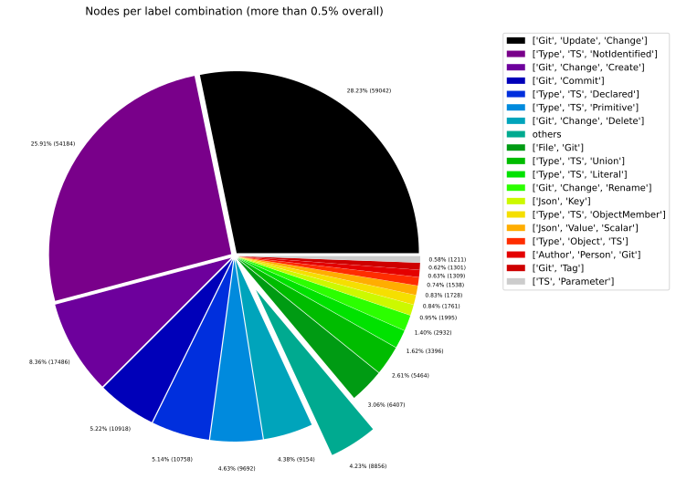
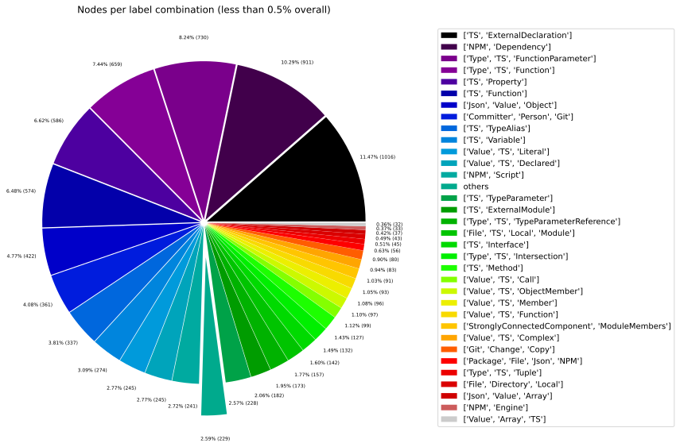
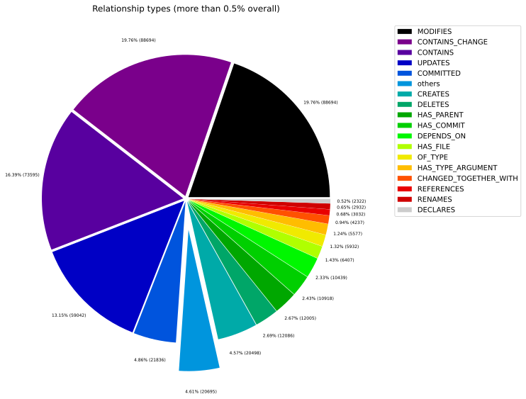
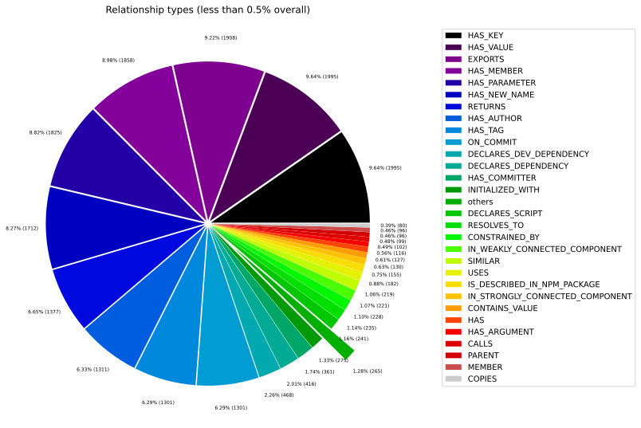
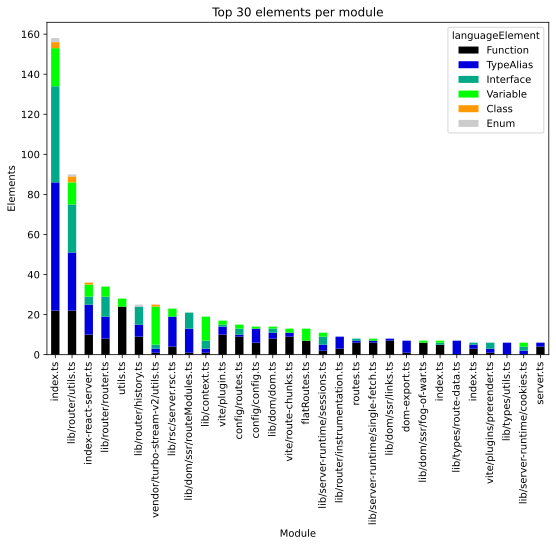
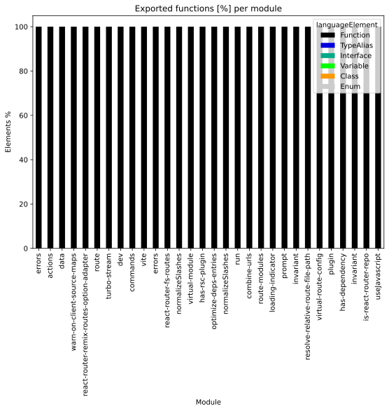
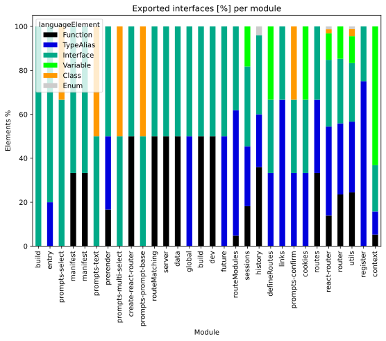
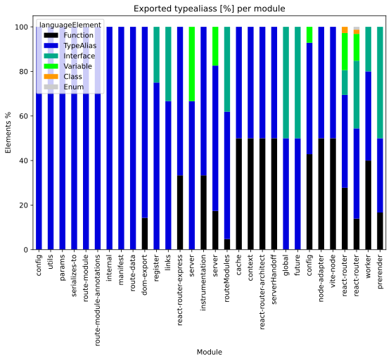
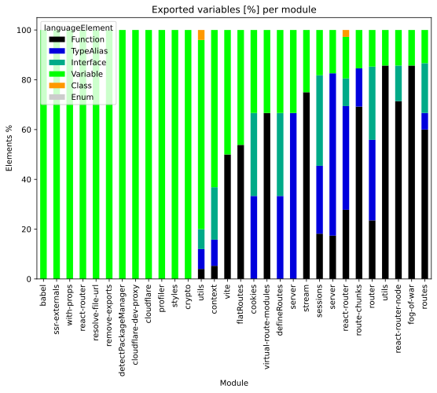

# Overview Report

## 1. Overview

High-level summary of graph database contents: general graph structure (node labels, relationships), Java artifacts, and TypeScript modules.

## 📚 Table of Contents

1. [Overview](#1-overview)
1. [General](#2-general)
1. [Java](#3-java)
1. [TypeScript](#4-typescript)

---

## 2. General

### 2.1 Node label combinations

Shows how many nodes carry each combination of labels and their share of the total node count.

| nodeLabels | nodesWithThatLabels | nodesWithThatLabelsPercent |
| --- | --- | --- |
| ["Git","Update","Change"] | 59042 | 28.231930072872636 |
| ["Type","TS","NotIdentified"] | 54184 | 25.908995275711032 |
| ["Git","Change","Create"] | 17486 | 8.361226402463515 |
| ["Git","Commit"] | 10918 | 5.220626207371422 |
| ["Type","TS","Declared"] | 10758 | 5.144119503471491 |
| ["Type","TS","Primitive"] | 9692 | 4.634393588738213 |
| ["Git","Change","Delete"] | 9154 | 4.377139796874701 |
| ["File","Git"] | 6407 | 3.0636153242927913 |
| ["Type","TS","Union"] | 5464 | 2.6127039381825834 |
| ["Type","TS","Literal"] | 3396 | 1.623854790275998 |

[Full data](./Node_label_combination_count.csv)

---

### 2.2 Node labels

Shows the number of nodes carrying each individual label, sorted by count descending.

| nodeLabel | nodesWithThatLabel | nodesWithThatLabelPercent |
| --- | --- | --- |
| Git | 108992 | 52.116366696631786 |
| TS | 94497 | 45.18533749019758 |
| Change | 88694 | 42.41053497312702 |
| Type | 88532 | 42.33307193542834 |
| Update | 59042 | 28.231930072872636 |
| NotIdentified | 54184 | 25.908995275711032 |
| Create | 17486 | 8.361226402463515 |
| Declared | 11003 | 5.261270393818259 |
| Commit | 10918 | 5.220626207371422 |
| Primitive | 9692 | 4.634393588738213 |

[Full data](./Node_label_count.csv)

---

### 2.3 Relationship types

Shows the number of relationships for each type and their share of the total relationship count.

| relationshipType | nodesWithThatRelationshipType | nodesWithThatRelationshipTypePercent |
| --- | --- | --- |
| CONTAINS_CHANGE | 88694 | 19.756270868555113 |
| MODIFIES | 88694 | 19.756270868555113 |
| CONTAINS | 73595 | 16.393022691177684 |
| UPDATES | 59042 | 13.151394058462024 |
| COMMITTED | 21836 | 4.863890800795651 |
| CREATES | 20498 | 4.565856092448674 |
| DELETES | 12086 | 2.692113217549745 |
| HAS_PARENT | 12005 | 2.674070757627394 |
| HAS_COMMIT | 10918 | 2.4319454003978254 |
| DEPENDS_ON | 10439 | 2.325249865795283 |

[Full data](./Relationship_type_count.csv)

---

### 2.4 Node labels and their relationships

Shows which node labels are connected by each relationship type, with count and percentage share.
| sourceLabels | relationshipType | targetLabels | relationshipCount |
| --- | --- | --- | --- |
| ["Git","Update","Change"] | UPDATES | ["Git"] | 59042 |
| ["Git","Update","Change"] | MODIFIES | ["Git"] | 59042 |
| ["Git","Commit"] | CONTAINS_CHANGE | ["Git","Update","Change"] | 59042 |
| ["TS","Union"] | CONTAINS | ["TS","NotIdentified"] | 53911 |
| ["Git","Change","Create"] | MODIFIES | ["Git"] | 17486 |
| ["Git","Change","Create"] | CREATES | ["Git"] | 17486 |
| ["Git","Commit"] | CONTAINS_CHANGE | ["Git","Change","Create"] | 17486 |
| ["Git","Commit"] | HAS_PARENT | ["Git","Commit"] | 12005 |
| ["Repository","Git"] | HAS_COMMIT | ["Git","Commit"] | 10918 |
| ["Committer","Person","Git","Author"] | COMMITTED | ["Git","Commit"] | 10918 |

[Full data](./Node_labels_and_their_relationships.csv)

---

### 2.5 Graph density

Statistical measures of the graph structure: node count, relationship count, and density metric.

---

### 2.6 Dependency node labels

Shows node labels present on dependency nodes — nodes that represent external dependencies not scanned as artifacts.

| sourceLabels | targetLabels | numberOfNodes | percentageOfTotalNodes |
| --- | --- | --- | --- |
| TS,Function | TS,ExternalDeclaration | 1180 | 0.56 |
| TS,Function | TS,Function | 815 | 0.39 |
| TS,Function | TS,ExternalModule | 442 | 0.21 |
| TS,Variable | TS,ExternalDeclaration | 382 | 0.18 |
| TS,Function | TS,Property | 377 | 0.18 |
| TS,Function | TS,Interface | 373 | 0.18 |
| File,TS,Local,Module | TS,ExternalDeclaration | 315 | 0.15 |
| TS,Function | TS,TypeAlias | 301 | 0.14 |
| TS,Function | TS,Variable | 287 | 0.14 |
| TS,TypeAlias | TS,TypeAlias | 188 | 0.09 |

[Full data](./Dependency_node_labels.csv)

---

## 3. Java

### 3.1 Artifact size

Overview of scanned Java artifacts: number of packages, types, methods, and lines of code.

> No overview data available.
> Please run the analysis pipeline first to scan and import code artifacts into the graph database (e.g., `analyze.sh`), then start Neo4j and re-run the overview reports.

### 3.2 Java overview charts

---

## 4. TypeScript

### 4.1 Module size

Overview of scanned TypeScript modules: number of exported language elements per module.

| nodeCount | relationshipCount | projectCount | moduleCount | functionCount | objectCount | typeAliasCount | interfaceCount | classCount | methodCount |
| --- | --- | --- | --- | --- | --- | --- | --- | --- | --- |
| 209132 | 448941 | 11 | 159 | 1326 | 1556 | 337 | 142 | 13 | 127 |

[Full data](./Overview_size_for_Typescript.csv)

### 4.2 TypeScript overview charts

