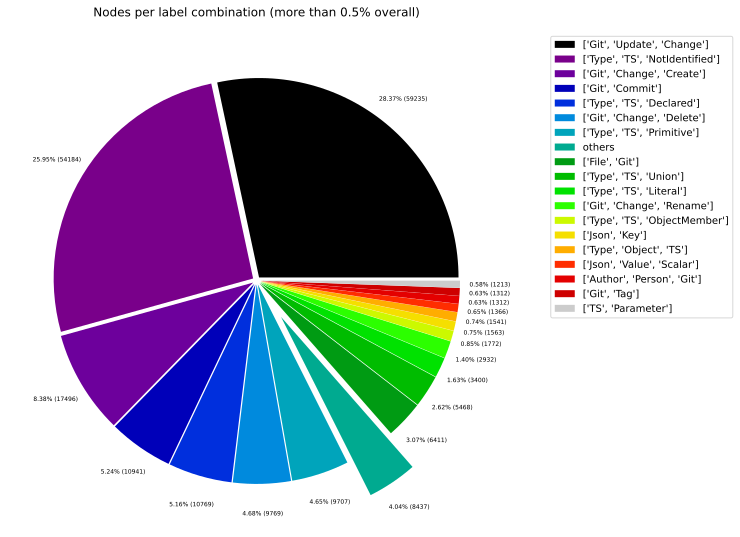
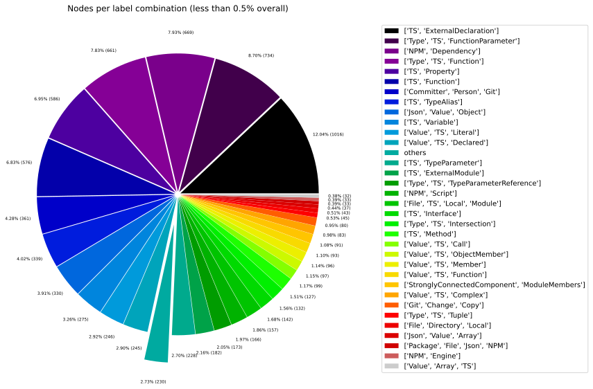
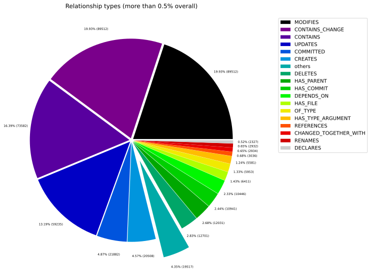
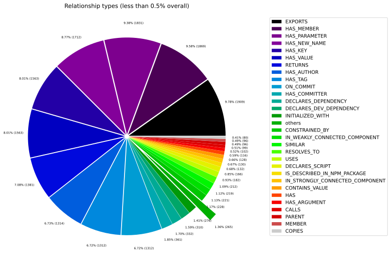
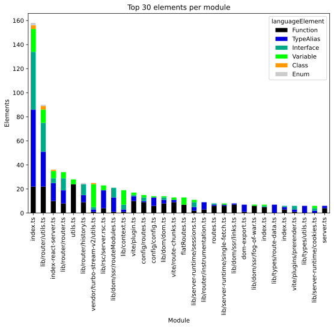
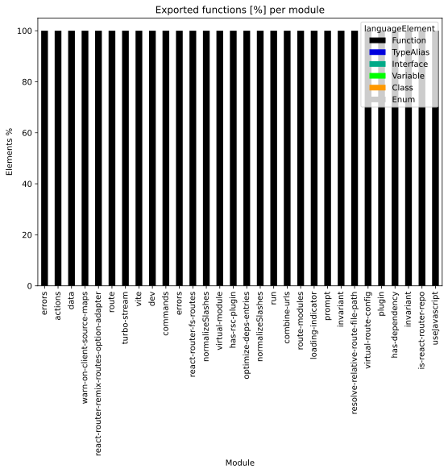
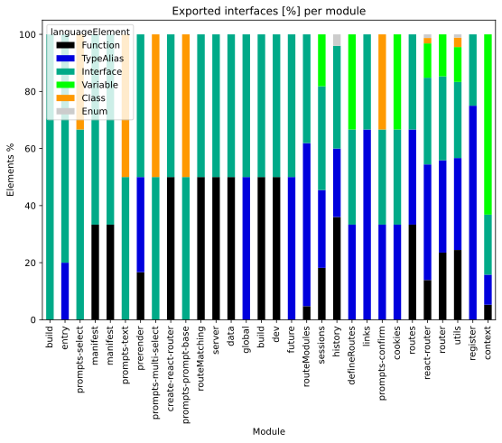
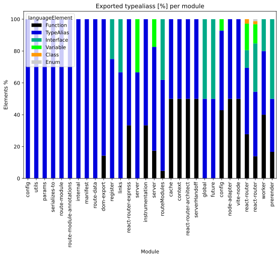
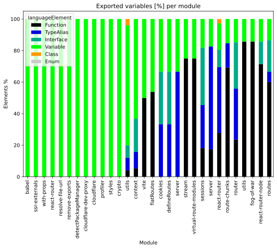

# Overview Report

## 1. Overview

High-level summary of graph database contents: general graph structure (node labels, relationships), Java artifacts, and TypeScript modules.

## 📚 Table of Contents

1. [Overview](#1-overview)
1. [General](#2-general)
1. [Java](#3-java)
1. [TypeScript](#4-typescript)

---

## 2. General

### 2.1 Node label combinations

Shows how many nodes carry each combination of labels and their share of the total node count.

| nodeLabels | nodesWithThatLabels | nodesWithThatLabelsPercent |
| --- | --- | --- |
| ["Git","Change","Update"] | 59235 | 28.36558490999727 |
| ["Type","TS","NotIdentified"] | 54184 | 25.946836376522192 |
| ["Git","Change","Create"] | 17496 | 8.378226953411197 |
| ["Git","Commit"] | 10941 | 5.239265037566981 |
| ["Type","TS","Declared"] | 10769 | 5.156900209264128 |
| ["Git","Change","Delete"] | 9769 | 4.678034928433584 |
| ["Type","TS","Primitive"] | 9707 | 4.64834528102209 |
| ["File","Git"] | 6411 | 3.070005315404617 |
| ["Type","TS","Union"] | 5468 | 2.6184353555814144 |
| ["Type","TS","Literal"] | 3400 | 1.6281419548238494 |

[Full data](./Node_label_combination_count.csv)

---

### 2.2 Node labels

Shows the number of nodes carrying each individual label, sorted by count descending.

| nodeLabel | nodesWithThatLabel | nodesWithThatLabelPercent |
| --- | --- | --- |
| Git | 109851 | 52.60382996451608 |
| TS | 94559 | 45.28102209005541 |
| Change | 89512 | 42.86418901770365 |
| Type | 88586 | 42.420759767654566 |
| Update | 59235 | 28.36558490999727 |
| NotIdentified | 54184 | 25.946836376522192 |
| Create | 17496 | 8.378226953411197 |
| Declared | 11014 | 5.274222203067612 |
| Commit | 10941 | 5.239265037566981 |
| Delete | 9769 | 4.678034928433584 |

[Full data](./Node_label_count.csv)

---

### 2.3 Relationship types

Shows the number of relationships for each type and their share of the total relationship count.

| relationshipType | nodesWithThatRelationshipType | nodesWithThatRelationshipTypePercent |
| --- | --- | --- |
| CONTAINS_CHANGE | 89512 | 19.934037203729726 |
| MODIFIES | 89512 | 19.934037203729726 |
| CONTAINS | 73582 | 16.38647695867415 |
| UPDATES | 59235 | 13.19144576998537 |
| COMMITTED | 21882 | 4.873051681249596 |
| CREATES | 20508 | 4.567066258983033 |
| DELETES | 12701 | 2.828472233047762 |
| HAS_PARENT | 12031 | 2.679265367750384 |
| HAS_COMMIT | 10941 | 2.436525840624798 |
| DEPENDS_ON | 10446 | 2.3262909177558395 |

[Full data](./Relationship_type_count.csv)

---

### 2.4 Node labels and their relationships

Shows which node labels are connected by each relationship type, with count and percentage share.
| sourceLabels | relationshipType | targetLabels | relationshipCount |
| --- | --- | --- | --- |
| ["Git","Change","Update"] | MODIFIES | ["Git"] | 59235 |
| ["Git","Change","Update"] | UPDATES | ["Git"] | 59235 |
| ["Git","Commit"] | CONTAINS_CHANGE | ["Git","Change","Update"] | 59235 |
| ["TS","Union"] | CONTAINS | ["TS","NotIdentified"] | 53911 |
| ["Git","Change","Create"] | MODIFIES | ["Git"] | 17496 |
| ["Git","Commit"] | CONTAINS_CHANGE | ["Git","Change","Create"] | 17496 |
| ["Git","Change","Create"] | CREATES | ["Git"] | 17496 |
| ["Git","Commit"] | HAS_PARENT | ["Git","Commit"] | 12031 |
| ["Repository","Git"] | HAS_COMMIT | ["Git","Commit"] | 10941 |
| ["Committer","Person","Git","Author"] | COMMITTED | ["Git","Commit"] | 10941 |

[Full data](./Node_labels_and_their_relationships.csv)

---

### 2.5 Graph density

Statistical measures of the graph structure: node count, relationship count, and density metric.

---

### 2.6 Dependency node labels

Shows node labels present on dependency nodes — nodes that represent external dependencies not scanned as artifacts.

| sourceLabels | targetLabels | numberOfNodes | percentageOfTotalNodes |
| --- | --- | --- | --- |
| TS,Function | TS,ExternalDeclaration | 1183 | 0.57 |
| TS,Function | TS,Function | 819 | 0.39 |
| TS,Function | TS,ExternalModule | 445 | 0.21 |
| TS,Variable | TS,ExternalDeclaration | 382 | 0.18 |
| TS,Function | TS,Property | 378 | 0.18 |
| TS,Function | TS,Interface | 373 | 0.18 |
| File,TS,Local,Module | TS,ExternalDeclaration | 310 | 0.15 |
| TS,Function | TS,TypeAlias | 303 | 0.15 |
| TS,Function | TS,Variable | 291 | 0.14 |
| TS,TypeAlias | TS,TypeAlias | 188 | 0.09 |

[Full data](./Dependency_node_labels.csv)

---

## 3. Java

### 3.1 Artifact size

Overview of scanned Java artifacts: number of packages, types, methods, and lines of code.

> No overview data available.
> Please run the analysis pipeline first to scan and import code artifacts into the graph database (e.g., `analyze.sh`), then start Neo4j and re-run the overview reports.

### 3.2 Java overview charts

---

## 4. TypeScript

### 4.1 Module size

Overview of scanned TypeScript modules: number of exported language elements per module.

| nodeCount | relationshipCount | projectCount | moduleCount | functionCount | objectCount | typeAliasCount | interfaceCount | classCount | methodCount |
| --- | --- | --- | --- | --- | --- | --- | --- | --- | --- |
| 208827 | 449041 | 11 | 159 | 1330 | 1559 | 339 | 142 | 13 | 127 |

[Full data](./Overview_size_for_Typescript.csv)

### 4.2 TypeScript overview charts

