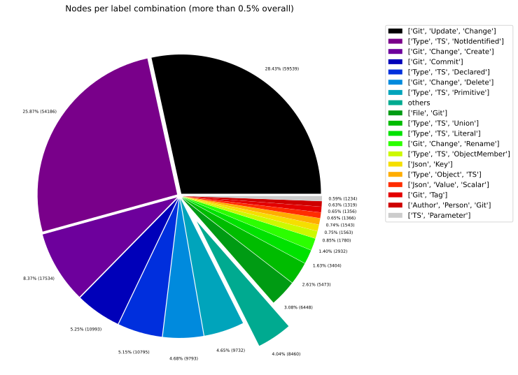
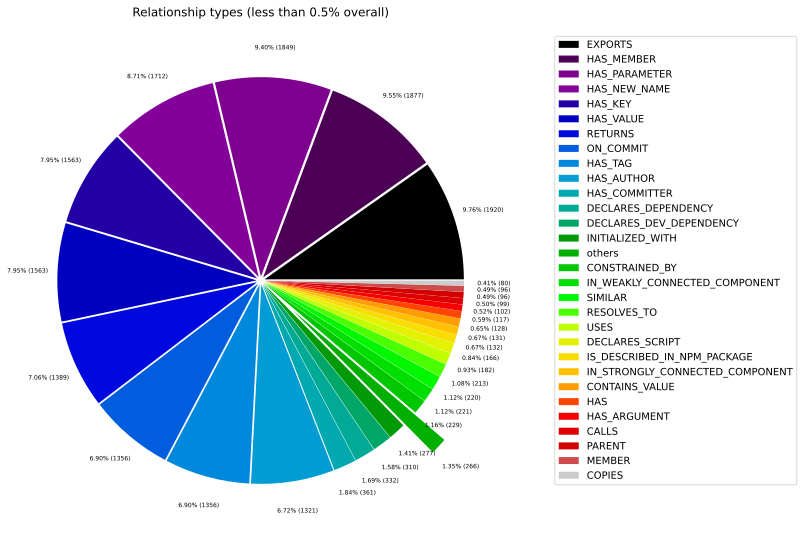
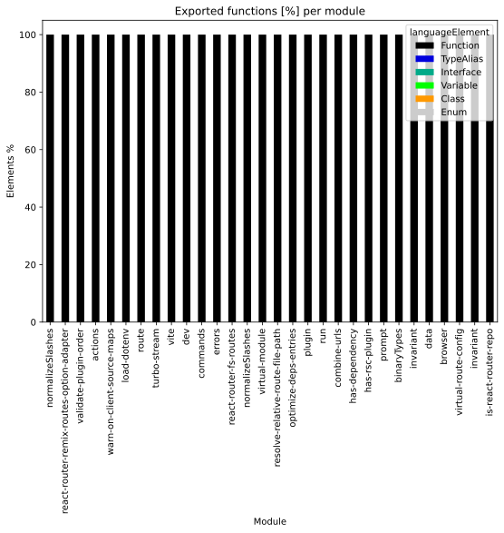
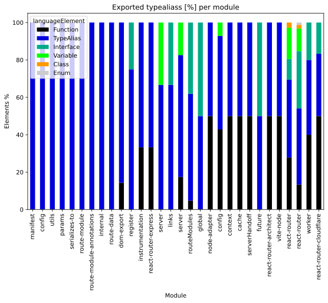

# Overview Report

## 1. Overview

High-level summary of graph database contents: general graph structure (node labels, relationships), Java artifacts, and TypeScript modules.

## 📚 Table of Contents

1. [Overview](#1-overview)
1. [General](#2-general)
1. [Java](#3-java)
1. [TypeScript](#4-typescript)

---

## 2. General

### 2.1 Node label combinations

Shows how many nodes carry each combination of labels and their share of the total node count.

| nodeLabels | nodesWithThatLabels | nodesWithThatLabelsPercent |
| --- | --- | --- |
| ["Git","Update","Change"] | 59539 | 28.426354738601102 |
| ["Type","TS","NotIdentified"] | 54186 | 25.870613511577943 |
| ["Git","Change","Create"] | 17534 | 8.371449033182143 |
| ["Git","Commit"] | 10993 | 5.248507997135354 |
| ["Type","TS","Declared"] | 10795 | 5.153974695631415 |
| ["Git","Change","Delete"] | 9793 | 4.675578897111483 |
| ["Type","TS","Primitive"] | 9732 | 4.646455001193602 |
| ["File","Git"] | 6448 | 3.078539030794939 |
| ["Type","TS","Union"] | 5473 | 2.613034137025543 |
| ["Type","TS","Literal"] | 3404 | 1.6252088804010505 |

[Full data](./Node_label_combination_count.csv)

---

### 2.2 Node labels

Shows the number of nodes carrying each individual label, sorted by count descending.

| nodeLabel | nodesWithThatLabel | nodesWithThatLabelPercent |
| --- | --- | --- |
| Git | 110357 | 52.6889472427787 |
| TS | 94676 | 45.202196228216756 |
| Change | 89878 | 42.91143470995464 |
| Type | 88656 | 42.32800190976367 |
| Update | 59539 | 28.426354738601102 |
| NotIdentified | 54186 | 25.870613511577943 |
| Create | 17534 | 8.371449033182143 |
| Declared | 11040 | 5.270947720219623 |
| Commit | 10993 | 5.248507997135354 |
| Delete | 9793 | 4.675578897111483 |

[Full data](./Node_label_count.csv)

---

### 2.3 Relationship types

Shows the number of relationships for each type and their share of the total relationship count.

| relationshipType | nodesWithThatRelationshipType | nodesWithThatRelationshipTypePercent |
| --- | --- | --- |
| CONTAINS_CHANGE | 89878 | 19.94323993884647 |
| MODIFIES | 89878 | 19.94323993884647 |
| CONTAINS | 73597 | 16.330610714293638 |
| UPDATES | 59539 | 13.211248166614523 |
| COMMITTED | 21986 | 4.878525037222441 |
| CREATES | 20546 | 4.559000064348779 |
| DELETES | 12725 | 2.823580055428707 |
| HAS_PARENT | 12084 | 2.681347064031473 |
| HAS_COMMIT | 10993 | 2.4392625186112205 |
| DEPENDS_ON | 10524 | 2.335195010085007 |

[Full data](./Relationship_type_count.csv)

---

### 2.4 Node labels and their relationships

Shows which node labels are connected by each relationship type, with count and percentage share.
| sourceLabels | relationshipType | targetLabels | relationshipCount |
| --- | --- | --- | --- |
| ["Git","Update","Change"] | MODIFIES | ["Git"] | 59539 |
| ["Git","Update","Change"] | UPDATES | ["Git"] | 59539 |
| ["Git","Commit"] | CONTAINS_CHANGE | ["Git","Update","Change"] | 59539 |
| ["TS","Union"] | CONTAINS | ["TS","NotIdentified"] | 53911 |
| ["Git","Change","Create"] | CREATES | ["Git"] | 17534 |
| ["Git","Change","Create"] | MODIFIES | ["Git"] | 17534 |
| ["Git","Commit"] | CONTAINS_CHANGE | ["Git","Change","Create"] | 17534 |
| ["Git","Commit"] | HAS_PARENT | ["Git","Commit"] | 12084 |
| ["Repository","Git"] | HAS_COMMIT | ["Git","Commit"] | 10993 |
| ["Committer","Person","Git","Author"] | COMMITTED | ["Git","Commit"] | 10993 |

[Full data](./Node_labels_and_their_relationships.csv)

---

### 2.5 Graph density

Statistical measures of the graph structure: node count, relationship count, and density metric.

---

### 2.6 Dependency node labels

Shows node labels present on dependency nodes — nodes that represent external dependencies not scanned as artifacts.

| sourceLabels | targetLabels | numberOfNodes | percentageOfTotalNodes |
| --- | --- | --- | --- |
| TS,Function | TS,ExternalDeclaration | 1189 | 0.57 |
| TS,Function | TS,Function | 834 | 0.4 |
| TS,Function | TS,ExternalModule | 446 | 0.21 |
| TS,Function | TS,Property | 384 | 0.18 |
| TS,Variable | TS,ExternalDeclaration | 383 | 0.18 |
| TS,Function | TS,Interface | 376 | 0.18 |
| File,TS,Local,Module | TS,ExternalDeclaration | 310 | 0.15 |
| TS,Function | TS,TypeAlias | 308 | 0.15 |
| TS,Function | TS,Variable | 296 | 0.14 |
| TS,TypeAlias | TS,TypeAlias | 188 | 0.09 |

[Full data](./Dependency_node_labels.csv)

---

## 3. Java

### 3.1 Artifact size

Overview of scanned Java artifacts: number of packages, types, methods, and lines of code.

> No overview data available.
> Please run the analysis pipeline first to scan and import code artifacts into the graph database (e.g., `analyze.sh`), then start Neo4j and re-run the overview reports.

### 3.2 Java overview charts

---

## 4. TypeScript

### 4.1 Module size

Overview of scanned TypeScript modules: number of exported language elements per module.

| nodeCount | relationshipCount | projectCount | moduleCount | functionCount | objectCount | typeAliasCount | interfaceCount | classCount | methodCount |
| --- | --- | --- | --- | --- | --- | --- | --- | --- | --- |
| 209450 | 450669 | 11 | 160 | 1336 | 1561 | 341 | 142 | 14 | 128 |

[Full data](./Overview_size_for_Typescript.csv)

### 4.2 TypeScript overview charts

