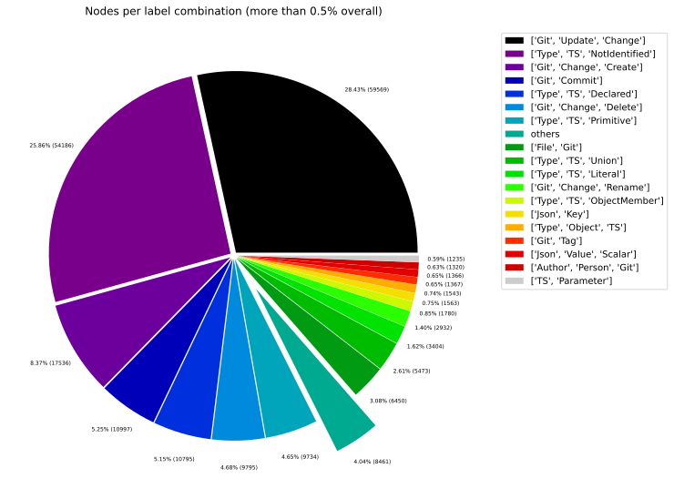
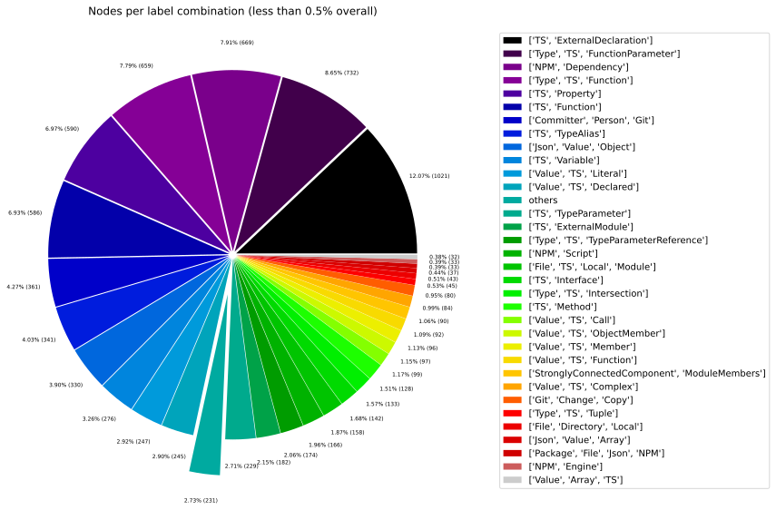
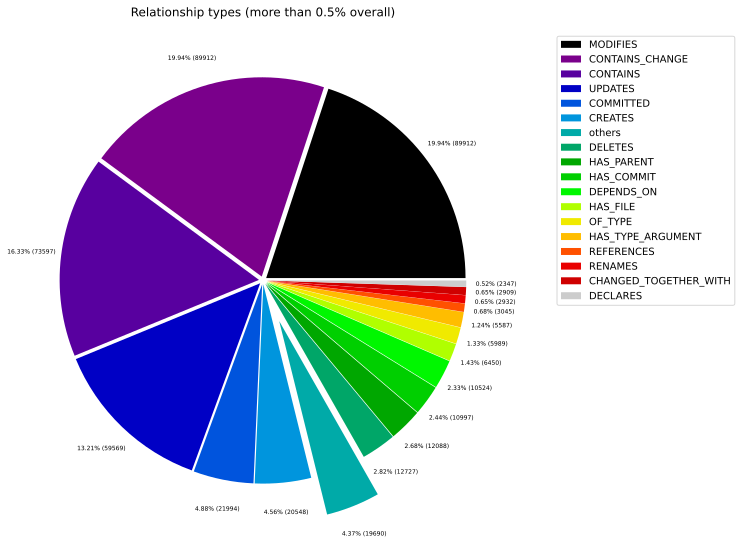
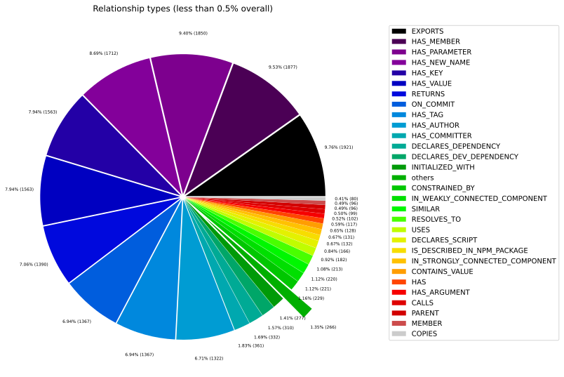
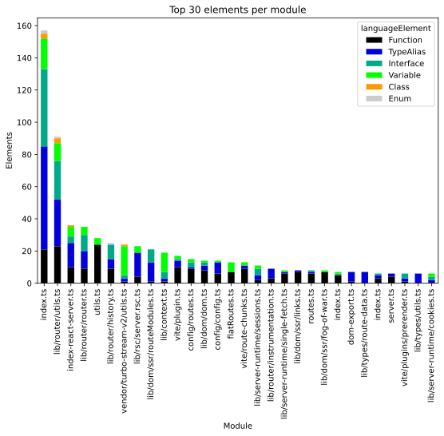
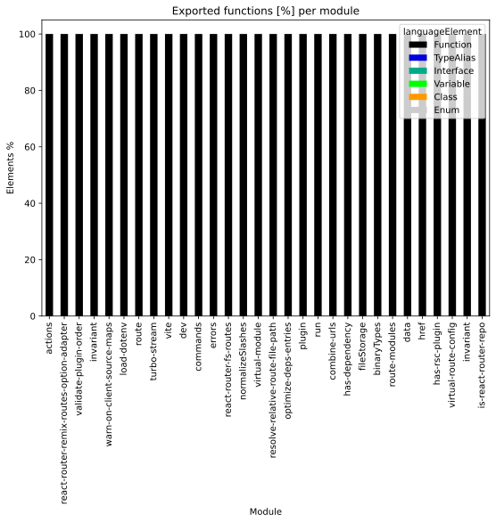
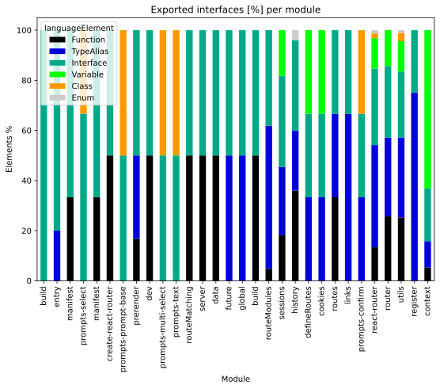
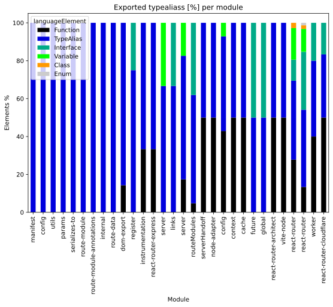
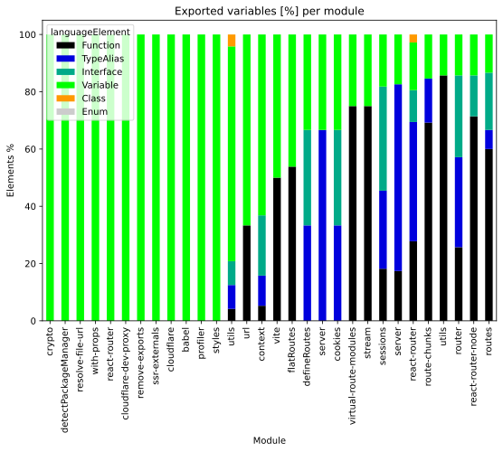

# Overview Report

## 1. Overview

High-level summary of graph database contents: general graph structure (node labels, relationships), Java artifacts, and TypeScript modules.

## 📚 Table of Contents

1. [Overview](#1-overview)
1. [General](#2-general)
1. [Java](#3-java)
1. [TypeScript](#4-typescript)

---

## 2. General

### 2.1 Node label combinations

Shows how many nodes carry each combination of labels and their share of the total node count.

| nodeLabels | nodesWithThatLabels | nodesWithThatLabelsPercent |
| --- | --- | --- |
| ["Git","Update","Change"] | 59569 | 28.433075902360795 |
| ["Type","TS","NotIdentified"] | 54186 | 25.86369841436522 |
| ["Git","Change","Create"] | 17536 | 8.370166009565358 |
| ["Git","Commit"] | 10997 | 5.249014348037765 |
| ["Type","TS","Declared"] | 10795 | 5.152597061659332 |
| ["Git","Change","Delete"] | 9795 | 4.675283762756198 |
| ["Type","TS","Primitive"] | 9734 | 4.646167651523107 |
| ["File","Git"] | 6450 | 3.0786707779252147 |
| ["Type","TS","Union"] | 5473 | 2.6123356848968524 |
| ["Type","TS","Literal"] | 3404 | 1.6247744694662682 |

[Full data](./Node_label_combination_count.csv)

---

### 2.2 Node labels

Shows the number of nodes carrying each individual label, sorted by count descending.

| nodeLabel | nodesWithThatLabel | nodesWithThatLabelPercent |
| --- | --- | --- |
| Git | 110409 | 52.69968401859613 |
| TS | 94680 | 45.19202314014873 |
| Change | 89912 | 42.91619333097859 |
| Type | 88658 | 42.31764245415406 |
| Update | 59569 | 28.433075902360795 |
| NotIdentified | 54186 | 25.86369841436522 |
| Create | 17536 | 8.370166009565358 |
| Declared | 11040 | 5.2695388198906 |
| Commit | 10997 | 5.249014348037765 |
| Delete | 9795 | 4.675283762756198 |

[Full data](./Node_label_count.csv)

---

### 2.3 Relationship types

Shows the number of relationships for each type and their share of the total relationship count.

| relationshipType | nodesWithThatRelationshipType | nodesWithThatRelationshipTypePercent |
| --- | --- | --- |
| CONTAINS_CHANGE | 89912 | 19.94423457855405 |
| MODIFIES | 89912 | 19.94423457855405 |
| CONTAINS | 73597 | 16.325249491478804 |
| UPDATES | 59569 | 13.213565593134243 |
| COMMITTED | 21994 | 4.87869800828274 |
| CREATES | 20548 | 4.557947016195041 |
| DELETES | 12727 | 2.8230967332642734 |
| HAS_PARENT | 12088 | 2.6813540749350624 |
| HAS_COMMIT | 10997 | 2.43934900414137 |
| DEPENDS_ON | 10524 | 2.3344283822482295 |

[Full data](./Relationship_type_count.csv)

---

### 2.4 Node labels and their relationships

Shows which node labels are connected by each relationship type, with count and percentage share.
| sourceLabels | relationshipType | targetLabels | relationshipCount |
| --- | --- | --- | --- |
| ["Git","Update","Change"] | MODIFIES | ["Git"] | 59569 |
| ["Git","Update","Change"] | UPDATES | ["Git"] | 59569 |
| ["Git","Commit"] | CONTAINS_CHANGE | ["Git","Update","Change"] | 59569 |
| ["TS","Union"] | CONTAINS | ["TS","NotIdentified"] | 53911 |
| ["Git","Change","Create"] | MODIFIES | ["Git"] | 17536 |
| ["Git","Commit"] | CONTAINS_CHANGE | ["Git","Change","Create"] | 17536 |
| ["Git","Change","Create"] | CREATES | ["Git"] | 17536 |
| ["Git","Commit"] | HAS_PARENT | ["Git","Commit"] | 12088 |
| ["Repository","Git"] | HAS_COMMIT | ["Git","Commit"] | 10997 |
| ["Committer","Person","Git","Author"] | COMMITTED | ["Git","Commit"] | 10997 |

[Full data](./Node_labels_and_their_relationships.csv)

---

### 2.5 Graph density

Statistical measures of the graph structure: node count, relationship count, and density metric.

---

### 2.6 Dependency node labels

Shows node labels present on dependency nodes — nodes that represent external dependencies not scanned as artifacts.

| sourceLabels | targetLabels | numberOfNodes | percentageOfTotalNodes |
| --- | --- | --- | --- |
| TS,Function | TS,ExternalDeclaration | 1189 | 0.57 |
| TS,Function | TS,Function | 834 | 0.4 |
| TS,Function | TS,ExternalModule | 446 | 0.21 |
| TS,Function | TS,Property | 384 | 0.18 |
| TS,Variable | TS,ExternalDeclaration | 383 | 0.18 |
| TS,Function | TS,Interface | 376 | 0.18 |
| File,TS,Local,Module | TS,ExternalDeclaration | 340 | 0.16 |
| TS,Function | TS,TypeAlias | 308 | 0.15 |
| TS,Function | TS,Variable | 296 | 0.14 |
| TS,TypeAlias | TS,TypeAlias | 188 | 0.09 |

[Full data](./Dependency_node_labels.csv)

---

## 3. Java

### 3.1 Artifact size

Overview of scanned Java artifacts: number of packages, types, methods, and lines of code.

> No overview data available.
> Please run the analysis pipeline first to scan and import code artifacts into the graph database (e.g., `analyze.sh`), then start Neo4j and re-run the overview reports.

### 3.2 Java overview charts

---

## 4. TypeScript

### 4.1 Module size

Overview of scanned TypeScript modules: number of exported language elements per module.

| nodeCount | relationshipCount | projectCount | moduleCount | functionCount | objectCount | typeAliasCount | interfaceCount | classCount | methodCount |
| --- | --- | --- | --- | --- | --- | --- | --- | --- | --- |
| 209506 | 450817 | 11 | 160 | 1337 | 1561 | 341 | 142 | 14 | 128 |

[Full data](./Overview_size_for_Typescript.csv)

### 4.2 TypeScript overview charts

